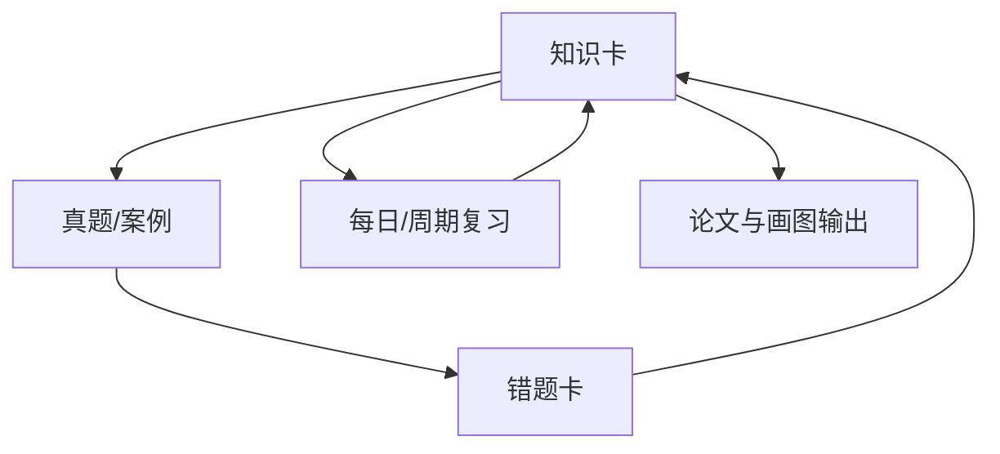

# 知识库设计规范

## 一、四层结构

### L0：首页
唯一总入口：[[知识库首页]]。

### L1：领域 MOC
负责回答“这个领域有哪些模块、先学什么、彼此什么关系”。例如：[[计算机系统基础知识地图]]、[[信息安全技术索引]]。

### L2：专题/章节 MOC
负责一组强相关考点的顺序、对比和计算关系，例如 CPU、存储、进程管理、网络协议。

### L3：原子知识卡
一篇只讲一个核心知识点，按仓库 `AGENTS.md` 约定的“痛点 → 定义 → 逐个认识 → 核心机制 → 考试关系 → 口诀 → 下一站”组织。

## 二、三条关系线

每张知识卡尽量同时具备：

1. **结构线**：属于哪个 MOC。
2. **学习线**：前置知识 → 当前知识 → 下一站。
3. **考试线**：知识卡 ↔ 真题错题 ↔ 案例 ↔ 论文/画图素材。

这样同一知识点既能按教材体系找到，也能按做题和输出场景找到。

## 三、命名原则

- MOC：`领域/专题 + 知识地图` 或 `领域 + 索引`。
- 原子卡：直接使用考试概念名；只有确有必要时才使用 `主题-子主题`。
- 不用“新建文档”“笔记1”等无语义名称。
- 文件夹编号只用于排序，不把编号写进 wikilink 显示名。

## 四、可视化原则

- **Canvas**：只放领域、模块、关键链路，不把所有原子卡塞进一张图。
- **Mermaid**：用于单篇笔记中的机制、流程、状态和结构关系。
- **Markdown 列表/表格**：用于知识清单、易错对比和复习入口。
- Canvas 节点保持足够宽度和间距；长知识清单下沉到 Markdown MOC，避免文字遮挡。

## 五、知识卡最低质量门槛

新增/重写考点卡至少回答：

- 为什么需要它？
- 它是什么？
- 核心组成/机制是什么？
- 和相似概念怎么区分？
- 考试通常怎么问？
- 有计算时，公式、单位和典型陷阱是什么？
- 下一步应该学什么？

## 六、复习闭环

## 七、变更策略

- 优先“新增 MOC、补链接、重做入口”，谨慎移动大量已有文件。
- 必须移动时，先查入链和附件，再同步修正 wikilink。
- 一个 PR 聚焦一个明确模块；大规模重构先改导航骨架，再逐章重写内容。
