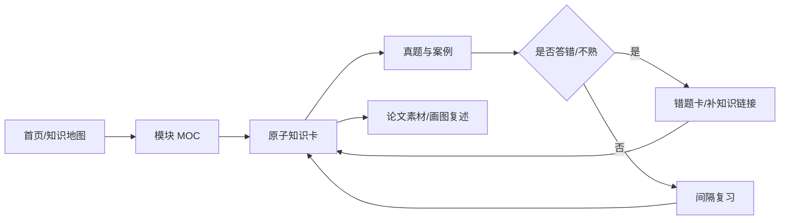

# 系统架构设计师知识库首页

> [!important] 使用方式
> 不从文件夹乱翻。每次学习都从本页进入：**总地图 → 模块 MOC → 原子知识卡 → 真题/错题 → 复习**。

## 1. 总导航

| 区域 | 作用 | 入口 |
|---|---|---|
| 综合知识 | 建立概念、机制、计算与对比 | [[软考架构设计师索引]] |
| 计算机系统基础 | 硬件、OS、网络、软件、多媒体的完整主线 | [[计算机系统基础知识地图]] |
| 案例分析 | 把知识点变成方案判断与答题模板 | [[案例分析索引]] |
| 论文素材 | 把架构知识沉淀成可复用项目素材 | [[论文素材索引]] |
| 真题错题 | 暴露薄弱点并反向链接知识卡 | [[真题错题索引]] |
| 画图素材 | 结构图、部署图、流程图表达训练 | [[软考画图规范]] |
| 学习计划 | 周期安排与阶段目标 | [[软考系统架构师学习计划]] |
| 每日复习 | 按状态和复习时间回收知识 | [[软考每日复习]] |

## 2. 学习闭环



## 3. 推荐学习顺序

1. **计算机系统基础**：[[计算机系统基础知识地图]] → [[学习路线]]。
2. **系统工程与信息系统基础**：从 [[软考架构设计师索引]] 的对应模块进入。
3. **信息安全技术**：[[信息安全技术索引]]。
4. 每学完一个模块，至少完成一次真题/案例回测，并把错因落到 [[真题错题索引]]。
5. 每周把能用于案例和论文的知识，反向沉淀到对应素材库。

## 4. 当前学习状态

```dataview
TABLE chapter AS 章节, topic AS 主题, difficulty AS 难度, status AS 状态, next-reviewed AS 下次复习
FROM "01_综合知识"
WHERE type = "考点" AND status != "已掌握"
SORT next-reviewed ASC, difficulty DESC
LIMIT 20
```

## 5. 知识库维护规则

- 一篇知识卡只解决一个核心问题，避免“大而全”。
- 模块目录必须有 MOC/知识地图，不让原子笔记成为孤岛。
- 新增知识卡至少建立：**上级 MOC + 前置知识 + 下一站** 三类关系中的两类。
- Canvas 只负责“看全局”，Markdown MOC 负责“可搜索、可维护、可学习”。
- 详细规范见 [[知识库设计规范]]。
