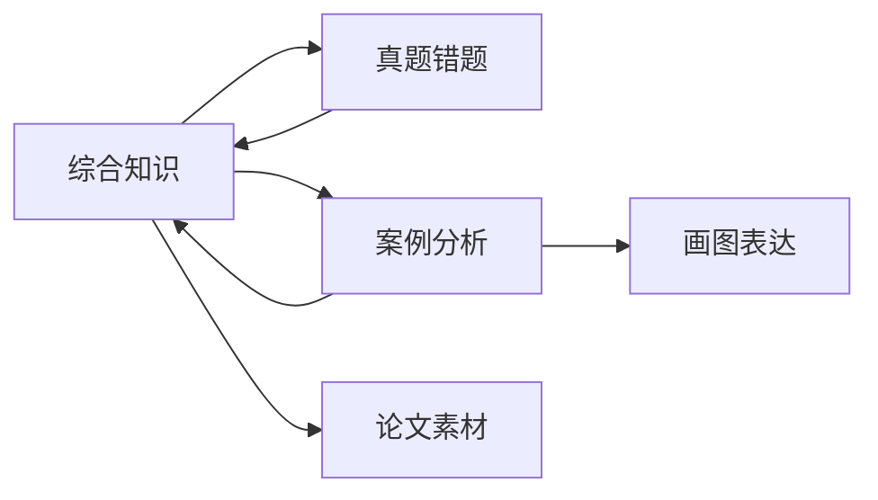

# 软考系统架构设计师索引

> [!tip] 本页定位
> 本页是**综合知识总 MOC**。整个知识库的唯一首页是 [[知识库首页]]；全局可视化使用 [[软考架构设计师知识地图.canvas]]。这里不再堆叠全部原子卡，而是按领域进入下一层知识地图。

## 一、综合知识三大领域

### 1. 计算机系统基础

入口：[[计算机系统基础知识地图]] · [[学习路线]]

主线：**数据表示 → CPU/指令 → 存储 → 总线/I/O → 操作系统 → 网络 → 软件/语言/多媒体 → 性能评价**。

- 组成与体系结构：[[计算机系统组成]]、[[CPU内部组成-运算器与控制器]]、[[CPU内部组成-寄存器体系]]、[[CPU内部组成-指令执行过程]]、[[指令流水线]]、[[Cache]]、[[IO控制技术]]
- 操作系统：[[操作系统概述]]、[[进程与线程]]、[[进程调度]]、[[信号量与PV操作]]、[[死锁与银行家算法]]、[[虚拟存储与页面置换]]
- 网络：[[计算机网络索引]]、[[网络协议与OSI七层]]、[[IP编址与子网划分]]、[[TCP与UDP协议]]、[[应用层常用协议]]

> 完整知识树、计算题清单和易混淆对比统一维护在 [[计算机系统基础知识地图]]。

### 2. 系统工程与信息系统基础

主线：**系统思想 → 系统工程方法 → 生命周期/开发模型 → 信息系统 → 企业信息化**。

- 基础：[[系统工程的概念]]、[[系统工程与信息系统基础]]
- 系统工程方法：[[霍尔三维结构]]、[[切克兰德方法]]、[[并行工程]]、[[综合集成法]]
- 生命周期与模型：[[7阶段详解]]、[[瀑布模型]]、[[V模型]]、[[迭代与增量模型]]、[[螺旋模型]]、[[敏捷开发模型]]、[[RUP]]
- 信息系统：[[信息系统基础]]、[[诺兰模型]]、[[4大阶段]]、[[开发阶段5子步骤]]
- 开发方法：[[结构化方法]]、[[原型法]]、[[面向对象方法]]、[[面向服务方法]]、[[敏捷开发方法]]、[[构件化方法]]
- 企业信息化：[[企业信息化]]、[[企业信息化体系全览]]、[[企业信息系统战略规划方法]]、[[企业应用集成EAI]]、[[ERP发展史]]

### 3. 信息安全技术

入口：[[信息安全技术索引]]

主线：**密码基础 → 身份认证 → 访问控制 → 网络安全 → 应用安全 → 安全体系与架构**。

- 密码与信任：[[对称加密]]、[[非对称加密]]、[[哈希算法]]、[[数字签名]]、[[数字证书与PKI]]
- 身份认证：[[身份认证]]、[[Kerberos认证]]、[[单点登录SSO]]
- 访问控制：[[DAC自主访问控制]]、[[MAC强制访问控制]]、[[RBAC基于角色访问控制]]
- 网络与通信：[[防火墙]]、[[IDS与IPS]]、[[VPN]]、[[TLS与HTTPS]]、[[常见网络攻击]]
- 应用安全：[[SQL注入]]、[[XSS跨站脚本]]、[[CSRF跨站请求伪造]]
- 安全体系：[[等级保护2.0]]、[[零信任架构]]、[[纵深防御]]、[[可信计算]]、[[ISO27001信息安全管理]]、[[安全架构设计]]

## 二、从知识到考试输出



- 案例分析 → [[案例分析索引]]
- 论文素材 → [[论文素材索引]]
- 真题错题 → [[真题错题索引]]
- 画图规范 → [[软考画图规范]]
- 学习计划 → [[软考系统架构师学习计划]]
- 每日复习 → [[软考每日复习]]
- 知识库维护 → [[知识库设计规范]]

## 三、待复习考点

```dataview
TABLE chapter AS 章节, topic AS 主题, difficulty AS 难度, status AS 状态, next-reviewed AS 下次复习
FROM "01_综合知识"
WHERE type = "考点" AND status != "已掌握"
SORT next-reviewed ASC, difficulty DESC
```

## 下一站

→ [[知识库首页]]
