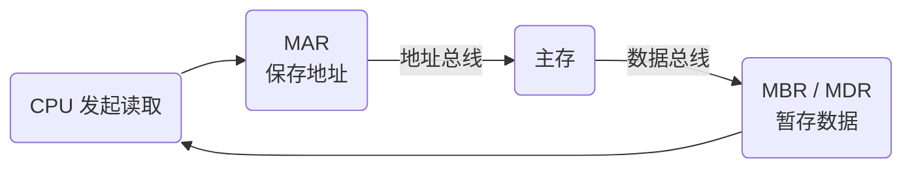

# 寄存器体系：CPU 为什么需要这么多“临时小格子”？

## 先抓住主线：寄存器不是一堆要背的缩写

前面 [[CPU内部组成-运算器与控制器]] 已经知道：

- 运算器负责计算；
- 控制器负责组织和指挥整个执行过程；
- 寄存器是实现这些功能时使用的高速暂存部件。

所以这一卡真正要解决的不是：

> “PC、IR、MAR、MBR 分别是什么缩写？”

而是：

> **CPU 在执行一条指令时，到底有哪些东西必须暂时记住？这些东西分别放在哪里？**

CPU 工作过程中至少会反复遇到三类信息：

1. **正在计算的数据和结果**；
2. **当前执行到哪里、正在执行什么指令**；
3. **如果要访问主存，要访问哪个地址、交换什么数据**。

于是寄存器自然按这些工作分工。

> [!important] 一句话先抓住
> **寄存器负责“暂时记住 CPU 下一步马上要用的信息”。不同寄存器的区别，本质上只是“各自负责记什么”。**

---

## 第一类：运算时，要把数据和结果先放在手边

假设 CPU 要做：

$$
5+3
$$

ALU 负责真正的加法，但参与计算的数据不能凭空出现。

更接近实际的逻辑是：

$$
\text{寄存器中的 5}
+
\text{寄存器中的 3}
\rightarrow
\text{ALU}
\rightarrow
\text{结果写回寄存器}
$$

因此，运算相关寄存器主要服务于：

> **暂存操作数、中间结果和运算状态。**

典型例子：

- **ACC（累加器）**：保存运算结果或中间结果；
- **PSW（程序状态字）**：保存进位、溢出、零、负等状态标志。

这里要分清：

> **寄存器负责“拿着数/状态”，ALU 才负责真正“算”。**

---

## 第二类：控制器要记住“执行到哪了”

CPU 不只是算，还必须知道：

- 下一条指令在哪里；
- 当前拿到的指令是什么。

于是出现两个非常重要的控制相关寄存器。

### PC：记“下一条去哪取”

**PC（程序计数器）**保存下一条要取的指令地址。

例如：

$$
PC=1000
$$

表示下一次取指应从地址 1000 开始。

经典考试模型中，顺序执行时取指后 PC 按指令长度递增；遇到跳转指令时，目标地址可以重新写入 PC。

所以题目看到：

> “下一条指令地址”

优先想到 **PC**。

### IR：记“当前正在执行哪条”

从主存取回来的当前指令，会进入 **IR（指令寄存器）**。

所以：

- PC：下一条在哪里；
- IR：当前这一条是什么。

> **PC 管下一条，IR 管当前。**

---

## 第三类：CPU 要访问主存，为什么又出现 MAR 和 MBR？

学到这里最容易产生一个疑问：

> 寄存器不是 CPU 内部临时存东西的吗，怎么突然讲到主存、总线、MAR、MBR 了？

因为 CPU 手边的数据并不是凭空产生的。

如果 CPU 需要主存中的一个数据，就必须先回答两个问题：

1. **去主存哪个位置找？**
2. **找到的数据通过哪里暂存？**

于是又需要两个专门服务于 CPU ↔ 主存交换的寄存器。

### MAR：装“地址”

**MAR（Memory Address Register，存储器地址寄存器）**保存本次要访问的主存地址。

例如：

$$
MAR=1000
$$

含义是：

> “这次访问主存的 1000 号位置。”

它保存的是**地址**，不是地址 1000 里面的数据。

### MBR / MDR：装“数据”

**MBR（Memory Buffer Register）**，也常称 **MDR（Memory Data Register）**，保存本次 CPU 与主存之间交换的数据或指令。

假设：

- 主存地址 1000 中保存的是 25；
- CPU 要读取它。

那么可以理解成：

$$
MAR=1000
$$

读取完成后：

$$
MBR=25
$$

所以：

> **MAR 告诉主存“去哪里”，MBR/MDR 暂存“搬什么”。**

这就是它们为什么会出现在“寄存器体系”里：它们本来就是**专用寄存器**。

---

## 总线为什么又跟着出现？

现在还有一个问题没有解决。

MAR 已经装好了地址，但这个地址怎样送到主存？

主存找到数据后，数据又怎样回到 CPU？

这就不是“存在哪里”的问题，而是：

> **部件之间怎样搬运信息？**

于是自然引出 [[总线]]。

- **寄存器**：负责暂存；
- **总线**：负责在部件之间传送。

一次最简单的主存读取可以这样理解：

假设 CPU 要读取地址 1000 中的 25：

1. CPU 把地址 1000 放入 MAR；
2. MAR 中的地址经地址相关通路送到主存；
3. 控制器发出“读”控制信号；
4. 主存找到地址 1000；
5. 数据 25 经数据相关通路返回；
6. 25 暂存在 MBR/MDR；
7. CPU 再把它送到真正需要的寄存器或运算部件。

所以学习顺序其实非常自然：

> **CPU 要干活 → 需要寄存器暂存 → 数据不全在 CPU 内部 → 需要 MAR/MBR 与主存交换 → 信息要在部件之间移动 → 引出总线。**

不是从寄存器突然跳到了总线。

---

## 把常见寄存器放回同一条主线

| 寄存器 | 主要记什么 | 在 CPU 工作中解决什么问题 | 题眼 |
| --- | --- | --- | --- |
| **ACC** | 运算数据 / 中间结果 | 算完以后结果先放哪 | 运算结果 |
| **PSW** | 状态标志 | 运算后是零、负、进位还是溢出 | 状态、条件转移 |
| **PC** | 下一条指令地址 | 下一步去哪取指 | 下一条 |
| **IR** | 当前指令 | 当前到底执行什么 | 当前指令 |
| **MAR** | 主存地址 | 这次访问主存哪里 | 地址 |
| **MBR / MDR** | 与主存交换的数据或指令 | 这次搬运什么 | 数据、读写 |

不要把它们当六个孤立缩写背。

可以把它们压缩成三个问题：

> **算什么？** → ACC / PSW  
> **执行到哪？** → PC / IR  
> **主存怎么交换？** → MAR / MBR(MDR)

---

## MAR、MBR 和总线最容易混在哪里？

### MAR 不是地址总线

MAR 是一个**寄存器**，负责把地址暂时保存下来。

地址总线/地址通路是**传送地址的线路或通路**。

所以关系是：

> **MAR 里放地址 → 地址通过地址相关总线/通路送到主存。**

不能说 MAR 就是地址总线。

### MBR 不是数据总线

同理：

- MBR/MDR：暂存数据；
- 数据总线/数据通路：传送数据。

关系是：

> **数据通过数据相关总线/通路移动 → 到达后由 MBR/MDR 等部件暂存。**

### “寄存器”和“总线”解决的问题不同

| 部件 | 解决的问题 |
| --- | --- |
| 寄存器 | 东西暂时放在哪里 |
| 总线 | 东西怎样从一个部件搬到另一个部件 |

这两个概念有关联，但不是同一层东西。

---

## 为什么有些教材把 MAR、MBR 放在控制器里？

前面已经知道：

> **CPU = 运算器 + 控制器**

这是高层的**功能划分**。

寄存器并不是 CPU 之外的第三大功能部件，而是分布在这些功能模块内部参与实现。

经典教材模型中：

- ACC、部分通用寄存器更偏向运算器/数据通路；
- PC、IR 明显服务于控制过程；
- MAR、MBR/MDR 服务于 CPU 与主存的访存过程，教材对其归属画法可能略有不同。

考试更重要的是认清它们的**功能**，不要死磕“必须画在哪个框里”。

> **寄存器是实现运算器和控制器功能的一部分，而不是与运算器、控制器并列的第三个 CPU 一级组成。**

---

## 考试怎么认

常见题眼：

- “下一条指令地址” → **PC**
- “当前正在执行的指令” → **IR**
- “访问主存的地址” → **MAR**
- “CPU 与主存交换的数据/指令” → **MBR / MDR**
- “运算中间结果” → **ACC**
- “零、负、进位、溢出等状态” → **PSW**

### 高频坑

- 把 PC 当成当前指令 → 错，当前指令是 IR；
- 把 MAR 当成数据寄存器 → 错，MAR 保存地址；
- 把 MBR/MDR 当成地址寄存器 → 错，它保存交换的数据/指令；
- 把 MAR 当成地址总线 → 错，一个是寄存器，一个是传输通路；
- 认为寄存器与运算器、控制器是三个并列的 CPU 一级组成 → 不符合经典功能划分。

---

## 一句话记住

> **寄存器负责“暂时记住”，ALU 负责“算”，控制逻辑负责“指挥”，总线负责“搬”。**

再压缩常用寄存器：

> **PC 下一条，IR 当前；MAR 记地址，MBR/MDR 装数据；ACC 放结果，PSW 记状态。**

---

## 自测

1. CPU 要读取主存地址 1000 中的数据，为什么既需要 MAR，又需要 MBR/MDR？
2. MAR 和地址总线是不是同一个东西？
3. PC 和 IR 最根本的区别是什么？
4. 为什么说寄存器是实现运算器和控制器的一部分，而不是 CPU 的第三个一级组成？
5. “CPU 要访问主存，于是寄存器这章开始讲总线”这条知识链应该怎样解释？

## 下一站

- 上一站：[[CPU内部组成-运算器与控制器]]
- 下一站：[[CPU内部组成-指令执行过程]]
- 关联：[[总线-数据地址与控制]]
