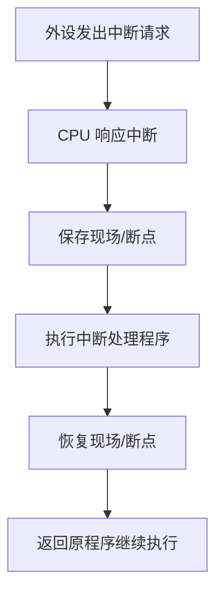

# 中断技术：设备怎么“举手”告诉 CPU

## 痛点：CPU 忙自己的事，外设来了消息咋办？

CPU 正在跑程序，可打印机突然吐完了、键盘被敲了一下、网卡到了新数据——这些外设“有事了”，但 CPU 不能干等着它们，否则又回到老问题（死等）。

那怎么办？让 CPU 平时安心干自己的活，**外设一有事就“举起手”打断 CPU**，CPU 暂停手头的事去处理，处理完再回去接着干。这就是中断。

中断要解决的核心问题：**让慢而多的外设能“随时报告”事件，CPU 不必轮询等待，平时专心干活，有事件才响应。** 就像老师（CPU）正改作业，学生（外设）有问题就举手——不用老师轮流盯着每个学生。

> 记一句：**中断 = 外设“举手上报”，CPU 暂停手头去处理，完事再回来。比“挨个点名轮询”省事太多。**

## 定义（讲人话）

中断：CPU 执行程序过程中，遇到**外部事件或内部异常**，暂停当前程序，转而执行处理该事件的中断处理程序，处理完再返回原程序继续执行。

## 中断的分类（含“怎么认”）

| 分类            | 来源          | 是什么              | 怎么认               |
| ------------- | ----------- | ---------------- | ----------------- |
| **外中断（硬件中断）** | 来自 CPU 外部设备 | 外设请求（I/O 完成、时钟）  | 题里说“外部设备、硬件请求”    |
| **内中断（异常）**   | CPU 内部      | 指令执行中出错（除零、越界）   | 题里说“除零、非法指令、内部异常” |
| **软中断**       | 程序主动发       | 系统调用（主动请求操作系统服务） | 题里说“系统调用、trap”    |

> 关键区分：**外中断=外部设备“举手”，内中断=CPU 自己“出状况”（除零等异常），软中断=程序主动“喊一声要服务”。** 分清来源是常考点。

## 中断处理过程（重点顺序）

> 图的意思：**请求→响应→保存现场→处理→恢复现场→返回**。硬件通常先保存断点和必要状态，中断服务程序再保存通用寄存器等现场；题目若区分“断点”和“现场”，要按这一层次作答。

## 中断判优（多个中断同时来，谁先？）

当多个中断同时到达，CPU 要先处理**优先级高**的。具体次序由系统的硬件设计、中断控制器配置和软件策略共同决定，不能把某一种设备顺序当成普遍规律。

> 记一句：**多个中断一起到，按优先级排座次先处理，硬件/紧急的先来。**

## 这个知识与考试的关系

- **选择题**：问“中断响应首先做什么”→ 保护现场；问“外中断来源”→ 外部设备；问“除零属于”→ 内中断（异常）。
- **经典陷阱**：把“软中断”说成外部设备请求（错，它是程序主动发起的系统调用）；把“内中断”说成外设（错，内中断是 CPU 内部异常）。
- **考点**：中断属于上篇 I/O 控制里的“中断方式”那一环，它让 CPU 不用轮询死等。

## 记忆口诀

> **外设举手是外中断，CPU 出状况是内中断，程序主动喊是软中断；响应先保存现场，多个一起按优先级来。**

## 下一站

> 顺着主线往下走，该看 **[[校验码]]**——给数据传输加防错保险。
> 想回看这一段怎么来的，回 **[[IO控制技术]]**——看CPU怎么从亲力亲为变甩手掌柜。
