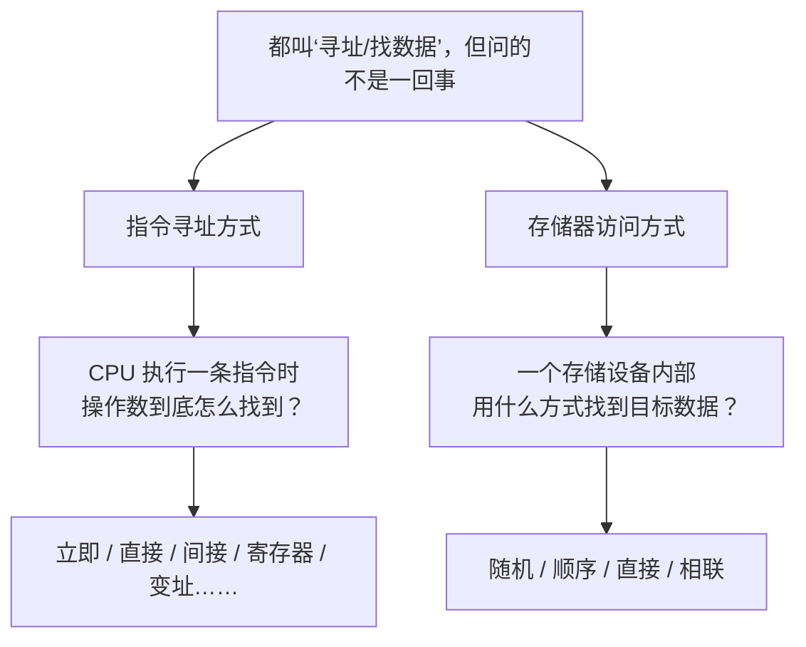

# 存储器访问方式：同样是“找数据”，四种存储器走四条路

## 先从一个你刚踩过的坑开始

题目突然扔给你四个词：

> 随机存储器、顺序存储器、直接存储器、相联存储器。

你第一反应很可能是：

> “等等，我不是学过立即寻址、直接寻址、间接寻址吗？怎么又来一个‘直接’？”

这里最关键的一步不是背答案，而是先把**两套完全不同的问题**分开。



> [!important] 先记住
> **立即、直接、间接**是在讲“CPU 指令怎么找操作数”；  
> **随机、顺序、直接、相联**是在讲“存储器怎么访问数据”。
>
> 两套里都有“直接”，但不是同一个概念。

---

## 假设你去一个巨大仓库找箱子

仓库里有 10 万个箱子，你现在要找其中一个。

不同仓库的“找法”不一样，这就对应四种存储器访问方式。

## 1. 随机存取：知道门牌号，直接跳过去

想象仓库每个格子都有唯一编号：

> A 区 9527 号。

工作人员拿到编号后，不需要从 1 号开始一路找过去，直接就能访问 9527 号。

这就是：

> **随机存取（Random Access）**

典型代表：

> **主存 RAM**

“随机”不是“随便乱找”，而是说：

> **访问任意一个存储单元，主要靠地址直接定位，访问时间基本不取决于它排在前面还是后面。**

### 初学者记法

> **知道地址 → 直接跳过去。**

---

## 2. 顺序存取：像磁带，只能从前往后走

现在仓库换成了一条很长的传送带。

你要找第 5000 个箱子，但箱子只能按顺序经过你面前：

```text
1 → 2 → 3 → 4 → …… → 4999 → 5000
```

你不能直接“瞬移”到第 5000 个。

这就是：

> **顺序存取（Sequential Access）**

典型代表：

> **磁带**

它最大的特点是：

> **访问时间与数据所在的位置有关。**

### 初学者记法

> **排队找，从前往后。**

---

## 3. 直接存取：先跳到大区域，再在区域里找

这个名字最容易和“直接寻址”混淆。

这次仓库非常大，分成很多区。

你可以先快速到：

> 第 8 区。

但到了第 8 区之后，还要继续寻找：

> 第 8 区里的第 37 个箱子。

也就是说：


这就是：

> **直接存取（Direct Access）**

经典教材例子：

> **磁盘**

以传统磁盘理解最直观：

1. 先把磁头移动到目标磁道；
2. 再等待目标扇区旋转到磁头下面；
3. 然后读取。

所以它不像 RAM 那样“一步访问任意单元”，也不像磁带那样必须从最前面一直走。

### 初学者记法

> **先跳到一大片，再找最后一小段。**

---

## 4. 相联存取：我不知道地址，但我知道“它长什么样”

最后一种更特殊。

你根本不知道数据在哪，只告诉系统：

> “帮我找内容里符合这个关键特征的数据。”

系统不是先拿到一个普通地址，再去那个地址读数据，而是：

> **根据内容特征进行匹配。**

这就是：

> **相联存取（Associative Access）**

也常看到：

> **CAM：Content Addressable Memory，内容可寻址存储器**

对比一下：

```text
普通地址访问：
地址 ──→ 数据

相联访问：
内容特征 ──→ 匹配的数据
```

### 初学者记法

> **不知道在哪，只知道要找什么。**

---

## 四种方式一张表看懂

| 方式 | 人话 | 典型例子 | 一眼识别 |
| --- | --- | --- | --- |
| **随机存取** | 给地址，直接访问任意单元 | RAM | 任意位置访问时间基本相近 |
| **顺序存取** | 必须按顺序一路找 | 磁带 | 前面的数据不走完，后面够不着 |
| **直接存取** | 先定位大区域，再找具体位置 | 磁盘 | 先粗定位，再精确找到目标 |
| **相联存取** | 按内容匹配，不靠普通地址找 | CAM | 题干出现“按内容查找/匹配” |

> **口诀：随机直接跳，顺序排队找，直接先到区，相联看内容。**

---

# 最重要：两个“直接”千万别混

你已经学过 [[指令寻址方式]]，那里也有：

> **直接寻址**

但它和本篇的：

> **直接存取**

只是中文里都出现了“直接”两个字。

| 对比 | 指令的直接寻址 | 存储器的直接存取 |
| --- | --- | --- |
| 在问什么 | CPU 怎么找到操作数？ | 存储设备内部怎么访问数据？ |
| 属于哪套概念 | 指令寻址方式 | 存储器访问方式 |
| “直接”的意思 | 指令给出操作数所在地址 | 先定位到目标区域，再到具体数据 |
| 常见搭档 | 立即、间接、寄存器、变址 | 随机、顺序、相联 |
| 典型语境 | 指令地址字段 | 磁盘 |

### 考场看到“直接”先问一句

> **题目是在问 CPU 指令，还是在问存储器？**

如果说：

> “操作数在指令中 / 地址的地址 / 寄存器……”

这是：

> [[指令寻址方式]]

如果说：

> “随机 / 顺序 / 相联 / 磁带 / 磁盘……”

这是：

> **本篇的存储器访问方式**

---

## 关于题库分类口径的提醒

不少教材把：

> **随机、顺序、直接、相联**

一起放在“按存取/访问方式分类”下面。

有些题目又会进一步强调：

- 随机、顺序、直接主要根据**位置/地址**访问；
- 相联根据**内容**匹配访问。

所以看到“按寻址方式”这类措辞时，要看题目采用的分类口径。

> [!warning] 稳定不变的是原理
> **随机 = 任意地址访问；顺序 = 按顺序；直接 = 先定位区域再找；相联 = 按内容匹配。**
> 不要因为题库用词略有差异，把这四种方式本身学乱。

---

## 自测：现在你应该能秒答

1. 磁带为什么属于顺序存取？
2. 磁盘为什么叫直接存取，却不等于 RAM 的随机存取？
3. CAM 最特别的地方是什么？
4. “立即寻址、间接寻址”属于存储器访问方式吗？
5. “直接寻址”和“直接存取”是不是同一个概念？

## 一句话收尾

> **存储器四种找法：随机靠地址直接跳，顺序从前排队找，直接先定位区域再找，相联拿内容去匹配。**

## 下一站

- 上一篇：[[存储层次与主存]]
- 下一篇：[[Cache]]

如果再次看到“立即 / 直接 / 间接”，回 [[指令寻址方式]]，先确认自己正在回答的是“CPU 怎么找操作数”。
