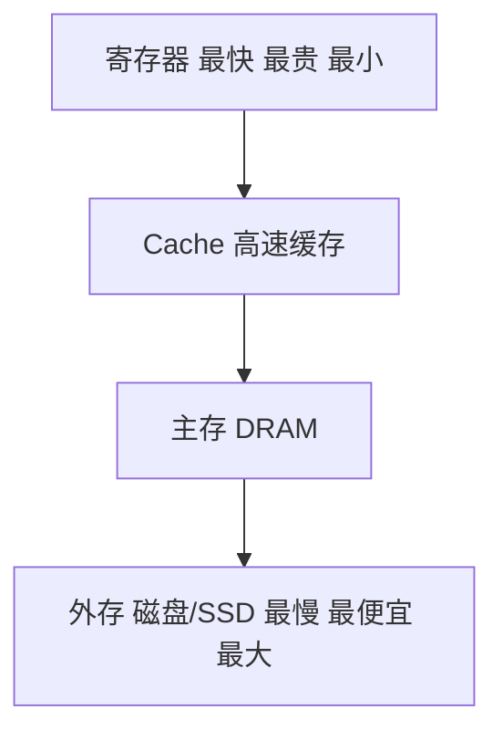

# 存储层次与主存：CPU 的“记忆金字塔”

## 痛点：CPU 太快，内存太慢，怎么办？

CPU 算一条指令用纳秒级，磁盘却要毫秒级——差了上百万倍。如果把所有数据都放磁盘，CPU 就整天干等；全放最快的寄存器，又贵到破产。快和便宜，鱼和熊掌难兼得。

那怎么办？计算机想出一个“分层”的主意：**别用一个存储装所有东西，而是把存储分成好几层，快而贵的放最要紧的数据，慢而便宜的放大批数据**——让 CPU 绝大多数时候都能就近拿到数据。

既然要分层，就得先知道“金字塔”到底有几层、每层是什么。这正是下面要逐层认识的。先看这一层层的构成：

## 逐层认识

| 层 | 是什么 | 特点 |
| --- | --- | --- |
| **寄存器** | CPU 内部 | 最快，但数量极少、最贵 |
| **Cache** | CPU 和主存之间的高速缓存 | 快，放最热的数据（SRAM 做） |
| **主存** | 内存 RAM | 程序运行的地方（DRAM 做） |
| **外存** | 磁盘/SSD | 慢，但大而便宜，掉电不丢 |

### 记忆金字塔一张图

> 越往上越快越贵越小，越往下越慢越便宜越大。CPU 取数据从金字塔尖往下找。

> 注意表里已经埋了个伏笔：Cache 是 SRAM 做、主存是 DRAM 做——**明明是两种芯片在干两种活**。你可能会问：凭什么这两层用不同的芯片？这就引到下面最重要的一对对比。

可细想一层：这些层这么排，**凭什么就能让 CPU 更快地拿到数据？** 分层理论的地基是“局部性原理”，下一节讲它：

## 局部性原理（Cache 为什么管用）

1. **时间局部性**：刚访问的数据，很快还要再访问（比如循环里的变量）。
2. **空间局部性**：刚访问的数据附近，很快也会被访问（比如挨个读数组）。

> 一句话：程序其实总是“盯着”一小块地方反复用（循环 + 数组占了大部分运行时间），天然高度集中。既然访问这么集中，把最热的数据放最快的那层（Cache），CPU 命中率就高，也就变快了——这就是分层能提速的底气。

那“很快的那层 Cache”和“存程序的这层主存”，到底用什么芯片做的？这就是上一节那个伏笔的答案——SRAM 和 DRAM，分工完全不同：

## SRAM vs DRAM（谁当缓存、谁当内存）

| 对比项 | SRAM | DRAM |
| --- | --- | --- |
| 原理 | 触发器（双稳态） | 电容（存电荷） |
| 速度 | 快 | 慢 |
| 价格 | 贵 | 便宜 |
| 刷新 | 不需刷新 | 需按器件规定的刷新周期定期刷新，防止电荷泄漏 |
| 掉电 | 丢失 | 丢失 |
| 用途 | 做 Cache | 做主存 |

> 记住这一句就够：**SRAM 做缓存（快、贵、不刷新），DRAM 做内存（慢、便宜、要刷新）。** 一个图快、一个图便宜，各司其职。

到这里讲的全是“掉电就丢”的 RAM。但你肯定想过：**开机的时候，电脑凭什么不用插着电就能记住怎么启动？** 那就要“掉电不丢”的存储器出场了：

## ROM：掉电不丢，是“只读”家

- **RAM**（主存）：掉电全丢，临时存放运行的程序。
- **ROM**（只读存储器）：掉电不丢，存开机必需的固定程序。演化：MROM → PROM → EPROM → EEPROM → Flash。

> 关键区分：**RAM 掉电丢（临时），ROM 掉电不丢（固定）。** 题里问“掉电不丢失的是”→ ROM。

存储的“用什么芯片”讲完了，可还有一个实际问题没解决：**生产上当一块芯片不够用、要拼出一块大内存时，怎么用几片小芯片拼起来？** 这就是最后一节：

## 这个知识与考试的关系：存储器扩展计算

常考“用几片小芯片拼成大内存”，两种拼法：

| 扩展方式 | 干什么 | 公式 |
| --- | --- | --- |
| **位扩展** | 拼“字长”（每个字变宽） | $\frac{需要位宽}{单片位宽}$ |
| **字扩展** | 拼“容量”（地址数变多） | $\frac{总容量}{单片容量}$ |

**完整示例**：用 8K×8 位芯片，组成 64K×8 内存。
- 字扩展（容量翻倍）：64K ÷ 8K = 8 片
- 若要先位扩展再字扩展，按“位×字”逐层乘。

**易错点**：别把“位扩展”（加宽，算位宽比）和“字扩展”（加深，算容量比）搞混——位=拼宽度，字=拼深度。

## 记忆口诀

> SRAM 做缓存、DRAM 做内存、ROM 掉电不丢；分层靠局部性原理变快；位扩展拼宽度、字扩展拼深度。

## 下一站

> 顺着主线往下走，该看 **[[存储器访问方式]]**——随机、顺序、直接、相联到底是四种什么“找数据”的方法。
> 想回看这一段怎么来的，回 **[[Flynn分类法]]**——按并行度给计算机排座次。
