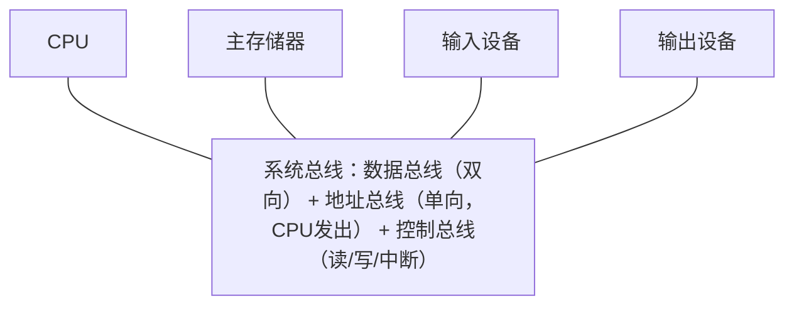
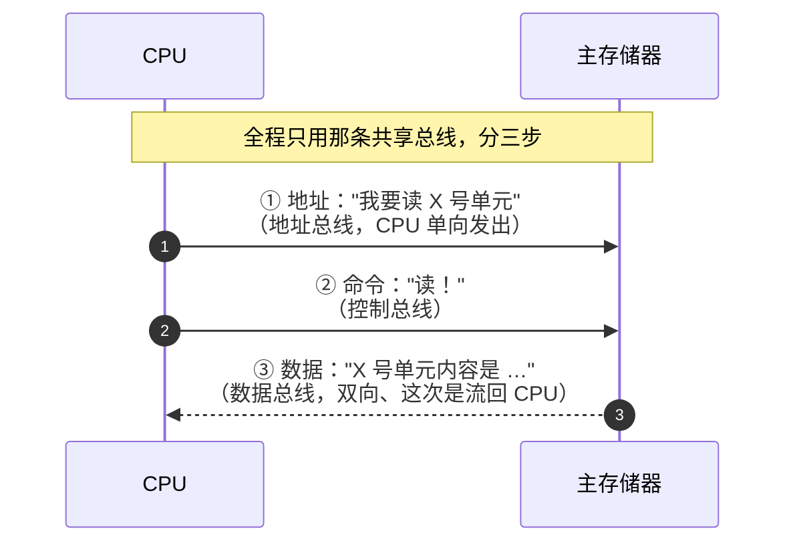

# 总线：计算机各部件的“高速公路”

## 痛点：五大部件之间怎么传数据？

计算机有运算器、控制器、存储器、输入、输出五大部件。它们要交换数据——指令要走、数据要搬、控制信号要发。但总不能每两个部件之间都拉一堆专用连线吧？那会乱成一团、线缆爆炸。

于是有了**总线**：一条（或一组）供全机共享的传输通道，让各部件都挂到这条“高速公路”上，谁需要数据谁通过它传。这就像一根共同的数据管道，大家共用，不必两两连线。

总线要解决的核心问题：**用一组共享的通道，让 CPU、内存、外设之间有条不紊地传地址、传数据、传控制信号，而不是部件之间各自拉线。** 考试重点就是三种总线各自“传什么、怎么认”。

> 记一句：**总线 = 各部件的公共“高速公路”，分三类：一条传地址、一条传数据、一条传控制。**

## 结构图：五大部件挂在总线上

### 图1：部件都挂在同一条总线上

> 结构上看：所有部件共用一条通道，谁用谁占线。

### 图2：数据是怎么“走”总线的（以 CPU 读内存为例）

> 过程上看：**先给地址、再下命令、最后数据回流**。三条总线各干一件事，这就是它们分工的意义——也是“数据总线双向、地址总线单向”这个考点的出处。

## 定义（讲人话）

总线是一组为多个部件共享的传输线路，把中央处理器、存储器、I/O 设备等连接起来，用于在各部件间传送**数据、地址和控制信号**。

## 三种总线逐个认识（含“怎么认”）

| 总线 | 传什么 | 作用 | 怎么认 |
| --- | --- | --- | --- |
| **数据总线** | 数据本身 | 传送数据，宽度决定一次传多少位 | 题里说“传送数据” → 数据总线 |
| **地址总线** | 地址（门牌号） | 传送要访问的内存/设备地址 | 题里说“访问哪个单元” → 地址总线 |
| **控制总线** | 控制信号 | 传送读/写/中断等控制命令 | 题里说“读写控制、中断” → 控制总线 |

**关键区分（常考）：**
- **数据总线** = 车道多宽（决定一次总线传输能传多少位）——通常双向；总线宽度与 CPU 字长相关，但不必然相等。
- **地址总线** = 门牌号有多少位（若按字节编址，$N$ 位可寻址 $2^N$ 字节）——通常由 CPU/总线主设备发出。
- **控制总线** = 红绿灯和交警（读/写/中断信号）。

> 一句话记：**数据总线管“每次传几位”，地址总线管“有多少个地址（$2^N$）”，控制总线管“发什么命令”。**

## 另一个分类角度：串行 vs 并行（按一次传几位分）

上面三种总线是按“**传什么内容**”分的；还有一种常见的分类是按“**一次传几个位**”分：

| 分法 | 怎么传 | 比喻 | 优点 | 缺点 | 典型例子 |
| --- | --- | --- | --- | --- | --- |
| **并行总线** | 多根线，一次同时传多位（如 8/16/32 位） | 8 车道大马路，一趟运一整队人 | 速度理论更快 | 线多、成本高、长距离时各位到达时间不一致（信号偏移），难以提速 | 早期内部总线、老式并口打印机（LPT）、IDE 硬盘线 |
| **串行总线** | 一根线一位一位排队传 | 单车道小路，一个一个过 | 线少、省成本、抗干扰好、长距离可靠，靠提高频率跑得飞快 | 同频率下单次吞吐低于并行 | USB、SATA、PCIe、网线 |

**关键理解（也是近年考向）：**
- 并行“快”是老观念——线的数量限制了频率和数据宽度；如今**串行靠高频 + 差分信号反超**，所以现代高速接口几乎全是串行的（PCIe 就是“串行的 PCI”）。
- 题目常见问法：“以下属于串行总线的是”→ 认准 **USB / SATA / PCIe**；“适合长距离、抗干扰” → 串行。

> 一句话记：**并行用多根线同时传多位，吞吐高但线多、偏斜明显；串行用较少线路按位传，靠高频和编码提升速率。**

## 这个知识与考试的关系

- **选择题**：问“数据总线宽度决定什么”→ 一次总线传输的位数；问“地址总线位数决定什么”→ 地址数量为 $2^N$，再结合编址单位求容量。
- **经典陷阱**：把地址总线说成“传数据”❌；把数据总线说成“单向”❌（数据总线双向，地址总线单向）。
- **考点**：地址总线 $N$ 位 → 可寻址 $2^N$ 个存储单元；容量还要乘每个编址单元的大小。
- **分类别混淆陷阱**：数据/地址/控制是按“传什么”分，串行/并行是按“一次传几位”分，**两个维度不冲突**（一条串行总线上同样在传数据和地址）。题目问“属于哪类”时先看清它问的是哪个维度。
- **权重提示**：架构师考试里“三种总线”几乎每年都涉及，是必背主干；串行/并行近年偶有选择题（判断 USB/PCIe 属于串行、比较优缺点），属于低频但送分的次要考点。

## 记忆口诀

> **数据总线宽=一次传几位，地址总线 $N$ 位=可寻址 $2^N$ 个单元，控制总线发命令。**

## 下一站

> 顺着主线往下走，该看 **[[IO控制技术]]**——看CPU怎么从亲力亲为变甩手掌柜。
> 想回看这一段怎么来的，回 **[[外存与RAID]]**——看数据放哪安全够大够快。
