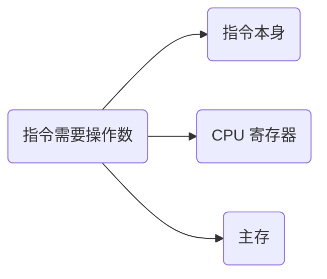

# 指令寻址方式：CPU 去哪找要用的数据

## 痛点：一条指令知道“要算什么”，但操作数到底在哪？

前面 [[CPU内部组成-寄存器体系]] 已经知道：

- **寄存器就在 CPU 内部**；
- CPU 既可以直接使用寄存器里的数据，也可以访问主存中的数据。

因此这里直接从“操作数可能放在哪里”来理解：

> **一条指令需要操作数时，这个操作数到底放在哪里？CPU 应该按照什么方式找到它？**

操作数常见有三种位置：

- **直接写在指令里**；
- **放在 CPU 内部寄存器里**；
- **放在主存里，需要根据地址去找**。

这就是寻址方式存在的原因。

> **寻址方式 = 指令告诉 CPU“去哪里、按什么规则找到操作数”。**

---

## 定义（讲人话）

寻址方式描述的是：

> **CPU 根据指令中提供的信息，怎样确定操作数的位置并取得它。**

所以判断一种寻址方式时，先问两个问题：

1. **操作数最终在哪里？**
2. **指令里给的是操作数本身，还是地址 / 寄存器信息？**

> [!warning] 别和存储器访问方式混了
> 本篇的“立即 / 直接 / 间接 / 寄存器 / 变址”是在回答：**CPU 指令怎样找到操作数？**
>
> [[存储器访问方式]]里的“随机 / 顺序 / 直接 / 相联”是在回答：**存储设备本身怎样访问数据？**
>
> 两套概念里都有“直接”，但不是同一个概念。

---

## 逐种认识

| 寻址方式 | 操作数最终在哪 | 指令提供什么 | CPU 怎么找 | 怎么认 |
| --- | --- | --- | --- | --- |
| **立即寻址** | 指令本身 | 操作数 | 直接使用 | “操作数就在指令中” |
| **寄存器寻址** | CPU 寄存器 | 寄存器编号/名称 | 直接读取寄存器 | “操作数在寄存器” |
| **直接寻址** | 主存 | 操作数地址 | 按给出的地址访问主存 | “指令直接给地址” |
| **间接寻址** | 主存 | 保存有效地址的位置 | 先找到地址，再按地址取操作数 | “地址的地址” |
| **变址寻址** | 主存 | 地址信息 + 变址寄存器 | 计算有效地址后访问主存 | “基址/地址 + 变址量” |

先不要死背名字，抓住“操作数最终在哪”：

> **立即：就在指令里。**  
> **寄存器：就在 CPU 里的寄存器。**  
> **直接 / 间接 / 变址：最终通常都要去主存找。**

---

## 直接寻址和间接寻址为什么容易混？

假设真正的数据放在主存地址 1000。

### 直接寻址

指令直接告诉 CPU：

> “数据就在地址 1000。”

于是：

$$
A=1000
$$

CPU 直接去地址 1000 取操作数。

### 间接寻址

指令给出的地址并不直接放数据，而是先放着另一个地址。

例如：

- 指令给出地址 500；
- 主存 500 中保存 1000；
- 真正的数据在主存 1000。

于是：

> **先到 500 取出有效地址 1000，再到 1000 取真正数据。**

所以：

> **直接寻址：给数据地址。**  
> **间接寻址：先给“地址所在的位置”。**

---

## 为什么寄存器寻址通常更快？

因为寄存器就在 CPU 内部。

寄存器寻址时，操作数已经在 CPU 手边，不需要为了取得这个操作数再访问主存。

这和 [[CPU内部组成-寄存器体系]] 的知识正好接上：

> **寄存器负责 CPU 内部高速暂存；寄存器寻址就是直接从这些高速暂存单元中取操作数。**

因此不要再把“寄存器”和“CPU”理解成两个并列位置。

---

## 这个知识与考试的关系

常见题眼：

- “操作数直接包含在指令中” → **立即寻址**
- “操作数在寄存器中” → **寄存器寻址**
- “指令给出操作数地址” → **直接寻址**
- “地址的地址” → **间接寻址**
- “变址寄存器参与形成有效地址” → **变址寻址**

高频坑：

- 寄存器寻址不是“去 CPU 外找数据”，寄存器本来就在 CPU 内；
- 立即寻址给的是**操作数本身**，不是操作数地址；
- 直接寻址和间接寻址的核心区别，是是否还要再取一次有效地址。

---

## 一句话记住

> **寻址方式不是在问“数据在不在 CPU”，而是在问“这条指令的操作数在哪里，CPU 怎么找到它”。**

> **指令里直接带数 → 立即；CPU 寄存器里 → 寄存器；主存里 → 根据地址继续找。**

---

## 自测

1. 寄存器寻址时，操作数是在 CPU 内还是 CPU 外？
2. 立即寻址和直接寻址最根本的区别是什么？
3. 为什么间接寻址比直接寻址多绕一步？
4. “指令里给出的是寄存器编号”属于什么寻址方式？
5. 寻址方式真正解决的核心问题是什么？

## 下一站

- 前置：[[CPU内部组成-寄存器体系]]
- 下一站：[[指令流水线]]
- 相关：[[存储器访问方式]]
