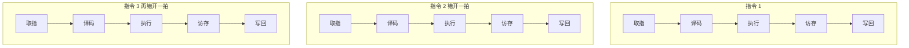

# 指令流水线：让 CPU 的车间同时开工

## 痛点：一条算完再算下一条，太浪费了

CPU 执行一条指令要经过"取指→译码→执行→访存→写回"5 个步骤，每一步占一个"工位"。问题来了：如果**一条指令跑完 5 个工位，下一条才开工**，那 5 个工位里时刻有 4 个是闲着的——CPU 花大价钱建了 5 个工位，却一次只用 1 个。

> **先澄清和 [[CPU内部组成-指令执行过程]] 的关系**：那张卡说的"取指→译码→执行"是**宏观三阶段**（逻辑上分三步步）。本篇的5段是**为了流水线并行，把"执行"拆细成"执行→访存→写回"**的微观切法。同一个 CPU 工作，两种粒度：三阶段看"节奏"，五段看"怎么切成能重叠的小段"。不是矛盾的两种执行。

想象洗车店 5 个工位（冲洗→泡沫→擦洗→打蜡→抛光）。最笨的做法是一辆车洗完下一辆才进厂——**工位大量闲置**。聪明的做法是流水线：5 辆车排队，每辆前进一个工位，下一个时间点就有下一辆车补上——**连续出车，不再闲置**。

指令流水线就是这个道理：让多条指令的不同阶段在时间上重叠进行。它要解决的核心问题：**怎么让 CPU 的各个工位同时工作，而不是干等，从而让整个系统吞吐量成倍上升。**（这也是前面 [[CPU指令集 CISC与RISC]] 里 RISC 指令定长的好处兑现之处）

> 记一句：**流水线 = 让多条指令“排队进车间、重叠着干”,不再一条做完才做下一条。**

## 定义（讲人话）

流水线把一条指令的执行拆成多段（取指→译码→执行→访存→写回），让**多条指令的不同段在时间上重叠进行**，从而提高吞吐率。

### 五段流水线怎么重叠跑

> 图的意思：三条"车道"错开一拍——上面一条走到"译码"时，下一条就开始"取指"，五个工位各忙各的，谁也不空等。

## 关键概念：被最慢的工位卡住

流水线整体节奏由**最慢的一段**决定。就像洗车店打蜡要 4 分钟，全厂节奏就是 4 分钟/辆——其他工位再快也要等打蜡。

## 这个知识与考试的关系：四大计算，必考

流水线这块考试几乎全考计算，四连背：

1. **流水线周期**：取最慢一段的时间

$$\Delta t = \max(\text{各段时间})$$

2. **总时间**（$n$ 条指令）：先分清理论公式与按实际段时长计算

若 $k$ 段都被理想均衡成同一周期 $\Delta t$：

$$T_{\text{理论}}=(k+n-1)\Delta t$$

若题目给出各段实际耗时，第一条要经历各段实际时间：

$$T_{\text{流水}} = \sum \text{各段时间} + (n-1) \times \Delta t$$

> 推导逻辑：第 1 条要完整走完所有段（各段时间相加）；之后每一条只需再过一个周期（前面已经在流水线上接力）。

3. **加速比**：

$$S = \frac{T_{\text{串行}}}{T_{\text{流水}}}$$

4. **吞吐率**：

$$TP = \frac{n}{T_{\text{流水}}}$$

**完整示例**：各段耗时 2、3、4、3 分钟，10 条指令。

- 周期 = 最慢段 = 4 分钟
- 总时间 = 第 1 条全段 $(2+3+4+3) + (10-1)\times 4 = 12 + 36 = 48$ 分钟
- 串行时间 = 每条 12 分钟 × 10 条 = 120 分钟
- 加速比 = $\frac{120}{48} = 2.5$
- 吞吐率 = $\frac{10}{48} = \frac{5}{24}$ 条/分钟

**易错点**：题目问“理论公式”常用 $(k+n-1)\Delta t$；给出不等长各段并要求实际时间时，才用 $\sum t_i+(n-1)\Delta t$。

## 三类"相关"：流水线的三大刺客（防混淆）

流水线会因指令之间互相干扰而卡壳，三类要分清：

| 相关类型 | 问题 | 常见解决 | 怎么认 |
| --- | --- | --- | --- |
| **结构相关** | 多条指令抢同一个硬件 | 硬件冗余、指令缓存 | 题里说"抢同一部件" |
| **数据相关** | 后一条依赖前一条的结果 | 转发、插入气泡 | 题里说"后一条依赖前一条" |
| **控制相关** | 跳转指令预取失效 | 分支预测、延迟槽 | 题里说"跳转、分支" |

> 最容易搞混的是**数据相关**：题干说"后一条指令要用前一条的结果"→ 一定是数据相关。

## 记忆口诀

> **周期看最长，首条满程跑，后面每周期出一条。**（计算口诀）  
> **结构抢硬件，数据靠前条，控制怕跳转。**（三类相关）

## 下一站

> 顺着主线往下走，该看 **[[Flynn分类法]]**——按并行度给计算机排座次。
> 想回看这一段怎么来的，回 **[[指令寻址方式]]**——看CPU去哪找要用的数据。
