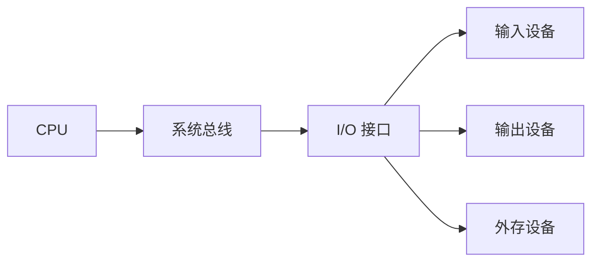

# 计算机系统组成：一套看懂整台机器怎么拼

## 痛点：让一台计算机“换程序不换硬件”

1946 年的 ENIAC 是 30 吨、1.8 万个电子管的庞然大物，但它的“编程”靠**人工插拔线路板**——换一道题就要重新布一次电路，等于“改程序=改硬件”。这就是“一题一机”：要做不同类型的题，就得重新造一台机器，通用计算根本无从谈起。

冯·诺依曼看破了这个问题，提出天才解法，这也正是**整台计算机的组成逻辑**：

> **把“程序”也当成“数据”，和操作的数据一起存进机器里。** 这样换程序只需换内存里的内容，不用换硬件——通用计算机从此诞生。

要理解整台机器怎么拼，抓住三件事：**存储程序原理（为什么能通用）、五大部件（靠什么分工）、指令驱动（怎么跑起来）**。这套骨架，就是下面整块“计算机组成与体系结构”的学习地图。

> 记一句：**冯·诺依曼 = “程序也是数据，存进机器换程序不换硬件”——五大部件按此分工，靠逐条取指译码执行跑起来。**

## 定义（讲人话）

基于冯·诺依曼“存储程序”原理的计算机，由五大部件组成，把**程序与数据同存于存储器**，靠控制器逐条取指、译码、驱动运算器执行，实现“换程序而不换硬件”。

## 三根支柱

| 支柱 | 是什么 | 对应下面的学习卡 |
| --- | --- | --- |
| **存储程序原理** | 指令和数据同存，是通用性的根源 | [[数据表示与编码-进制转换]]（数据怎么表示） |
| **五大部件** | 输入/存储/运算/控制/输出分工 | [[CPU内部组成-运算器与控制器|运算器与控制器]]（核心分工） |
| **指令驱动** | 取指→译码→执行循环 | [[CPU内部组成-指令执行过程]]（怎么跑） |

## 五大部件一句话

- **输入设备**：把程序和数据送进来
- **存储器**：存程序和数据（[[存储层次与主存]]、[[Cache]]、[[外存与RAID]]）
- **运算器**：算术与逻辑运算（[[CPU内部组成-运算器与控制器|运算器与控制器]]）
- **控制器**：发出控制信号，协调各部件（[[CPU内部组成-运算器与控制器|运算器与控制器]]、[[CPU内部组成-寄存器体系]]）
- **输出设备**：把结果吐出去

输入/输出设备通常不直接接到 CPU 内部，而是通过**接口**连接总线。接口负责地址译码、数据缓冲、速度匹配、格式转换和状态/控制信号协调；键盘、显示器、磁盘、打印机等属于外部设备，接口与驱动共同把设备差异屏蔽起来。

> 怎么认：题干出现“速度匹配、缓冲、状态寄存器、设备控制”时，优先想到 I/O 接口；出现“具体键盘、磁盘、显示器”时，是外设。

## 本块知识地图（按学习顺序串起来）

- 先看**数据怎么表示**：[[数据表示与编码-进制转换]] → [[数据表示与编码-原反补移码]] → [[数据表示与编码-定点与浮点]]（字符编码基本不考，了解即可）
- 再看**CPU 怎么组成**：[[CPU内部组成-运算器与控制器|运算器与控制器]] → [[CPU内部组成-寄存器体系]] → [[CPU内部组成-指令执行过程]]
- 然后 CPU **怎么说指令**：[[CPU指令集 CISC与RISC]] → [[指令寻址方式]] → [[指令流水线]] → [[Flynn分类法]]
- 接着处理**记忆**：[[存储层次与主存]] → [[Cache]] → [[外存与RAID]]
- 再处理**部件间通信**：[[总线]] → [[IO控制技术]] → [[中断技术]]
- 数据传输的**防错**：[[校验码]] → [[海明码]]
- 最后**验收**：[[计算机性能指标与Amdahl定律]]

> 学习顺序口诀：**表示 → CPU → 指令 → 记忆 → 通信 → 防错 → 度量。** 这也是[[学习路线]]的“七大关”底层。

## 这个块与考试的关系

这一块是上午综合知识的基础得分区（常考 CPU 部件归属、指令流水线计算、Cache、RAID、中断、校验码、性能指标等，计算题多）。每一张卡都带“怎么认”和“这个知识与考试的关系”，按卡学完即覆盖考法。

## 下一站

> 顺着主线往下走，该看 **[[数据表示与编码-进制转换]]**——学会把十进制转成机器能认的0/1。
