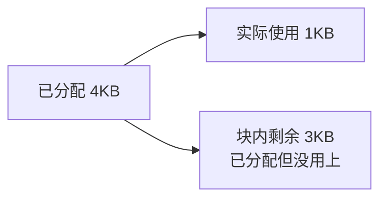
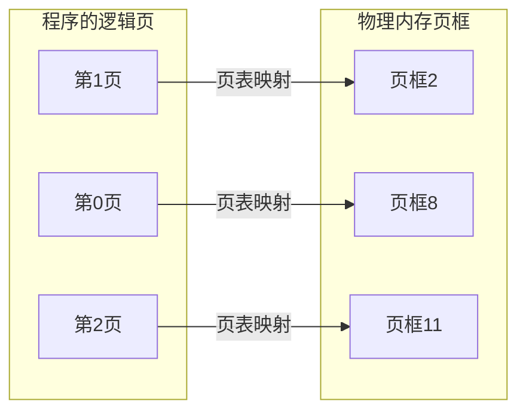
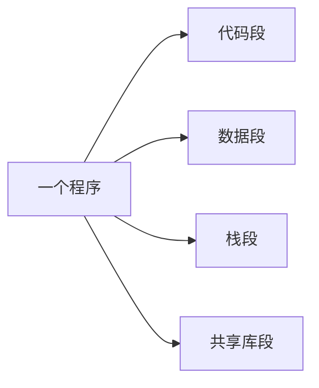
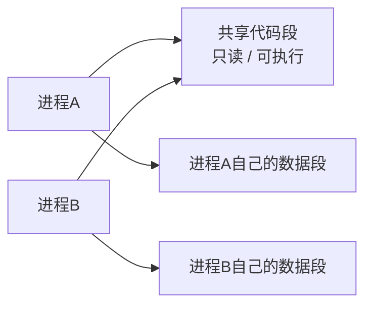

# 存储管理：程序怎么住进内存，地址怎么从逻辑变物理

## 先说为什么需要存储管理

程序写出来时，并不知道自己运行时会被放到物理内存的哪个位置。

程序看到的是自己的地址；真正运行时，操作系统可能把它放到物理内存的任意位置。

所以先分清三个概念：

- **逻辑地址**：程序自己看到的地址。
- **物理地址**：真实内存中的地址。
- **地址转换**：把逻辑地址翻译成物理地址。

> **程序只管自己的逻辑地址，操作系统负责把它翻译成真实物理地址。**

先用一张图把整章的核心问题定住：

> **后面的分页、分段、段页式，本质上都在解决“中间这一步怎么翻译”。**

---

## 一、最早的思路：分区管理

最直接的办法是：

> **给一个进程找一整块连续内存，把它整个放进去。**

例如：

~~~text
进程A → 连续20MB
进程B → 连续10MB
进程C → 连续30MB
~~~

这种方法简单，但会带来碎片问题。

### 什么叫碎片？

碎片就是：

> **内存里虽然还有空闲空间，但因为分配方式的问题，这些空间没有被充分利用。**

#### 内部碎片

已经分配出去的一整块空间内部，还有一部分没用完。

~~~text
分给进程：4KB
实际使用：1KB
浪费：    3KB
~~~

这 3KB 在已经分配出去的块内部，所以叫**内部碎片**。

#### 外部碎片

空闲空间散落在很多已分配区域之间，总量可能够，但不连续。

~~~text
已占 | 空2MB | 已占 | 空4MB | 已占 | 空5MB
~~~

总空闲有 11MB，但如果某个进程需要连续 10MB，仍然放不进去。

这就是**外部碎片**。

两种碎片不要挤在一张图里看。它们关注的位置不同，分开画更容易读。

**内部碎片：看“块里面”。**

> **内部碎片 = 已经分出去的块里面，还有没用完的空间。**

**外部碎片：看“块之间”。**

> **外部碎片 = 空闲空间散落在已分配块之间，总量可能够，但不连续。**

一句话区分：

> **内部碎片看块里面；外部碎片看块之间。**

### 外部碎片怎么处理？

一种办法叫**紧凑（Compaction，也叫压缩）**。

先看整理前：

这时虽然总空闲有 11MB，但空闲空间被切散了。

紧凑做的事情就是：

> **把已占用区域向一边移动，让零散空闲区合并到一起。**

整理后：

这样原来分散的：

~~~text
2MB + 4MB + 5MB
~~~

就变成：

~~~text
连续 11MB
~~~

所以如果某个进程需要连续 10MB，现在就能放进去了。

> **看图记：紧凑不是增加内存，而是把“散着的空闲”搬成“一整块连续空闲”。**

但它要搬动程序和数据，地址也可能需要重新调整，开销很大，所以不适合频繁做。

---

## 二、分页：不再要求整个进程连续存放

外部碎片难处理，本质上是因为以前要求：

> **一个进程必须找到一整块连续物理内存。**

分页换了一个思路：

> **把程序和内存都切成固定大小的小块。**

### 页、页框、页表分别是什么？

假设：

~~~text
一页 = 4KB
~~~

这里的“4KB 页面”只是在说：**每一页有多大。**

程序的逻辑地址空间切成：

~~~text
第0页
第1页
第2页
...
~~~

物理内存也切成相同大小的小块：

~~~text
页框0
页框1
页框2
页框3
...
~~~

所以：

- **页（Page）**：程序逻辑地址空间里的固定大小小块。
- **页框（Page Frame）**：物理内存里的固定大小小块。
- **页表**：记录“程序的某一页实际放到了哪个页框”。

例如：

~~~text
第0页 → 页框8
第1页 → 页框2
第2页 → 页框11
~~~

这说明程序的各页可以散落在不同物理位置。

> **分页最重要的变化：物理内存不再要求连续。**

下面这张图最直观：程序的“页”按顺序编号，但实际可以映射到完全不同的物理页框。

> **看图记：页是程序里的块，页框是物理内存里的块，页表负责把两边对应起来。**

所以分页能够消除外部碎片。

### 分页为什么还有内部碎片？

分页必须按固定大小整页分配。

例如每页 4KB，某进程最后一页只用了 1KB：

~~~text
这一页总共：4KB
实际使用：  1KB
剩余：      3KB
~~~

剩下 3KB 位于已经分配出去的页框内部，不能再单独给别的页使用。

所以：

> **分页没有外部碎片，但可能有内部碎片。**

### 内部碎片怎么缓解？

可以减小页面大小。

页越小，最后一页浪费的空间通常越少。

但页面不能无限变小：

> **页越小 → 页数量越多 → 页表越大 → 管理开销越高。**

所以页面大小本身是一种折中。

---

## 三、分页地址转换：页号 + 页内偏移

### 页内偏移是什么？

页内偏移就是：

> **这一页里面的第几个字节。**

假设页面大小是 4KB：

~~~text
4KB = 4096B

第0页：0    ~ 4095
第1页：4096 ~ 8191
第2页：8192 ~ 12287
~~~

如果逻辑地址是 5000：

~~~text
5000 = 1 × 4096 + 904
~~~

所以：

- 页号 = 1
- 页内偏移 = 904

也就是说：

> **逻辑地址 5000 = 第1页里的第904个字节。**

把“5000”拆开看：

这里最重要的是：**页号负责找“哪一页”，偏移负责找“这一页里的哪个字节”。**

### 页号和页框号不是一回事

假设页表写着：

~~~text
第1页 → 页框4
~~~

那么：

- 1 是页号
- 4 是页框号
- 904 是页内偏移

物理地址：

$$
物理地址 = 页框号 \times 页大小 + 页内偏移
$$

所以：

$$
4 \times 4096 + 904 = 17288
$$

一句话记：

> **页号拿去查页表变成页框号，页内偏移原样保留。**

完整地址转换过程：

> **看图抓住变化：1 变成 4；904 从头到尾都没变。**

### 为什么 4KB 页面对应 12 位页内偏移？

这一步主要用于考试里的“位数题”。

因为：

$$
4KB = 4096B = 2^{12}B
$$

一页里有 4096 个字节位置。

要用二进制区分这 4096 个位置，需要 12 位。

所以：

> **4KB 页面 → 4096 个页内位置 → 页内偏移占 12 位。**

把这条因果链画出来：

注意：

> **不是“4KB 变成 12 位”，而是“4096 个位置需要 12 位二进制来编号”。**

如果题目只是让你根据逻辑地址求页号和偏移，直接除以页面大小并取余即可，不一定用到 2 的 12 次方。

---

## 四、分段：为什么还要按代码、数据、栈来分？

分页解决了物理连续分配的问题，但分页只按固定大小机械地切，并不关心程序本身的逻辑结构。

一个程序从逻辑上通常不是“一坨数据”，而是有不同部分：

~~~text
代码
数据
栈
共享库
~~~

于是有另一种思路：

> **按程序的逻辑模块来分。**

这就是**分段（Segmentation）**。

先看程序在“逻辑上”怎么被分开：

> **分页是在“按大小切”，分段是在“按意义切”。**

### 段是什么？

一个段就是程序中的一个逻辑部分。

例如：

~~~text
0号段：代码段
1号段：数据段
2号段：栈段
~~~

不同段的大小可以不同。

所以分页和分段的根本区别是：

| 对比 | 分页 | 分段 |
| --- | --- | --- |
| 为什么切 | 为了内存管理 | 为了符合程序逻辑结构 |
| 大小 | 固定 | 可变 |
| 使用者更关心什么 | OS / 物理分配 | 程序逻辑 |
| 典型关键词 | 页、页框、页表 | 代码段、数据段、栈段 |

### 为什么分段方便共享和保护？

因为每个段有明确的逻辑含义。

操作系统可以分别设置权限：

~~~text
代码段：只读、可执行
数据段：可读写
栈段：可读写
~~~

也可以让多个进程共同映射同一个代码段。

例如两个进程可以共享同一份只读代码，但各自保留自己的数据段：

这就是“分段方便共享和保护”最直观的地方：**共享的是明确的一段，不需要把整个进程都共享出去。**

所以考试看到：

> **共享、保护、逻辑模块**

通常应该想到：

> **分段**

### 分段地址怎么表示？

分段中的逻辑地址通常表示为：

~~~text
段号 + 段内偏移
~~~

例如：

~~~text
段号 = 1
段内偏移 = 500
~~~

意思是：

> **访问 1 号段里的第 500 个字节。**

### 段表里记录什么？

段表通常至少记录：

- **段基址**：这一段从物理内存哪里开始。
- **段长**：这一段有多大。

例如：

| 段号 | 段基址 | 段长 |
| --- | ---: | ---: |
| 0 | 10000 | 2000 |
| 1 | 30000 | 5000 |

如果访问：

~~~text
段号1，段内偏移500
~~~

先检查：

~~~text
500 < 段长5000
~~~

说明没有越界。

然后：

$$
物理地址 = 段基址 + 段内偏移
$$

所以：

$
30000 + 500 = 30500
$

把分段地址转换画出来：

> **分段比分页多一个很重要的动作：先用段长检查“有没有越界”。**

### 为什么分段会产生外部碎片？

因为：

- 每个段大小不同；
- 一个段通常要求连续存放。

不同大小的段不断分配、释放后，很容易留下零散空闲区。

所以：

> **分段容易产生外部碎片。**

---

## 五、段页式：先分段，再在每个段里分页

现在分页和分段的优缺点已经很明显了。

### 分页的优点

- 物理内存不要求连续。
- 没有外部碎片。
- 内存分配方便。

缺点：

- 看不出程序逻辑结构。
- 不如分段方便做共享和保护。

### 分段的优点

- 符合程序逻辑结构。
- 方便共享。
- 方便保护。

缺点：

- 段大小不同。
- 每个段通常要求连续存放。
- 容易产生外部碎片。

于是出现了**段页式**：

> **先按逻辑分段，再把每个段内部继续分页。**

先只看“先段后页”的层级，不急着看地址转换：

> **第一层按逻辑意义分段；第二层再把每个段切成固定大小的页。**

例如：

~~~text
代码段：
  第0页
  第1页
  第2页

数据段：
  第0页
  第1页

栈段：
  第0页
~~~

### 段页式地址怎么表示？

通常拆成：

~~~text
段号 + 段内页号 + 页内偏移
~~~

意思是：

> 先确定属于哪个段，再确定这个段里的哪一页，最后确定这一页里的哪个字节。

### 为什么段页式要查两层？

因为先要知道：

> **这个段对应哪张页表？**

然后再知道：

> **这个段里的某一页实际放在哪个页框？**

流程：

~~~text
段号
↓
查段表
↓
找到该段对应的页表
↓
用段内页号查页表
↓
得到页框号
↓
加页内偏移
↓
得到物理地址
~~~

所以：

> **段页式 = 逻辑上按段管理，物理上按页分配。**

用图看两层关系：

这张图表达的是：

- 第一次映射：**段号 → 找到这个段的页表**；
- 第二次映射：**页号 → 找到实际页框**；
- 最后：**页框号 + 页内偏移 → 物理地址**。

### 段页式解决了什么？

它想同时得到两边的好处：

- 保留分段的逻辑结构；
- 方便共享和保护；
- 段内通过分页分散放到物理内存；
- 不再要求整个段连续存放；
- 从而避免或大幅减轻分段带来的外部碎片问题。

代价是：

> **地址转换更复杂，需要段表 + 页表两级映射。**

而且因为内部仍然分页，所以仍可能有分页带来的内部碎片。

---

## 六、四种方式放在一起看

| 方式 | 怎么切 | 是否要求连续 | 主要碎片 | 最大特点 |
| --- | --- | --- | --- | --- |
| **分区** | 按进程分整块 | 通常要求连续 | 内部或外部碎片 | 简单 |
| **分页** | 固定大小切页 | 整个进程不要求连续 | **内部碎片** | 无外部碎片、地址转换常考 |
| **分段** | 按逻辑模块切 | 每段通常要求连续 | **外部碎片** | 方便共享、保护 |
| **段页式** | 先分段，段内再分页 | 段内页可不连续 | 仍可能有内部碎片 | 兼顾逻辑结构与分页分配 |

---

## 七、考试最常见的识别方式

| 题目关键词 | 应想到 |
| --- | --- |
| 页号、页框、页表、页内偏移 | **分页** |
| 4KB 页面、偏移多少位 | **分页位数计算** |
| 无外部碎片 | **分页** |
| 内部碎片 | **分页常见问题** |
| 代码段、数据段、栈段 | **分段** |
| 共享、保护、逻辑模块 | **分段** |
| 外部碎片 | **分段 / 连续分配** |
| 段号 + 页号 + 页内偏移 | **段页式** |
| 两级地址转换 | **段页式** |

---

## 八、最容易混的几个点

### 1. 页号不等于页框号

页号属于程序逻辑地址。

页框号属于物理内存。

页号必须查页表，才能找到页框号。

### 2. 分页不是没有碎片

分页没有**外部碎片**，但可能有**内部碎片**。

### 3. 分段不是按固定大小切

分段按程序逻辑结构切，因此各段大小通常不同。

### 4. 段页式不是分段和分页二选一

段页式是：

> **先分段，再在每个段内部分页。**

### 5. 2 的 12 次方主要用来干什么？

主要用来回答：

> **4KB 页面时，页内偏移占多少位？**

不是每一道分页题都必须先算它。

---

## 九、一句话总结整章

> **分区：整块连续放，简单但容易有碎片。**

> **分页：固定大小切，不要求连续，消除外部碎片，但有内部碎片。**

> **分段：按代码、数据、栈等逻辑模块切，方便共享保护，但有外部碎片。**

> **段页式：先分段、段内再分页，逻辑上像分段，物理分配上像分页。**

地址转换再记：

> **分页：页号查页表，偏移不变。**

> **分段：段号查段表，基址 + 段内偏移。**

> **段页式：先查段表，再查页表，最后加页内偏移。**

---

## 下一站

顺着主线往下看 [[虚拟存储与页面置换]]。

前面解决的是：

> **程序怎么装进内存、地址怎么找到。**

下一步解决的是：

> **如果程序比物理内存还大，怎么办？**

想回看内存为什么分层次，回 [[存储层次与主存]]；想回看 PV 锁，回 [[信号量与PV操作]]。
