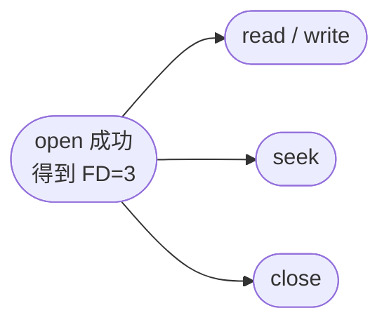
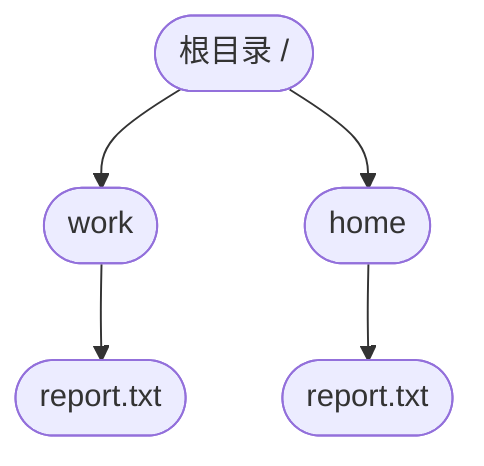

# 文件管理：从“文件名”到“磁盘块”，操作系统到底怎么找到数据

## 痛点：你双击 report.txt，系统凭什么知道数据在哪？

上一篇 [[虚拟存储与页面置换]] 解决的是：

> **程序运行时，需要的页不在内存怎么办。**

但内存里的数据断电就会丢。真正需要长期保存的代码、文档、图片、数据库文件，最终都要放到磁盘或其他外存里。

问题是，磁盘并不会天然认识“report.txt”。

它看到的更像是一大片编号的数据块：

**块 0、块 1、块 2、块 3……**

现在你让操作系统打开：

**/work/report.txt**

操作系统至少要连续回答五个问题：

1. **这个名字对应哪个文件？** —— 目录。
2. **这个文件有哪些属性、数据放在哪里？** —— FCB / inode 等文件元数据。
3. **一个文件占用的多个磁盘块怎么组织？** —— 连续、链接、索引等分配方式。
4. **新文件需要空间时，哪些磁盘块还是空的？** —— 位示图、空闲表等空闲空间管理。
5. **这个用户能不能读、写、执行？** —— 文件保护与访问控制。

> 记一句：**目录负责“找文件”，FCB 负责“认文件”，分配方式负责“找数据块”，位示图负责“找空位”，权限负责“能不能动”。**

把整篇主线先摆出来：


后面的知识其实都在解释这条链上的某一步。

---

# 一、先把“目录、FCB、文件数据”分清

很多初学者会把目录理解成“里面直接装着文件数据”。

不是。

目录更像一本通讯录，它首先解决：

> **文件名对应谁？**

真正描述一个文件的，是它的文件控制信息。

## FCB 是什么？

FCB（File Control Block，文件控制块）可以理解为一个文件的“档案卡”。

通常会记录或关联：

- 文件标识；
- 文件大小；
- 文件类型；
- 文件数据所在位置；
- 创建/修改时间；
- 访问权限；
- 其他管理信息。

不同操作系统实现不同。例如 Unix/Linux 常使用 inode 一类结构保存核心元数据，目录项再把“名字”关联到相应标识。

软考层面先抓住：

> **FCB 保存文件的管理信息，是操作系统识别和管理文件的重要数据结构。**

### 那目录里是什么？

可以把目录理解成：

> **文件名 → 文件控制信息/文件标识**

所以查找文件的思路是：

**先根据名字查目录，再根据文件控制信息找到真正的数据块。**

> [!important]
> **文件名、FCB、文件内容不是同一个东西。**
>
> 文件名负责“叫啥”；FCB 负责“这个文件是什么、在哪、有什么权限”；磁盘块里才是真正的数据。

---

# 二、打开一个文件时，系统到底做了什么？

这里最容易混的是两层东西：

> **`open/read/write/seek/close` 是程序看到的文件操作接口；“查目录、找 FCB、检查权限……”是 `open()` 在操作系统内部展开的处理过程。**

它们不是两套流程，而是**包含关系**。

假设程序第一次执行：

**open("/work/report.txt")**

操作系统内部大致要做：


也就是说：

> **“打开文件要走的几步”描述的是 `open()` 内部怎么把一个路径变成一个可继续使用的打开文件引用。**

## open 返回的“句柄”到底有什么用？

假设：

**open("/work/report.txt") → 返回 3**

在 Unix/Linux 中，这个小整数通常叫**文件描述符 FD（File Descriptor）**。

这里的 `3` 不是：

- 文件在内存里的地址；
- 文件在磁盘上的块号；
- 文件本身。

它更像：

> **“这次打开文件的取件号 / 引用”。**

操作系统已经通过路径把文件找到了，于是后面程序不必每次重新解析：

**/work/report.txt**

而可以直接拿这个引用继续操作：



所以它们的关系是：

- **open**：根据路径找到文件，检查权限，建立“这次打开”的运行状态，并返回句柄 / FD；
- **read/write**：通过这个句柄找到已经打开的文件，从**当前读写位置**开始读取或写入；
- **seek**：不负责读数据，而是修改这个打开文件的**当前读写位置**；
- **close**：结束这次打开，释放与该句柄关联的运行时管理状态。

## 为什么还要保存“当前读写位置”？

假设 `FD=3` 当前已经读到第 500 字节。

再执行一次：

**read(3, 100B)**

就可以从第 500 字节继续往后读 100B，随后当前位置移动到大约第 600 字节。

如果执行：

**seek(3, 5000)**

则把当前位置跳到第 5000 字节；下一次 `read(3, ...)` 就从那里开始。

所以“打开状态”里通常会保存或关联：

- 当前读写位置；
- 以只读、只写还是读写方式打开；
- 是否追加写；
- 指向哪个文件对象 / FCB / inode；
- 其他运行时状态。

> [!important]
> **文件句柄 / FD = 程序操作“这次已打开文件”的引用。**
>
> **它不是“文件加载进内存后的地址”。普通 `open()` 也不会把整个文件一次性加载进内存。**

例如一个 20GB 文件被 `open()`，系统不会因为打开它就立刻把 20GB 全塞进内存；真正的数据通常是在后续读取时按需进入内存/缓存。

## 把整段压成一条主线

```text
文件还没打开
    ↓
open("/work/report.txt")
    ↓
查目录 → 找 FCB/inode → 查权限 → 建立打开状态
    ↓
返回句柄 / FD，例如 3
    ↓
read(3) / write(3) / seek(3)
    ↓
close(3)
```

所以最后只记一句：

> **open 负责“从路径找到文件并建立关系”，句柄负责“以后拿什么继续操作这个文件”。**

---

# 三、先纠正一个特别容易混的词：逻辑结构 ≠ 物理分配方式

原来最容易混的一点，就是把“顺序、链接、索引”全部叫成文件逻辑结构。

严格区分会更清楚。

## 1. 文件逻辑结构：用户怎么看文件里的数据

逻辑结构关心：

> **站在程序/用户视角，文件内部的数据是什么样的。**

常见理解：

- **流式文件 / 字节流**：看成连续的字节或字符序列；
- **记录式文件**：看成一条条记录，记录可以定长或变长。

它关心的是：

> **数据在逻辑上怎么组织。**

## 2. 文件物理结构 / 分配方式：这些数据块实际怎么放到磁盘

它关心：

> **站在操作系统和磁盘视角，一个文件占用的多个磁盘块怎么摆。**

常见方式：

- 连续分配；
- 链接分配；
- 索引分配。

> **考试题如果描述“连续磁盘块、块中带下一块指针、索引块保存数据块地址”，本质上是在考文件的物理组织/分配方式。**

一句话分开：

> **逻辑结构看“文件内容长什么样”；物理结构看“这些内容落到磁盘块后怎么摆”。**

---

# 四、一个文件占很多块：连续、链接、索引到底怎么工作？

假设一个文件需要 4 个磁盘块。

真正的问题是：

> **这 4 个块在磁盘上必须挨在一起吗？如果不挨着，怎么找到下一块？**

三种经典办法就是三种不同答案。

## 1. 连续分配：四个块挨着放

例如：

**20 → 21 → 22 → 23**

只要知道：

- 起始块 = 20
- 文件长度 = 4 块

就能快速找到任何一块。

### 优点

- 结构简单；
- 顺序访问快；
- 随机访问也方便，例如想找第 3 个块，可以直接算出来。

### 缺点

文件想继续长大时，后面的块可能已经被别人占了。

而且长期分配和释放不同大小的连续区域，容易产生**外部碎片**。

> **连续分配：找得快，但要求连续，扩展难。**

---

## 2. 链接分配：每一块告诉你“下一块在哪”

例如一个文件实际占：

**20 → 8 → 37 → 15**

这些块完全可以散开。

第 20 块里记录下一块是 8，第 8 块再告诉你下一块是 37……

就像链表。

### 优点

- 不要求连续；
- 文件增长比较方便；
- 一般不会因为“找不到一整片连续空间”而无法扩展。

### 缺点

如果要找文件的第 1000 个块，通常要从前面沿指针一个个走过去。

所以传统链式分配：

> **顺序访问方便，直接/随机访问能力较差。**

还会有指针空间开销，指针损坏也可能影响后续链。

> **链接分配：好扩展，但随机定位差。**

---

## 3. 索引分配：另外建一张“块地址表”

不再让数据块彼此串起来，而是给文件准备一个索引块。

假设索引块里写：

| 文件逻辑块 | 实际磁盘块 |
| ---: | ---: |
| 0 | 20 |
| 1 | 8 |
| 2 | 37 |
| 3 | 15 |

现在要找“文件第 2 个数据块”：


不需要从块 20 一路走到 8、再走到 37。

### 优点

- 不要求数据块连续；
- 支持直接/随机访问；
- 文件扩展相对灵活。

### 缺点

- 索引块本身也占空间；
- 文件很大时，一个索引块可能装不下所有地址，于是要用**多级索引**。

> **索引分配：数据块可以散开，再用一张地址表把它们找回来。**

---

# 五、三种分配方式，用同一个问题区分

不要只背“优缺点”，直接问：

> **我要找文件的第 500 个数据块，系统怎么办？**

| 分配方式 | 怎么找第 500 块 | 核心特点 |
| --- | --- | --- |
| **连续分配** | 起始块 + 偏移，直接算 | 快，但要求连续、扩展难 |
| **链接分配** | 沿链逐块找过去 | 易扩展，但随机访问差 |
| **索引分配** | 查索引表得到块号 | 支持随机访问，但索引有开销 |

最重要的识别词：

> **连续 = 起点 + 长度**  
> **链接 = 下一块指针**  
> **索引 = 地址表**

---

# 六、文件太大，一个索引块装不下怎么办？——多级索引

这一节最容易乱，不是因为公式难，而是因为下面几个词长得太像：

> **一级间接索引、一级间接指针、索引块、地址项、数据块。**

先把“**方法**”和“**实际存在的东西**”拆开。

## 0. 先分清 5 个概念

| 名称 | 它是什么 | 仓库比喻 |
| --- | --- | --- |
| **一级间接索引** | 一种查找文件数据的**方法** | “先查一张清单，再按清单找货物”这套办法 |
| **一级间接指针** | FCB / inode 中的一个地址项，指向索引块 | 档案卡上写着“清单放在哪” |
| **索引块** | 磁盘上的一个块，专门保存很多个“块地址” | 专门放清单的货架 |
| **地址项** | 索引块里的每一条地址记录 | 清单上的一行“去几号货架” |
| **数据块** | 真正保存文件内容的磁盘块 | 真正放货物的货架 |

> [!important]
> **一级间接索引是“方法”；索引块是这套方法里真正用到的“地址表”。**
>
> 不要把“一级间接索引”和“索引块”当成同一个东西。

### inode 和 FCB 在这里是什么关系？

FCB 是教材里的抽象概念：操作系统需要有一份结构保存文件的大小、权限、位置等控制信息。

Unix/Linux 文件系统里的 inode，可以看成实现这类文件控制信息的一种具体数据结构。

所以可以近似记成：

> **FCB 是“文件档案”的抽象概念；inode 是 Unix/Linux 中的一种具体档案结构。**

不是：

> **FCB 里面有一个 inode 属性。**

在下面的图里写 inode，是为了让 Unix/Linux 的具体实现更直观；考试问抽象概念时仍优先回答 FCB。

---

## 1. “磁盘块、索引块、数据块”到底是什么关系？

假设这个文件系统规定：

- 一个磁盘块大小 = 4KiB；
- 一个块地址占 4B。

这里的 4KiB 是**文件系统使用的块大小**。现实系统里块大小由具体文件系统和格式化配置决定，4KiB 只是常见例子，不是所有系统永远固定为 4KiB。

同一个 4KiB 磁盘块，可以被拿来做不同用途：

- 拿来保存文件正文 → **数据块**；
- 拿来保存很多个数据块地址 → **索引块**。

所以：

> **索引块本质上也是磁盘块，只是它里面装的不是文件正文，而是一张“块地址表”。**

如果索引块为 4096B，每个地址项占 4B，那么一张索引块里能放：

$$
N=\frac{4096B}{4B}=1024
$$

个地址项。

注意这里的单位：

> **1024 个“地址项”**，还不是 1024 个字节，也不是 1024 个索引块。

---

## 2. 直接地址：档案卡直接写“货物在哪”

最简单的情况：

```text
inode / FCB
    ↓ 直接指针
数据块 20
```

这个指针直接告诉系统：

> **文件的这部分数据就在数据块 20。**

所以：

> **1 个直接地址项 → 1 个数据块。**

---

## 3. 一级间接索引：中间只经过“一张清单”

文件一大，inode / FCB 不可能直接写下成千上万个数据块地址。

于是改成：

> **inode 只记“那张地址清单在哪里”。**

这就是一级间接。

```text
inode / FCB
     ↓
一级间接指针
     ↓
┌────────────────────┐
│     1 个索引块       │
│                    │
│ 地址项1    → 数据块20 │
│ 地址项2    → 数据块35 │
│ 地址项3    → 数据块81 │
│ ……                 │
│ 地址项1024 → 数据块…  │
└────────────────────┘
```

用仓库比喻：

> **inode 是档案卡；一级间接指针写着“货物位置清单放在 500 号货架”；500 号货架上的清单有 1024 行，每一行直接告诉你真正的货物在哪个货架。**

因此一级间接的结构是：


这里最重要的一点：

> **一级间接索引的索引块里，每个地址项直接指向数据块。**

不是：

> 索引块里的地址项再指另一个索引块。 ❌

如果还要再指一层索引块，那已经进入**二级间接索引**。

所以一级间接可以寻址：

$$
1024
$$

个数据块。

如果每个数据块也是 4KiB，那么对应的文件数据容量是：

$$
1024\text{ 个数据块}\times4KiB/\text{块}=4096KiB=4MiB
$$

这里三个单位必须分开：

| 问法 | 答案 |
| --- | ---: |
| 有几个一级索引块？ | 1 个 |
| 这个索引块里有几个地址项？ | 1024 个地址项 |
| 最终能找到几个数据块？ | 1024 个数据块 |
| 这些数据块能放多少文件内容？ | 4MiB |

> **一级间接 = 经过 1 层索引块后，就直接到数据块。**

---

## 4. 二级间接索引：第一张清单指向“更多清单”

现在文件继续变大。

一个索引块只能记 1024 个数据块地址，还是不够。

怎么办？

把第一层索引块里的地址项，改成：

> **不直接指向数据块，而是指向第二层索引块。**

结构变成：

```text
inode / FCB
     ↓
二级间接指针
     ↓
┌──────────────────────┐
│ 第 1 层索引块          │
│                      │
│ 地址项1 → 第2层索引块1 │
│ 地址项2 → 第2层索引块2 │
│ ……                   │
│ 地址项1024 → 第2层索引块1024
└──────────────────────┘
          ↓
     最多 1024 个
     第 2 层索引块
          ↓
每个索引块又有 1024 个地址项
          ↓
每个地址项直接指向一个数据块
```

用同一个仓库比喻：

> **二级间接就是“总目录 → 分目录 → 真正货架”。**

第一张清单不再直接写：

> “货物在 20 号货架”。

而是写：

> “第 1 本分清单在 500 号货架；第 2 本分清单在 501 号货架……”

然后每一本分清单，才真正写：

> “货物在 20、35、81……号货架”。

所以：


因此：

$$
1024\text{ 个第二层索引块}
\times
1024\text{ 个数据块地址/索引块}
=
1024^2
$$

个数据块。

也就是：

$$
1024^2=1,048,576
$$

个数据块。

如果每个数据块为 4KiB：

$$
1024^2\times4KiB=4GiB
$$

这里你前面问的：

> **“不是应该乘以所有索引块吗？”**

在二级间接这里就对了。

因为第一层最多能找到 **1024 个第二层索引块**，而每一个第二层索引块又能记录 **1024 个数据块地址**，所以：

$$
1024\times1024=1024^2
$$

---

## 5. 一级和二级最核心的差别

用同一个问题判断：

> **第一层索引块里的地址项，下一步指向谁？**

| 类型 | 第 1 层索引块里的地址项指向 | 最终可寻址数据块数 |
| --- | --- | ---: |
| **一级间接** | 直接指向**数据块** | $N$ |
| **二级间接** | 指向**另一个索引块** | $N^2$ |
| **三级间接** | 还要再多经过一层索引块 | $N^3$ |

一句话记：

> **“几级间接” = 从 inode / FCB 到真正数据块，中间要经过几层索引块。**

所以：

- 一级间接：inode → **1 层索引块** → 数据块；
- 二级间接：inode → **2 层索引块** → 数据块；
- 三级间接：inode → **3 层索引块** → 数据块。

---

## 6. 为什么最后还要乘数据块大小？

因为：

$$
N,\ N^2,\ N^3
$$

算出来的单位只是：

> **“多少个数据块”。**

如果题目问：

> **可以表示多大的文件？**

才继续乘每个数据块的大小。

统一公式：

$$
N=\frac{\text{索引块大小}}{\text{地址项大小}}
$$

一级间接可寻址：

$$
N\text{ 个数据块}
$$

二级间接可寻址：

$$
N^2\text{ 个数据块}
$$

三级间接可寻址：

$$
N^3\text{ 个数据块}
$$

问容量时：

$$
\text{文件数据容量}
=
\text{可寻址数据块数}
\times
\text{每个数据块大小}
$$

> [!important]
> **地址项数量、可寻址数据块数量、文件容量是三个不同单位。**
>
> 先算“地址项”，再算“能找到多少块”，最后才算“这些块能装多少字节”。

---

# 七、多级索引计算最容易错在哪？

假设某文件控制结构包含：

- 10 个直接地址项；
- 1 个一级间接地址项；
- 1 个二级间接地址项。

且 $N=1024$。

那么最大可寻址数据块数量不是：

$$
1024^2
$$

而是把三部分全部加起来：

$$
10 + 1024 + 1024^2
$$

因为：

- 10 个直接项 → 10 个数据块；
- 1 个一级间接项 → $1024$ 个数据块；
- 1 个二级间接项 → $1024^2$ 个数据块。

所以考试看到 inode/索引节点里同时给出“直接 + 一级 + 二级”，一定要：

> **分层算，再相加。**

---

# 八、新文件要写入磁盘：系统怎么知道哪些块是空的？

前面解决的是：

> **一个已有文件的块在哪里。**

现在换一个问题：

> **我要新建文件，去哪里找空闲磁盘块？**

这属于**空闲空间管理**。

常见办法包括：

- 位示图；
- 空闲链表；
- 分组；
- 计数等。

软考最适合计算的是**位示图**。

---

# 九、位示图：把每个磁盘块压缩成一个 0/1 状态

假设磁盘有很多块。

位示图就给每个磁盘块安排一个 bit：

**块 0 ↔ 第 0 个 bit**  
**块 1 ↔ 第 1 个 bit**  
**块 2 ↔ 第 2 个 bit**  
……

一个 bit 只负责回答：

> **这个块现在可不可以分配？**

但要注意：

> [!warning]
> **0 表示空闲还是 1 表示空闲，并不是脱离题目后永远固定的规则。**
>
> 实际系统和教材约定可能不同。做题时优先看题干定义，再根据定义判断“置 0”还是“置 1”。

真正高频的计算不是“0/1 的含义”，而是：

> **某个块号对应位示图里的第几个字、第几位。**

---

# 十、位示图坐标怎么算？

先假设题目约定：

- 磁盘块从 **1** 开始编号；
- 位示图中的“字”从 **1** 开始编号；
- 每个字有 $w$ 位。

对于块号 $b$：

$$
\text{字号}
=
\left\lfloor
\frac{b-1}{w}
\right\rfloor+1
$$

$$
\text{位号}
=
(b-1)\bmod w+1
$$

## 示例：字长 16 位，块号 35 在哪里？

先求字号：

$$
\left\lfloor
\frac{35-1}{16}
\right\rfloor+1
=
\left\lfloor
\frac{34}{16}
\right\rfloor+1
=
3
$$

再求位号：

$$
(35-1)\bmod16+1
=
34\bmod16+1
=
3
$$

所以：

> **块 35 → 第 3 个字、第 3 位。**

### 为什么一定要减 1？

因为每 16 个块是一组：

- 第 1～16 块 → 第 1 个字；
- 第 17～32 块 → 第 2 个字；
- 第 33～48 块 → 第 3 个字。

块 35 在第 3 组里的第 3 个位置。

所以减 1 的本质是：

> **先把从 1 开始的编号换成更方便做整除/取模的偏移量。**

---

# 十一、如果题目从 0 开始编号，公式会变

如果题目明确：

- 块号从 0 开始；
- 字号、位号也从 0 开始；

则：

$$
\text{字号}=\left\lfloor\frac{b}{w}\right\rfloor
$$

$$
\text{位号}=b\bmod w
$$

所以位示图题最先做的不是套公式，而是先在题干上圈出来：

> **块号从 0 还是 1 开始？字号/位号从 0 还是 1 开始？**

这是最容易白丢分的地方。

---

# 十二、树形目录：为什么不同文件夹里可以有同名文件？

如果整个磁盘只能有一层目录：

**a.txt、b.txt、c.txt……**

文件一多就很难管理，而且所有文件名还容易冲突。

树形目录把目录本身也组织成层级：



这里两个 report.txt 并不冲突，因为它们的完整路径不同：

- **/work/report.txt**
- **/home/report.txt**

所以：

> **文件的完整身份不能只看最后一个文件名，还要看它所在的路径。**

## 绝对路径和相对路径

- **绝对路径**：从根目录开始描述，例如 /work/report.txt。
- **相对路径**：从当前目录开始描述。

考试看到“当前目录”时，要先确认路径是从哪里开始算。

---

# 十三、文件保护：找到文件，不代表你有权修改它

目录已经找到了文件，FCB 也知道它在哪里。

还差一个问题：

> **你有权限吗？**

最基本的权限通常围绕：

- 读；
- 写；
- 执行；
- 删除；
- 其他管理操作。

系统可以通过访问控制表、用户/组权限、访问矩阵等方式表达：

> **谁，对哪个文件，可以执行什么操作。**

例如：

| 主体 | report.txt |
| --- | --- |
| 用户 A | 读、写 |
| 用户 B | 只读 |
| 用户 C | 无权限 |

所以：

> **共享解决“能不能让多人使用同一个文件”；保护解决“每个人到底能做什么”。**

不要把“可以共享”理解成“所有人都可以随便改”。

---

# 十四、把整个文件访问过程重新串起来

现在再看程序打开一个文件：

**/work/report.txt**

你应该能在脑中还原：

1. 根据路径逐级查目录；
2. 找到文件对应的 FCB / 文件标识；
3. 检查访问权限；
4. 根据文件的分配方式，定位它的数据块；
5. 把磁盘块内容读出来；
6. 如果文件继续增长，需要从空闲空间管理结构中申请新块；
7. 文件关闭时，释放本次打开对应的运行时管理状态。

这篇最核心的不是背一堆名词，而是知道它们分别负责哪一步：

| 问题 | 谁负责 |
| --- | --- |
| 文件叫什么、在哪个目录 | 目录 |
| 文件大小、位置、权限等 | FCB / 文件元数据 |
| 文件占哪些磁盘块、怎么连接 | 文件物理分配方式 |
| 哪些磁盘块还能用 | 位示图等空闲空间管理 |
| 谁能读写 | 文件保护 / 访问控制 |

---

# 十五、最容易混的细节

| 易混点 | 正确理解 |
| --- | --- |
| 目录里就是文件内容 | 错。目录主要用于名字查找和定位文件控制信息 |
| 文件名就是 FCB | 错。名字只是查找入口，FCB 保存管理信息 |
| 顺序/链接/索引都是“逻辑结构” | 严格说更接近文件物理组织/分配方式 |
| 连续分配只能顺序访问 | 错。连续分配很适合直接/随机访问 |
| 链接分配随机访问很好 | 错。传统链式分配通常要沿链逐块查找 |
| 索引分配要求数据块连续 | 错。数据块可以离散，靠索引表定位 |
| 一级间接 = 1 个数据块 | 错。它指向一个索引块，可再指向 $N$ 个数据块 |
| 二级间接容量就是 $2N$ | 错。是 $N^2$ 个数据块 |
| 位示图中 1 永远代表占用 | 不一定，以题目/系统约定为准 |
| 位示图块号公式永远一样 | 错。先判断编号是从 0 还是 1 开始 |
| 能找到文件就一定能修改 | 错。还要经过权限检查 |

---

# 十六、这个知识与考试怎么对应

## 选择题

看到这些题眼要快速对应：

- “文件控制信息、文件属性、位置” → **FCB**
- “目录层次、绝对路径、相对路径” → **树形目录**
- “连续磁盘块、起始块 + 长度” → **连续分配**
- “每块记录下一块地址” → **链接分配**
- “索引块保存数据块地址” → **索引分配**
- “随机访问能力较好” → **连续 / 索引**
- “文件扩展容易，但随机访问差” → **链接分配**
- “空闲块 0/1 标志” → **位示图**
- “直接、一级、二级间接地址” → **多级索引**
- “谁能读、谁能写” → **文件保护 / 访问控制**

## 计算题

最常见的是两类。

### 1. 位示图

固定步骤：

1. 看编号从 0 还是 1 开始；
2. 看每个字多少位；
3. 整除求字号；
4. 取余求位号；
5. 再根据题目约定判断对应 bit 应置 0 还是 1。

### 2. 多级索引

固定步骤：

1. 先求

$$
N=\frac{\text{索引块大小}}{\text{地址项大小}}
$$

2. 直接项算 $1$；
3. 一级间接算 $N$；
4. 二级间接算 $N^2$；
5. 三级间接算 $N^3$；
6. 有多个直接/间接入口时，分别乘入口数量再相加；
7. 问“文件容量”时最后乘数据块大小。

---

# 十七、记忆口诀

> **找文件：目录找名字，FCB 看档案，分配方式找数据块。**

> **三种分配：连续挨着放，链接一路串，索引查地址表。**

> **连续快但难长，链接好长随机慢，索引随机稳但要表。**

> **位示图：先看从 0 还是 1，再整除取余算坐标。**

> **多级索引：先算基数 $N$，一级 $N$、二级 $N^2$、三级 $N^3$；问容量再乘数据块大小。**

---

# 十八、闭卷自测

- [ ] 目录、FCB、文件数据三者分别是什么？
- [ ] 为什么说“文件名不是文件控制块”？
- [ ] 文件逻辑结构和文件物理结构有什么区别？
- [ ] 连续分配为什么随机访问快，但文件扩展困难？
- [ ] 链接分配为什么扩展方便，但随机访问差？
- [ ] 索引分配为什么既能离散存放，又能随机访问？
- [ ] 一个 4096B 索引块、4B 地址项，一个索引块能存多少个地址？
- [ ] 一级间接和二级间接分别能寻址多少个数据块？
- [ ] 位示图中 0/1 的含义为什么不能脱离题目死记？
- [ ] 1-based 位示图中，16 位一个字，块 35 对应第几个字、第几位？
- [ ] 树形目录为什么允许不同目录存在同名文件？
- [ ] 能找到一个文件，为什么仍不一定能写它？

## 下一站

> 顺着主线往下看 [[设备管理与磁盘调度]]——文件系统已经知道“数据在哪些磁盘块”，下一步还要解决“磁头按什么顺序去读这些块，才能少走路”。

> 想回看文件管理为什么会接在虚拟内存后面，回 [[虚拟存储与页面置换]]；想回看分页里的“逻辑块如何映射到物理位置”这种思路，回 [[存储管理]]。
