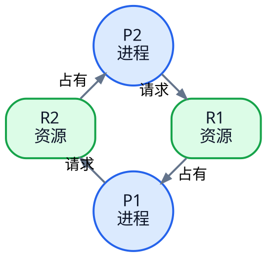

# 死锁与银行家算法：为什么进程会互相等，以及如何避免

## 一、什么是死锁？

上一篇学习了信号量和 PV 操作。

信号量可以让进程互斥、同步，也会让资源不足的进程阻塞等待。问题是：

> **如果多个进程都在等对方手里的资源，谁也无法继续，也就没人能释放资源。**

这就是**死锁（Deadlock）**。

### 一个最小例子

- A 已经占有 R1，还想要 R2；
- B 已经占有 R2，还想要 R1。

~~~text
A：占用 R1 → 申请 R2 → 等待
B：占用 R2 → 申请 R1 → 等待
~~~

于是：

~~~text
A 等 B 释放 R2
B 等 A 释放 R1
~~~

两边都不能继续，也不能释放已经占有的资源，于是永久僵住。

### 死锁和普通阻塞不一样

| 状态 | 含义 |
| --- | --- |
| 普通阻塞 | 条件满足后还能继续 |
| 死锁 | 进程互相等待，无法自行继续 |

> **阻塞不一定是死锁；死锁一定包含无法自行解除的等待。**

---

## 二、死锁产生的四个必要条件

死锁要成立，通常必须同时满足四个条件：

| 条件 | 讲人话 |
| --- | --- |
| **互斥** | 某些资源一次只能一个进程使用 |
| **请求并保持** | 已经拿着资源，还继续申请别的资源 |
| **不剥夺** | 已经拿到的资源不能被别人强行抢走 |
| **循环等待** | 进程之间形成“你等我、我等你”的环 |

一句话记：

> **互斥占着不放，继续申请，不能被抢，最后形成环。**

注意：

> **这四个是必要条件，不是“出现其中一个就一定死锁”。**

---

## 三、资源分配图：把“谁拿着谁、谁又在等谁”画出来

资源分配图（Resource Allocation Graph，RAG）用来表示**进程和资源之间的请求、分配关系**。

- **圆形**：进程，图中用 `P1`、`P2` 命名；
- **方框**：资源类型，图中用 `R1`、`R2` 命名；
- **P → R**：进程正在请求资源；
- **R → P**：资源已经分配给进程。

这类“进程—资源—请求—分配”的环形关系，使用 **Graphviz DOT** 更合适：节点身份清楚，布局稳定，环路也更容易读。

> 图例：圆形（`P`）= 进程，方框（`R`）= 资源。

图中已经把节点身份直接写出来：

- **进程 P1、进程 P2**：圆形节点；
- **资源 R1、资源 R2**：方框节点。

这里要区分“图形”和“名称”：圆形/方框是资源分配图的图例，`P`/`R` 只是常用命名约定，不是图形本身。考试题可能使用其他名称，但判断方法不变：看节点形状和箭头方向。

这张图表示：

~~~text
R1 → P1     P1 已经占有 R1
P1 → R2     P1 正在请求 R2

R2 → P2     P2 已经占有 R2
P2 → R1     P2 正在请求 R1
~~~

连起来就是：

~~~text
P1 → R2 → P2 → R1 → P1
~~~

形成一个环。

### 单实例资源

如果每种资源都只有一个实例，例如：

~~~text
R1 只有 1 个
R2 只有 1 个
~~~

那么：

> **资源分配图中有环 ⇔ 系统发生死锁。**

### 多实例资源

如果某类资源有多个实例，有环**不一定**代表死锁。

因为即使出现循环等待，也可能还有额外实例能满足某个进程，让它先完成并释放资源。

所以：

> **多实例资源：有环只是危险信号，还需要进一步做安全性分析。**

一句话记：

> **资源分配图的“环”是死锁的重要信号；单实例资源时，有环就能直接判死锁。**

---

## 四、死锁的处理方法

操作系统处理死锁通常有四种思路：

1. **死锁预防**
2. **死锁避免**
3. **死锁检测**
4. **死锁解除**

### 1. 死锁预防

核心：

> **直接破坏死锁四个必要条件中的一个。**

例如：

- 一次性申请全部资源 → 破坏“请求并保持”；
- 资源统一编号，只能按顺序申请 → 破坏“循环等待”。

### 2. 死锁避免

核心：

> **资源每次真正分配之前，先判断分配后系统是否仍然安全。**

银行家算法属于**死锁避免**。

### 3. 死锁检测

允许系统先运行，之后检查：

- 哪些进程无法继续；
- 是否形成资源等待环；
- 是否已经发生死锁。

### 4. 死锁解除

检测到死锁后，可通过：

- 终止进程；
- 强制剥夺资源；
- 回滚；
- 重新分配资源。

> **预防 = 改规则；避免 = 分配前先算；检测 = 发生后检查；解除 = 检测到以后处理。**

---

## 五、安全状态和不安全状态

银行家算法真正要判断的是：

> **在当前资源分配状态下，是否还存在一个安全序列，使所有进程最终都能完成。**

这里不是“预测未来一定会怎么执行”，而是做一次**安全性模拟**：只要能找到至少一个可行的完成顺序，就说明当前状态仍然安全；实际运行时不要求必须按这个顺序调度。

### 安全状态

如果能找到一个进程完成顺序，例如：

~~~text
P2 → P1 → P3
~~~

使每个进程都能依次获得资源、完成并释放资源，那么系统处于**安全状态**。

> 安全不代表“大家现在都能一起运行”，只代表“至少存在一种能让所有进程最终完成的顺序”。

### 不安全状态

如果找不到安全序列，系统处于**不安全状态**。

注意：

> **不安全 ≠ 已经死锁。**

它表示系统已经进入“有可能死锁”的危险区域。

---

## 六、银行家算法的四个核心数据

假设系统里有多类资源。银行家算法会把“每一类资源的数量”按固定顺序写在一对括号里，这叫**资源向量**。

### Available

`Available` 表示系统当前**每一类资源还剩多少**。

~~~text
Available = (3, 2, 1)
~~~

如果顺序是 `(R1, R2, R3)`，就表示：

- R1 还剩 3 个；
- R2 还剩 2 个；
- R3 还剩 1 个。

### Max

`Max[P1]` 表示进程 P1 对**每一类资源最多需要多少**。

~~~text
Max[P1] = (7, 5, 3)
~~~

表示 P1 最多需要：

- R1：7 个；
- R2：5 个；
- R3：3 个。

### Allocation

`Allocation[P1]` 表示当前**已经分配给 P1 的各类资源数量**。

~~~text
Allocation[P1] = (2, 1, 1)
~~~

表示 P1 当前已经拿到：

- R1：2 个；
- R2：1 个；
- R3：1 个。

### Need

`Need[P1]` 表示 P1 对各类资源**还差多少**。

$$
Need = Max - Allocation
$$

这个减法也是**逐项相减**：

~~~text
Max[P1]        = (7, 5, 3)
Allocation[P1] = (2, 1, 1)

Need[P1]       = (7-2, 5-1, 3-1)
               = (5, 4, 2)
~~~

也就是：

- R1 还差 5 个；
- R2 还差 4 个；
- R3 还差 2 个。

| 数据 | 含义 |
| --- | --- |
| Available | 系统每类资源还剩多少 |
| Max | 进程每类资源最多要多少 |
| Allocation | 进程每类资源已经拿了多少 |
| Need | 进程每类资源还差多少 |

> **看银行家算法向量时，始终按 R1、R2、R3……逐项看，不要看成一个整体数字。**
---

## 七、安全性算法：怎么找安全序列

这一节先不要急着背公式。安全性算法只是在做一件事：

> **拿当前剩余资源做一次“假想演练”，看看能不能一个接一个地让所有进程完成。**

### 1. Work 到底是什么？

`Work` 可以理解成：

> **安全性算法在模拟过程中，当前“可以拿来继续满足进程”的资源池。**

它不是系统里突然多出来的一份资源，也不是新的资源类型，只是算法为了模拟而使用的一个临时变量。

一开始还没有模拟任何进程完成，所以能用的资源就是系统当前真正剩下的资源：

$$
Work = Available
$$

例如：

~~~text
Available = (3, 2, 1)
~~~

那么刚开始：

~~~text
Work = (3, 2, 1)
~~~

意思仍然是：

- R1 当前可用 3 个；
- R2 当前可用 2 个；
- R3 当前可用 1 个。

> **Available 是现实中当前剩余多少；Work 是安全性算法拿来做模拟的“临时资源池”。开始时两者相等。**

### 2. `Finish[i] = false` 是什么？

`Finish[i]` 只是一个“打勾标记”，记录某个进程在这次模拟中是否已经能顺利完成。

刚开始一个都还没有模拟完成，所以：

~~~text
Finish[P1] = false
Finish[P2] = false
...
~~~

找到一个能够完成的进程后，就把它标记为：

~~~text
Finish[P1] = true
~~~

你可以直接理解成：

> **false = 这个进程还没在模拟中完成；true = 已经证明它能完成。**

### 3. `Need[i] <= Work` 是什么意思？

现在算法要找一个“当前资源池能够养活”的进程。

假设：

~~~text
Work     = (3, 2, 1)
Need[P1] = (2, 1, 1)
~~~

`Need[P1]` 表示 P1 还差：

- R1：2 个；
- R2：1 个；
- R3：1 个。

而 Work 里现在有：

- R1：3 个；
- R2：2 个；
- R3：1 个。

逐项比较：

~~~text
R1：2 <= 3   可以
R2：1 <= 2   可以
R3：1 <= 1   可以
~~~

三类资源都够，因此：

$$
Need[P1] \le Work
$$

它的人话就是：

> **当前这个临时资源池，足够补齐 P1 还缺的资源，所以可以假设 P1 最终能够完成。**

注意：这里一定是**逐项比较**，不是把三个数字加起来比较总数。

### 4. 为什么进程完成后是 `Work = Work + Allocation[i]`？

这是最容易看懵的地方。

假设 P1 当前已经占有：

~~~text
Allocation[P1] = (1, 1, 0)
~~~

前面已经判断出：当前 Work 足够补齐 P1 的 Need，所以我们可以在脑中假设：

~~~text
给 P1 补齐它还缺的资源
↓
P1 完成
↓
P1 把自己占有的所有资源都释放回来
~~~

最终，P1 原来已经占着的这部分资源也回到了公共资源池，所以：

$$
Work = Work + Allocation[P1]
$$

例如：

~~~text
原来 Work          = (3, 2, 1)
P1 已占 Allocation = (1, 1, 0)

P1 完成后：
Work = (3, 2, 1) + (1, 1, 0)
     = (4, 3, 1)
~~~

你可能会问：**刚才不是还要给 P1 一些 Need 吗，为什么公式没有先减 Need？**

因为这只是安全性模拟：给 P1 的 Need 在 P1 完成后也会被它一起归还，前后正好抵消。

可以想成：

~~~text
Work
- 补给 P1 的 Need
+ P1 完成后归还的 Need
+ P1 原来已经占有的 Allocation

中间的 -Need 和 +Need 抵消

最后只剩：
Work + Allocation
~~~

所以教材直接写成：

$$
Work = Work + Allocation[i]
$$

> **加回的是 Allocation，因为它代表这个进程原来就占着、完成后能够额外释放出来的资源。**

### 5. 整个安全性算法到底在干什么？

把所有公式翻译成人话，就是：

~~~text
① Work = Available
   先复制当前剩余资源，作为模拟资源池

② 找一个 Need <= Work 的进程
   看当前资源池能不能让它完成

③ 假设它完成
   Finish = true

④ Work = Work + Allocation
   把它原来占有的资源收回来，资源池变大

⑤ 再找下一个

⑥ 如果最后所有进程都能被依次“完成”
   就找到了安全序列
~~~

如果做到某一步时，剩下所有进程都满足不了 `Need <= Work`，就说明这次模拟走不下去了。

> **安全性算法的核心不是背公式，而是反复做：当前资源够谁完成 → 假设它完成 → 收回它占有的资源 → 再看下一个。**

---

## 八、安全性算法示例

当前：

~~~text
Available = (3, 3, 2)
~~~

| 进程 | Allocation | Max | Need |
| --- | --- | --- | --- |
| P0 | (0, 1, 0) | (7, 5, 3) | (7, 4, 3) |
| P1 | (2, 0, 0) | (3, 2, 2) | (1, 2, 2) |
| P2 | (3, 0, 2) | (9, 0, 2) | (6, 0, 0) |
| P3 | (2, 1, 1) | (2, 2, 2) | (0, 1, 1) |
| P4 | (0, 0, 2) | (4, 3, 3) | (4, 3, 1) |

初始：

~~~text
Work = (3, 3, 2)
~~~

先找 P1：

~~~text
Need[P1] = (1, 2, 2)
Work     = (3, 3, 2)
~~~

满足，P1 完成：

~~~text
Work = (3, 3, 2) + (2, 0, 0)
     = (5, 3, 2)
~~~

再找 P3：

~~~text
Need[P3] = (0, 1, 1)
Work     = (5, 3, 2)
~~~

满足：

~~~text
Work = (5, 3, 2) + (2, 1, 1)
     = (7, 4, 3)
~~~

之后依次可完成：

~~~text
P4 → P0 → P2
~~~

所以一个安全序列是：

~~~text
P1 → P3 → P4 → P0 → P2
~~~

系统处于**安全状态**。

---

## 九、银行家算法处理新的资源请求

假设进程 $P_i$ 提出 $Request_i$，依次检查三件事。

### 1. 请求不能超过 Need

$$
Request_i \le Need_i
$$

超过说明请求超出它声明的最大需求。

### 2. 请求不能超过 Available

$$
Request_i \le Available
$$

如果当前资源不够，只能等待。

### 3. 试探性分配

如果前两项都满足，先假装分配：

$$
Available = Available - Request_i
$$

$$
Allocation_i = Allocation_i + Request_i
$$

$$
Need_i = Need_i - Request_i
$$

然后重新执行安全性算法：

- 安全 → 正式分配；
- 不安全 → 撤销试探性分配，让进程等待。

---

## 十、易错点

### 1. 不安全状态就是死锁

错。

> **不安全 = 可能死锁；死锁 = 已经互相等待、无法继续。**

### 2. Need 是最大需求

错。

$$
Need = Max - Allocation
$$

Need 是“还差多少”。

### 3. 进程完成后把 Need 加回 Work

错。

$$
Work = Work + Allocation[i]
$$

因为释放的是已经占有的资源。

### 4. 向量比较看总和

错。

~~~text
Need = (2, 5)
Work = (3, 4)
~~~

第二类资源 $5>4$，所以不能满足。

### 5. 当前资源不足就是死锁

错。

当前不足可能只是暂时阻塞，其他进程释放资源后仍可能继续。

---

## 十一、考试速记

### 死锁四条件

> **互斥、请求并保持、不剥夺、循环等待。**

### 资源分配图

> **P → R 是请求，R → P 是已分配。**

> **单实例资源：有环 ⇔ 死锁；多实例资源：有环不一定死锁。**

### 银行家算法

$$
Need = Max - Allocation
$$

安全性判断：

$$
Need[i] \le Work
$$

进程完成：

$$
Work = Work + Allocation[i]
$$

资源请求：

~~~text
Request ≤ Need
Request ≤ Available
试探性分配后仍然安全
~~~

最后记三句话：

> **死锁：大家互相等。**

> **安全状态：能找到一条让所有进程完成的顺序。**

> **银行家算法：资源真正给出去之前，先确认系统仍然安全。**

## 下一站

> 顺着主线往下看 [[存储管理]]。  
> 想回看 PV 操作，回 [[信号量与PV操作]]。
