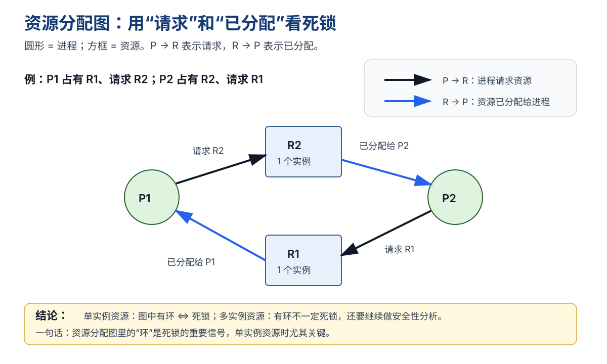

# 死锁与银行家算法：为什么进程会互相等，以及如何避免

## 一、什么是死锁？

上一篇学习了信号量和 PV 操作。

信号量可以让进程互斥、同步，也会让资源不足的进程阻塞等待。问题是：

> **如果多个进程都在等对方手里的资源，谁也无法继续，也就没人能释放资源。**

这就是**死锁（Deadlock）**。

### 一个最小例子

- A 已经占有 R1，还想要 R2；
- B 已经占有 R2，还想要 R1。

~~~text
A：占用 R1 → 申请 R2 → 等待
B：占用 R2 → 申请 R1 → 等待
~~~

于是：

~~~text
A 等 B 释放 R2
B 等 A 释放 R1
~~~

两边都不能继续，也不能释放已经占有的资源，于是永久僵住。

### 死锁和普通阻塞不一样

| 状态 | 含义 |
| --- | --- |
| 普通阻塞 | 条件满足后还能继续 |
| 死锁 | 进程互相等待，无法自行继续 |

> **阻塞不一定是死锁；死锁一定包含无法自行解除的等待。**

---

## 二、死锁产生的四个必要条件

死锁要成立，通常必须同时满足四个条件：

| 条件 | 讲人话 |
| --- | --- |
| **互斥** | 某些资源一次只能一个进程使用 |
| **请求并保持** | 已经拿着资源，还继续申请别的资源 |
| **不剥夺** | 已经拿到的资源不能被别人强行抢走 |
| **循环等待** | 进程之间形成“你等我、我等你”的环 |

一句话记：

> **互斥占着不放，继续申请，不能被抢，最后形成环。**

注意：

> **这四个是必要条件，不是“出现其中一个就一定死锁”。**

---

## 三、资源分配图：把“谁拿着谁、谁又在等谁”画出来

资源分配图（Resource Allocation Graph，RAG）用来表示**进程和资源之间的请求、分配关系**。

- **圆形**：进程，例如 P1、P2；
- **方框**：资源，例如 R1、R2；
- **P → R**：进程正在请求资源；
- **R → P**：资源已经分配给进程。

这张图表示：

~~~text
R1 → P1     P1 已经占有 R1
P1 → R2     P1 正在请求 R2

R2 → P2     P2 已经占有 R2
P2 → R1     P2 正在请求 R1
~~~

连起来就是：

~~~text
P1 → R2 → P2 → R1 → P1
~~~

形成一个环。

### 单实例资源

如果每种资源都只有一个实例，例如：

~~~text
R1 只有 1 个
R2 只有 1 个
~~~

那么：

> **资源分配图中有环 ⇔ 系统发生死锁。**

### 多实例资源

如果某类资源有多个实例，有环**不一定**代表死锁。

因为即使出现循环等待，也可能还有额外实例能满足某个进程，让它先完成并释放资源。

所以：

> **多实例资源：有环只是危险信号，还需要进一步做安全性分析。**

一句话记：

> **资源分配图的“环”是死锁的重要信号；单实例资源时，有环就能直接判死锁。**

---

## 四、死锁的处理方法

操作系统处理死锁通常有四种思路：

1. **死锁预防**
2. **死锁避免**
3. **死锁检测**
4. **死锁解除**

### 1. 死锁预防

核心：

> **直接破坏死锁四个必要条件中的一个。**

例如：

- 一次性申请全部资源 → 破坏“请求并保持”；
- 资源统一编号，只能按顺序申请 → 破坏“循环等待”。

### 2. 死锁避免

核心：

> **资源每次真正分配之前，先判断分配后系统是否仍然安全。**

银行家算法属于**死锁避免**。

### 3. 死锁检测

允许系统先运行，之后检查：

- 哪些进程无法继续；
- 是否形成资源等待环；
- 是否已经发生死锁。

### 4. 死锁解除

检测到死锁后，可通过：

- 终止进程；
- 强制剥夺资源；
- 回滚；
- 重新分配资源。

> **预防 = 改规则；避免 = 分配前先算；检测 = 发生后检查；解除 = 检测到以后处理。**

---

## 五、安全状态和不安全状态

银行家算法真正要判断的是：

> **现在这样分资源，未来还能不能找到一个顺序，让所有进程最终完成？**

### 安全状态

如果能找到一个进程完成顺序，例如：

~~~text
P2 → P1 → P3
~~~

使每个进程都能依次获得资源、完成并释放资源，那么系统处于**安全状态**。

> 安全不代表“大家现在都能一起运行”，只代表“至少存在一种能让所有进程最终完成的顺序”。

### 不安全状态

如果找不到安全序列，系统处于**不安全状态**。

注意：

> **不安全 ≠ 已经死锁。**

它表示系统已经进入“有可能死锁”的危险区域。

---

## 六、银行家算法的四个核心数据

假设有 $n$ 个进程、$m$ 类资源。

### Available

当前系统还剩多少资源。

~~~text
Available = (3, 2, 1)
~~~

### Max

进程声明的**最大资源需求**。

~~~text
Max[P1] = (7, 5, 3)
~~~

### Allocation

当前已经分配给进程的资源。

~~~text
Allocation[P1] = (2, 1, 1)
~~~

### Need

进程还需要多少资源才能达到最大需求。

$$
Need = Max - Allocation
$$

例如：

~~~text
Max[P1]        = (7, 5, 3)
Allocation[P1] = (2, 1, 1)
Need[P1]       = (5, 4, 2)
~~~

| 数据 | 含义 |
| --- | --- |
| Available | 系统还剩多少 |
| Max | 进程最多要多少 |
| Allocation | 进程已经拿了多少 |
| Need | 进程还差多少 |

---

## 七、安全性算法：怎么找安全序列

先设置：

~~~text
Work = Available
Finish[i] = false
~~~

然后寻找满足：

$$
Need[i] \le Work
$$

的进程。

这里必须**逐项比较**。

例如：

~~~text
Need = (1, 2, 1)
Work = (2, 2, 3)
~~~

因为三类资源都满足，所以这个进程可以完成。

假设它完成，就会释放已经占有的资源：

$$
Work = Work + Allocation[i]
$$

继续找下一个能完成的进程。

如果最终所有 Finish 都变为 true，说明存在安全序列；如果剩下的进程谁都满足不了，则系统不安全。

> **进程完成后加回的是 Allocation，不是 Need。**

---

## 八、安全性算法示例

当前：

~~~text
Available = (3, 3, 2)
~~~

| 进程 | Allocation | Max | Need |
| --- | --- | --- | --- |
| P0 | (0, 1, 0) | (7, 5, 3) | (7, 4, 3) |
| P1 | (2, 0, 0) | (3, 2, 2) | (1, 2, 2) |
| P2 | (3, 0, 2) | (9, 0, 2) | (6, 0, 0) |
| P3 | (2, 1, 1) | (2, 2, 2) | (0, 1, 1) |
| P4 | (0, 0, 2) | (4, 3, 3) | (4, 3, 1) |

初始：

~~~text
Work = (3, 3, 2)
~~~

先找 P1：

~~~text
Need[P1] = (1, 2, 2)
Work     = (3, 3, 2)
~~~

满足，P1 完成：

~~~text
Work = (3, 3, 2) + (2, 0, 0)
     = (5, 3, 2)
~~~

再找 P3：

~~~text
Need[P3] = (0, 1, 1)
Work     = (5, 3, 2)
~~~

满足：

~~~text
Work = (5, 3, 2) + (2, 1, 1)
     = (7, 4, 3)
~~~

之后依次可完成：

~~~text
P4 → P0 → P2
~~~

所以一个安全序列是：

~~~text
P1 → P3 → P4 → P0 → P2
~~~

系统处于**安全状态**。

---

## 九、银行家算法处理新的资源请求

假设进程 $P_i$ 提出 $Request_i$，依次检查三件事。

### 1. 请求不能超过 Need

$$
Request_i \le Need_i
$$

超过说明请求超出它声明的最大需求。

### 2. 请求不能超过 Available

$$
Request_i \le Available
$$

如果当前资源不够，只能等待。

### 3. 试探性分配

如果前两项都满足，先假装分配：

$$
Available = Available - Request_i
$$

$$
Allocation_i = Allocation_i + Request_i
$$

$$
Need_i = Need_i - Request_i
$$

然后重新执行安全性算法：

- 安全 → 正式分配；
- 不安全 → 撤销试探性分配，让进程等待。

---

## 十、易错点

### 1. 不安全状态就是死锁

错。

> **不安全 = 可能死锁；死锁 = 已经互相等待、无法继续。**

### 2. Need 是最大需求

错。

$$
Need = Max - Allocation
$$

Need 是“还差多少”。

### 3. 进程完成后把 Need 加回 Work

错。

$$
Work = Work + Allocation[i]
$$

因为释放的是已经占有的资源。

### 4. 向量比较看总和

错。

~~~text
Need = (2, 5)
Work = (3, 4)
~~~

第二类资源 $5>4$，所以不能满足。

### 5. 当前资源不足就是死锁

错。

当前不足可能只是暂时阻塞，其他进程释放资源后仍可能继续。

---

## 十一、考试速记

### 死锁四条件

> **互斥、请求并保持、不剥夺、循环等待。**

### 资源分配图

> **P → R 是请求，R → P 是已分配。**

> **单实例资源：有环 ⇔ 死锁；多实例资源：有环不一定死锁。**

### 银行家算法

$$
Need = Max - Allocation
$$

安全性判断：

$$
Need[i] \le Work
$$

进程完成：

$$
Work = Work + Allocation[i]
$$

资源请求：

~~~text
Request ≤ Need
Request ≤ Available
试探性分配后仍然安全
~~~

最后记三句话：

> **死锁：大家互相等。**

> **安全状态：能找到一条让所有进程完成的顺序。**

> **银行家算法：资源真正给出去之前，先确认系统仍然安全。**

## 下一站

> 顺着主线往下看 [[存储管理]]。  
> 想回看 PV 操作，回 [[信号量与PV操作]]。
