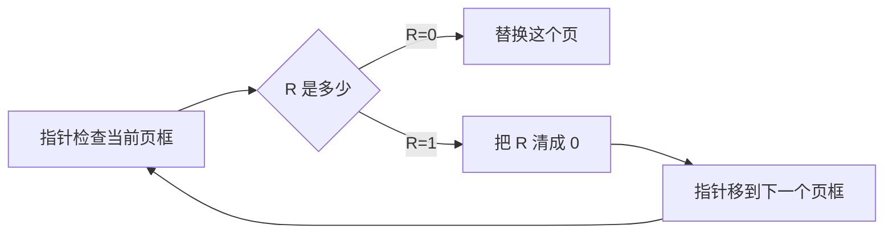

# 虚拟存储与页面置换：内存不够外存凑，缺页了就换页

## 痛点：程序比内存还大，装不下怎么办？

上一篇说的分页，前提是"内存装得下"。可程序往往比物理内存还大，总不能让它跑不了。答案：**只把当前要用的一部分页装进内存**，用不到的留在磁盘；等要用没装的那页，再把它调进来（**缺页**），必要时把老页换出去。这就是**虚拟存储**。

> 痛点一句话：**内存装不下程序就"假大内存"——只装用得到的页，缺了再调、满了再换。** 软考必考：调页过程 + 四种页面置换算法谁换谁、缺页次数怎么数。

## 定义（讲人话）

- **虚拟存储** = 用外存"假装"很大内存：程序只需要一部分页在内存就能跑，其余在磁盘。
- **缺页** = 要访问的页不在内存 → 去磁盘调 → 造成一次"缺页中断"。
- **页面置换** = 内存满了但还要调新页，得把某个老页踢出去腾地方。

类比：你手机内存只剩一点点，但要看很多照片。你只会"要看哪张就现下载哪张，看完全删"——虚拟存储同理，只留当前要看的页。

> 记一句：**内存只放热门页，缺了就外存调，满了就换页——虚拟存储就是"按需加载 + 老了换出"。**

## 逐个认识：四大页面置换算法

| 算法 | 换了谁 | 特点 | 考试怎么认 |
| --- | --- | --- | --- |
| **OPT（最优）** | 换"未来最久才用"的页 | 理想最优，**无法实现** | "理论上限" |
| **FIFO** | 换"最早进来"的页 | 实现简单，**可能 Belady 异常** | "先进先出" |
| **LRU** | 换“过去最久没被用”的页 | 利用局部性，性能通常较好 | “最近最久未用” |
| **Clock** | 环形扫描访问位，给最近访问过的页“第二次机会” | 比精确 LRU 更容易实现、维护开销更低 | “环、指针、访问位” |

**核心区分一句话**：

> **OPT 是理论上限但无法预知未来；FIFO 简单且可能出现 Belady 异常；LRU 利用过去推测未来；Clock 用较低开销近似 LRU。**

## Clock 到底怎么工作：指针绕圈，给最近用过的页一次机会

先不要把“近似 LRU”当结论背。Clock 真正做的是：

> **给每个页框附一个访问位（Reference bit，记作 R），再用一个指针按环形顺序扫描页框。**

### 访问位 R 是什么

- 某个页刚装入内存，或后来又被访问：把它的 **R 置为 1**。
- R=1 表示：**最近这段时间它被访问过。**
- R=0 表示：**从上一次被 Clock 检查/清零后，它一直没有再被访问。**

当发生缺页、而且内存已经满了，需要找牺牲页时，Clock 指针开始往前扫：

也就是说：

> **R=1 不马上换，先给它一次“第二次机会”；R=0 才真正淘汰。**

### 一个具体例子

假设有 4 个页框，当前是：

| 页框 | 页面 | R |
| --- | --- | --- |
| 1 | A | 1 |
| 2 | B | 1 |
| 3 | C | 0 |
| 4 | D | 1 |

指针现在指向 A。

发生缺页，需要换出一个页面：

1. 扫到 A：R=1 → 不换，把 A 的 R 清成 0，指针往后；
2. 扫到 B：R=1 → 不换，把 B 的 R 清成 0，继续；
3. 扫到 C：R=0 → **直接换掉 C**。

所以最终牺牲的是 C。

### 那“最近一轮没访问”这个理解对不对？

可以这样理解，但要加一个前提：

> **如果一个页在指针上次扫过并把它的 R 清成 0 以后，到这次再次扫到它之前都没有被访问，那么它会保持 R=0，很可能被淘汰。**

因此 Clock 不是精确记“最后一次访问发生在几点几分”，而是粗略记录：

> **“最近这一轮里，它有没有再被用过？”**

这就是为什么它叫 **近似 LRU**：

- LRU 要精确知道“谁最久没被访问”；
- Clock 只记录一个 0/1，判断“最近是否用过”。

### 为什么比 LRU 省事

如果要实现精确 LRU，系统得持续维护访问先后顺序或时间信息，开销比较大。

Clock 只需要：

- 每个页框一个访问位 R；
- 一个环形指针。

所以用更低的维护成本，获得“优先保留最近访问页”的近似效果。

> **一句话：Clock = 环形 FIFO + 访问位 + 第二次机会。**

## 核心机制：缺页次数怎么数（必考计算）

**方法套路（LRU / FIFO 通用）**：拿一个"页面串"（访问序列），用一个小窗口表示内存能放几页，逐格走，每格判断"这一页在不在内存里"，不在就算一次缺页。

**完整示例（LRU）**：页面串 `1 2 3 4 1 2 5 1 2 3 4 5`，内存放 3 页。

| 访问 | 1 | 2 | 3 | 4 | 1 | 2 | 5 | 1 | 2 | 3 | 4 | 5 |
| --- | --- | --- | --- | --- | --- | --- | --- | --- | --- | --- | --- | --- |
| 是否缺页 | E | E | E | E | E | E | E | H | H | E | E | E |

缺页次数为：

$$3+1+1+1+1+0+0+1+1+1=10$$

（第一格前 3 格必缺页：内存是空的；每引入新页、内存满时的替换都算缺页。）

**易错点**：

- 前几次访问内存是空的，**必然先缺页**，别漏。
- LRU 换页看"上次使用多久前"，不是按"最早进入"——FIFO 才是看进入时间。
- Belady 异常是“页框变多，缺页反而变多”。FIFO 是经典会出现该异常的算法；OPT、LRU 属于栈算法，不会出现该异常，不能把结论扩大到所有其他算法。

## 这个知识与考试的关系

- **选择题**：OPT 理论最优但无法实现；FIFO 可能出现 Belady 异常；LRU 按过去最久未用来替换。
- **计算题**：给访问串 + 页框数，用 LRU/FIFO 数缺页次数。
- **陷阱**：把"缺页算成命中"——只有"页已在内存"才算命中。
- **陷阱**：抖动=频繁换页性能雪崩，跟算法好坏要分清。

## 记忆口诀

> **OPT 理想、FIFO 翻车、LRU 靠谱、Clock 平价；缺页 = 不在内存才记一次，前几格空着必缺页。**

## 下一站

> 顺着主线往下看 [[文件管理]]——内存管的是"运行时的页"，可数据要长久保存，得落到外存；位示图、索引、多重索引就是"数据住哪儿"的计算重头。
> 想回看地址怎么转换的，回 [[存储管理]]。
