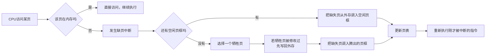
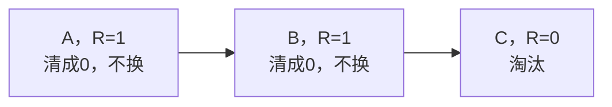

# 虚拟存储与页面置换：内存不够外存凑，缺页了就换页

## 痛点：程序比内存还大，装不下怎么办？

上一篇说的分页，前提是"内存装得下"。可程序往往比物理内存还大，总不能让它跑不了。答案：**只把当前要用的一部分页装进内存**，用不到的留在磁盘；等要用没装的那页，再把它调进来（**缺页**），必要时把老页换出去。这就是**虚拟存储**。

> 痛点一句话：**内存装不下程序就"假大内存"——只装用得到的页，缺了再调、满了再换。** 软考必考：调页过程 + 四种页面置换算法谁换谁、缺页次数怎么数。

## 定义（讲人话）

- **虚拟存储** = 用外存"假装"很大内存：程序只需要一部分页在内存就能跑，其余在磁盘。
- **缺页** = 要访问的页不在内存 → 去磁盘调 → 造成一次"缺页中断"。
- **页面置换** = 内存满了但还要调新页，得把某个老页踢出去腾地方。

类比：你手机内存只剩一点点，但要看很多照片。你只会"要看哪张就现下载哪张，看完全删"——虚拟存储同理，只留当前要看的页。

> 记一句：**内存只放热门页，缺了就外存调，满了就换页——虚拟存储就是"按需加载 + 老了换出"。**

## 先把共同流程讲清：发生缺页后，系统到底做什么

四种算法先别急着背。无论最后用 OPT、FIFO、LRU 还是 Clock，**缺页刚发生时前半段流程是一样的**。



所以真正需要页面置换算法的地方只有这里：

> **缺页 + 内存已满 → 选谁出去？**

如果还有空闲页框，直接把缺失页装进去，根本不需要 OPT/FIFO/LRU/Clock。

四种算法的区别，本质上就是对“牺牲页”这个问题给出四种不同答案。

---

## 四大页面置换算法：到底在缺页时换谁

| 算法 | 缺页且内存满时怎么选牺牲页 | 核心依据 | 考试怎么认 |
| --- | --- | --- | --- |
| **OPT（最优）** | 换“从现在往未来看，最晚才会再次访问”的页 | 看未来 | 理论最优、无法真实实现 |
| **FIFO** | 换“最早进入内存”的页 | 看进入时间 | 先进先出、可能 Belady 异常 |
| **LRU** | 换“往过去看，最久没有被访问”的页 | 看最近使用历史 | 最近最久未用 |
| **Clock** | 环形扫描访问位，优先换 R=0 的页 | 看最近是否被访问过 | 环、指针、访问位、第二次机会 |

> **OPT 看未来，FIFO 看进来多久，LRU 看多久没用，Clock 看最近有没有再用。**

---

## OPT 怎么处理一次缺页：偷看未来，换最晚才会用的

假设现在 3 个页框里有：

```text
[A, B, C]
```

现在访问 D，D 不在内存，所以发生缺页，而且内存已经满了。

假设后面的访问顺序是：

```text
A → C → …… → B
```

OPT 会往**未来**看：

- A 很快就要再用；
- C 也会较快再用；
- B 很久以后才会再用。

所以它选择 B：

```text
[A, B, C]
    ↓ 淘汰 B
[A, D, C]
```

为什么这样最优？

因为 B 离下一次使用最远，暂时把它换出去，短期内最不容易因为 B 再次发生缺页。

### 为什么现实里不能直接使用 OPT

操作系统在程序运行时并不知道**未来**究竟会访问哪一页。

所以 OPT 主要作为：

> **理论最优基准：用来比较其他算法到底离“最好情况”有多远。**

---

## FIFO 怎么处理一次缺页：谁最早进来，谁先出去

仍然假设：

```text
[A, B, C]
```

但三个页面装入内存的先后顺序是：

```text
A 最早 → B → C 最晚
```

现在访问 D，发生缺页且内存已满。

FIFO 不关心 A 最近有没有被频繁访问，只问：

> **谁进入内存最早？**

答案是 A，因此：

```text
[A, B, C]
 ↓ 淘汰 A
[D, B, C]
```

FIFO 实现简单，因为只需要维护页面进入内存的先后顺序。

它的问题是：

> **A 虽然进入得最早，却可能刚刚还被频繁使用，FIFO 仍然会把它换掉。**

这也是 FIFO 可能表现不佳、甚至出现 **Belady 异常** 的原因之一。

---

## LRU 怎么处理一次缺页：谁过去最久没用，谁出去

假设当前页框还是：

```text
[A, B, C]
```

最近一次被访问的先后关系是：

```text
B 最久没用 → A → C 刚刚用过
```

现在访问 D，发生缺页。

LRU 不看谁最早进入，而是问：

> **A、B、C 中，谁距离“上一次被访问”已经最久？**

答案是 B，所以：

```text
[A, B, C]
    ↓ 淘汰 B
[A, D, C]
```

LRU 背后的想法是程序局部性：

> **过去很久都没再使用的页面，短期内可能也不容易使用。**

### LRU 和 FIFO 最容易混在哪里

假设 A 很早就进入内存，但刚刚又被访问过：

- **FIFO**：仍可能换 A，因为它“进入最早”；
- **LRU**：通常不会换 A，因为它“刚刚使用过”。

所以：

> **FIFO 看进入时间；LRU 看最后使用时间。**

---

## Clock 怎么处理一次缺页：绕圈找 R=0，R=1 先给第二次机会

Clock 是为了降低精确 LRU 的维护成本。

它给每个页框一个访问位 R：

- 页刚装入或后来被访问 → R=1；
- 指针扫到 R=1 → 把它改成 0，暂时不换；
- 指针扫到 R=0 → 选它作为牺牲页。

假设：

| 页框 | 页面 | R |
| --- | --- | --- |
| 1 | A | 1 |
| 2 | B | 1 |
| 3 | C | 0 |
| 4 | D | 1 |

指针从 A 开始，发生一次新缺页：



所以 C 被替换。

如果 A 被清成 0 后，在指针下一次绕回来前又被访问，它会重新变成 R=1，于是又能获得一次机会。

> **Clock = 环形 FIFO + 访问位 + 第二次机会。**

它不像 LRU 那样精确记录“最后访问时间”，只是粗略判断：

> **最近这一轮里有没有被重新访问过。**

因此它是**近似 LRU**。

---

## 把四种算法放到同一次缺页里看

假设现在内存里都是：

```text
[A, B, C]
```

现在都要访问 D，而且没有空闲页框。

四种算法都会先经历：


真正不同的是最后一步：

| 算法 | 它会问什么 |
| --- | --- |
| OPT | “A/B/C 谁未来最晚才会再用？” |
| FIFO | “A/B/C 谁最早进入内存？” |
| LRU | “A/B/C 谁过去最久没被使用？” |
| Clock | “从指针开始，谁最先遇到 R=0？” |

选好牺牲页以后，后面的动作又重新一样：


> **所以：缺页处理流程基本相同，四种页面置换算法只负责决定“换谁”。**

## 核心机制：缺页次数怎么数（必考计算）

**方法套路（LRU / FIFO 通用）**：拿一个"页面串"（访问序列），用一个小窗口表示内存能放几页，逐格走，每格判断"这一页在不在内存里"，不在就算一次缺页。

**完整示例（LRU）**：页面串 `1 2 3 4 1 2 5 1 2 3 4 5`，内存放 3 页。

| 访问 | 1 | 2 | 3 | 4 | 1 | 2 | 5 | 1 | 2 | 3 | 4 | 5 |
| --- | --- | --- | --- | --- | --- | --- | --- | --- | --- | --- | --- | --- |
| 是否缺页 | E | E | E | E | E | E | E | H | H | E | E | E |

缺页次数为：

$$3+1+1+1+1+0+0+1+1+1=10$$

（第一格前 3 格必缺页：内存是空的；每引入新页、内存满时的替换都算缺页。）

**易错点**：

- 前几次访问内存是空的，**必然先缺页**，别漏。
- LRU 换页看"上次使用多久前"，不是按"最早进入"——FIFO 才是看进入时间。
- Belady 异常是“页框变多，缺页反而变多”。FIFO 是经典会出现该异常的算法；OPT、LRU 属于栈算法，不会出现该异常，不能把结论扩大到所有其他算法。

## 这个知识与考试的关系

- **选择题**：OPT 理论最优但无法实现；FIFO 可能出现 Belady 异常；LRU 按过去最久未用来替换。
- **计算题**：给访问串 + 页框数，用 LRU/FIFO 数缺页次数。
- **陷阱**：把"缺页算成命中"——只有"页已在内存"才算命中。
- **陷阱**：抖动=频繁换页性能雪崩，跟算法好坏要分清。

## 记忆口诀

> **OPT 理想、FIFO 翻车、LRU 靠谱、Clock 平价；缺页 = 不在内存才记一次，前几格空着必缺页。**

## 下一站

> 顺着主线往下看 [[文件管理]]——内存管的是"运行时的页"，可数据要长久保存，得落到外存；位示图、索引、多重索引就是"数据住哪儿"的计算重头。
> 想回看地址怎么转换的，回 [[存储管理]]。
