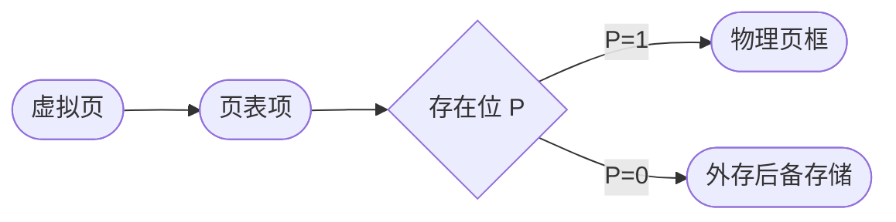
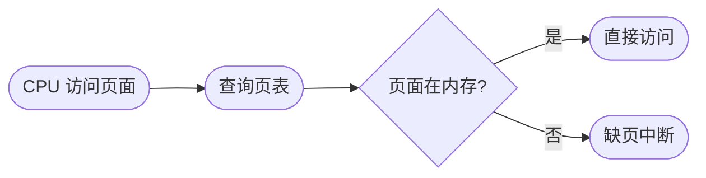
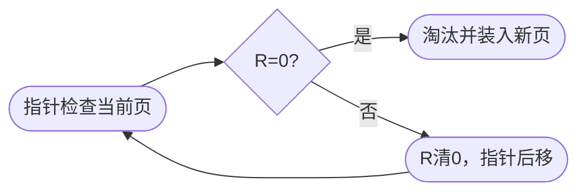

# 虚拟存储与页面置换：页不在内存时，系统到底怎么救场

## 痛点：程序想用 20 个页面，内存只给 3 个页框怎么办？

前面 [[存储管理]] 讲了分页：程序被切成一个个固定大小的**页**，物理内存被切成同样大小的**页框**，页表负责把“虚拟页号”翻译成“物理页框号”。

但如果一个进程有很多页，而当前只能分到少量物理页框，就不可能把所有页一直放在内存里。

真正的做法不是“程序太大就不能运行”，而是：

> **先把当前最可能用到的一小部分页放进内存；访问到不在内存的页时，再把它从外存调进来。**

如果此时内存还有空闲页框，直接装进去；如果页框已经满了，才需要**页面置换算法**挑一个旧页换出去。

所以这篇最重要的主线不是先背四种算法，而是先分清三个问题：

1. **为什么允许一部分页暂时不在内存？** —— 虚拟存储。
2. **访问到不在内存的页会发生什么？** —— 缺页。
3. **缺页时内存又满了，换谁出去？** —— 页面置换。

> 记一句：**虚拟存储负责“可以不全装”，缺页负责“发现没装”，页面置换负责“满了换谁”。**

---

## 先把“页、页框、外存”摆在一张图里

虚拟页并不等于一直驻留在物理内存中。页表项会告诉 CPU：这个页目前到底在不在内存。

这张图要抓住两个词：

- **页（Page）**：进程虚拟地址空间中的固定大小块。
- **页框（Frame）**：物理内存中的固定大小块。

页面大小和页框大小相同，因此一个页装入内存后，会占据一个页框。

### 为什么这种办法可行：局部性原理

程序通常不会在同一瞬间均匀访问所有代码和数据，而是集中访问某一小部分：

- **时间局部性**：刚访问过的数据，短时间内可能再次访问。
- **空间局部性**：刚访问某个地址，附近地址也可能很快被访问。

所以操作系统没有必要一次把整个进程全部装入内存，只保留当前活跃的页，就能让程序继续运行。

---

## 页表里三个位：后面的缺页、脏页、Clock 都靠它们

不同系统的页表格式不同，但软考理解页面置换时，最常见的是下面三个状态位。

| 位 | 作用 | 它回答的问题 | 后面哪里会用 |
| --- | --- | --- | --- |
| **存在位 / 有效位 P** | 标记页当前是否在物理内存 | “这个页已经装进来了吗？” | P=0 时访问该页会触发缺页 |
| **修改位 M / Dirty** | 标记页装入后是否被修改 | “换出去前要不要写回外存？” | 脏页被淘汰时通常先写回 |
| **访问位 R / Reference** | 标记页近期是否被访问 | “最近有没有用过？” | Clock 用它给页面第二次机会 |

这里就能看出：

- **缺页为什么发生？** 看 P。
- **为什么有时换出页面要先写磁盘？** 看 M。
- **Clock 为什么会有 R=0 / R=1？** 看 R。

---

# 一、缺页到底怎么发生？

CPU 每次访问虚拟地址时，要先根据页表判断目标页是否驻留在内存。

教材通常称为**缺页中断**。考试时看到下面这类描述，都要立刻想到缺页：

- 页表存在位为 0；
- 访问的页不在主存；
- 需要从磁盘调入页面；
- 当前页框中找不到目标页。

### 一个非常容易混淆的点

> **缺页 ≠ 一定发生页面置换。**

缺页只说明“要访问的页不在内存”。

如果内存还有空闲页框，直接把缺失页装进空闲页框即可，根本不需要淘汰旧页。

只有：

> **缺页 + 没有空闲页框**

才进入页面置换算法。

---

# 二、发生缺页后，操作系统怎么处理？

把缺页后的共同处理流程单独画出来，就不需要在每种算法里重复十几步。

其中“选择牺牲页并置换”内部还可能包含：

1. 页面置换算法选出牺牲页；
2. 如果牺牲页是脏页（M=1），先写回外存；
3. 把缺失页读入腾出的页框；
4. 更新页表中的页框号、存在位等信息；
5. 重新执行刚才因为缺页而中断的指令。

> **四种页面置换算法只负责一个问题：内存满时，“牺牲页选谁”。**

---

# 三、四种页面置换算法先看总表

| 算法 | 缺页且内存满时淘汰谁 | 依据 | 命中后会改变什么 | 典型考试关键词 |
| --- | --- | --- | --- | --- |
| **OPT** | 未来最晚才会再次访问的页 | 未来访问序列 | 无需真实维护 | 理论最优、无法实现 |
| **FIFO** | 最早进入内存的页 | 装入先后顺序 | **队列顺序不变** | 先进先出、Belady 异常 |
| **LRU** | 过去最久没有被访问的页 | 最近访问历史 | **更新最近使用顺序** | 最近最久未用 |
| **Clock** | 指针扫描时最先遇到的 R=0 页 | 访问位 R | 命中页的 R 置 1 | 环形、指针、第二次机会 |

最重要的时间轴区别：

> **OPT 看未来；FIFO 看进入时间；LRU 看过去的使用时间；Clock 不精确记时间，只看最近是否被访问过。**

下面不要只背一句话，要看它们在**命中、缺页但有空位、缺页且满**三种情况下到底怎么动作。

---

# 四、OPT：缺页且满时，偷看未来再决定换谁

OPT（Optimal）又叫最佳页面置换算法。

## OPT 的实际动作

### 1. 页面命中

目标页已经在内存：

> 直接访问，不发生缺页，也不需要换页。

### 2. 缺页，但还有空闲页框

> 把目标页装进空闲页框。

### 3. 缺页，而且页框已满

OPT 会查看**当前所有驻留页未来下一次被访问的位置**：

- 哪一页未来最晚才会再次访问，就淘汰哪一页；
- 如果某页以后再也不会访问，相当于“下一次访问在无限远”，优先淘汰它。

### 例子

当前内存：

**[1, 2, 3]**

现在访问页 4，发生缺页，而且内存已满。

从现在往后的访问顺序假设是：

**2 → 3 → 5 → 1**

于是：

- 页 2 很快再用；
- 页 3 接着再用；
- 页 1 最晚才会再用。

所以 OPT 淘汰页 1：

**[1, 2, 3] → [4, 2, 3]**

## 为什么 OPT 最好却不能真正使用？

因为操作系统运行程序时，并不知道程序**未来**到底会访问哪些页面。

因此 OPT 主要用于：

> **作为理论最优基准，比较其他算法离“最低缺页次数”还有多远。**

---

# 五、FIFO：命中了也不插队，最早进来的先走

FIFO（First In First Out）只记录页面进入内存的先后顺序。

可以把页框想成一个排队队列：

**队头（最老） → …… → 队尾（最新）**

## FIFO 的实际动作

### 1. 页面命中

目标页已经在内存：

> 直接访问，**但页面在 FIFO 队列中的位置不变**。

这是 FIFO 和 LRU 最关键的区别之一。

### 2. 缺页，但还有空闲页框

> 新页装入空闲页框，并排到队尾。

### 3. 缺页，而且页框已满

> 淘汰队头，也就是最早进入内存的页；新页放到队尾。

### 例子：刚访问过，照样可能被 FIFO 淘汰

3 个页框依次装入：

**1 → 2 → 3**

FIFO 队列是：

**1（最老） → 2 → 3（最新）**

此时再次访问页 1：

- 命中；
- 但 FIFO 队列仍然是 **1 → 2 → 3**；
- 页 1 不会因为“刚刚被使用”而变年轻。

下一步访问页 4，发生缺页且内存已满。

于是 FIFO 仍然淘汰页 1：

**[1, 2, 3] → [4, 2, 3]**

> **FIFO 看的是“进来多久”，不是“多久没用”。**

## FIFO 的经典陷阱：Belady 异常

一般直觉会觉得：页框越多，缺页应该越少。

但 FIFO 在某些访问序列中可能出现：

> **页框数增加，缺页次数反而增加。**

这就是 **Belady 异常**。

考试看到“增加页框反而缺页更多”，优先想到 FIFO。

---

# 六、LRU：每次命中都会刷新“最近使用顺序”

LRU（Least Recently Used）淘汰的是：

> **从过去往回看，最久没有被访问的页。**

它利用的是程序的时间局部性：过去很久都没有用的页，短期内也可能不急着用。

## LRU 的实际动作

### 1. 页面命中

目标页已经在内存：

> 不换页，但要把它更新为“最近刚使用”。

所以**一次命中会改变 LRU 的先后顺序**。

### 2. 缺页，但还有空闲页框

> 新页装入空闲页框，并记为最近使用。

### 3. 缺页，而且页框已满

> 找到“上一次访问距离现在最久”的页，把它淘汰；新页成为最近使用页。

### 同一个例子，看出 FIFO 和 LRU 的差别

访问序列先走：

**1 → 2 → 3 → 1**

3 个页框已经装满 **[1, 2, 3]**。

最后一次访问的是页 1，因此 LRU 的“从最久没用到最近刚用”顺序变成：

**2 → 3 → 1**

此时访问页 4，发生缺页。

LRU 淘汰的是页 2：

**[1, 2, 3] → [1, 4, 3]**

而刚才 FIFO 在同样场景里会淘汰页 1。

所以一定要记住：

> **FIFO 命中不改队列；LRU 命中会刷新最近使用顺序。**

## LRU 为什么现实实现成本比 FIFO 高？

因为系统要知道“谁最久没访问”，就需要维护访问时间、访问顺序或等价的数据结构。

精确维护这些信息有成本，所以实际系统常使用更便宜的近似方法，其中最经典的就是 Clock。

---

# 七、Clock：不是“淘汰上一轮没访问的页”，而是环形扫描找 R=0

Clock 又叫时钟算法、第二次机会算法，是对 LRU 的一种近似。

它把所有页框排成一个环，维护一个指针，并为每个页框保存访问位 R。

## Clock 的三个规则

1. **页面被访问时**：把该页的 R 置为 1。
2. **缺页且页框已满时**：从当前指针位置开始扫描。
3. 扫描到：
   - R=0：直接选择它作为牺牲页；
   - R=1：先把它清成 0，指针后移，给它一次“第二次机会”。

## 例子

当前页框：

| 指针顺序 | 页面 | R |
| --- | --- | --- |
| → | A | 1 |
|  | B | 1 |
|  | C | 0 |
|  | D | 1 |

现在访问新页 X，发生缺页且内存已满。

扫描过程：

1. 指针看 A：R=1 → 改成 0，不淘汰；
2. 看 B：R=1 → 改成 0，不淘汰；
3. 看 C：R=0 → 淘汰 C，装入 X。

所以最终换掉的是 C。

### 你之前问的“是不是替换最近一轮没有被访问的？”

更准确的说法是：

> **Clock 优先淘汰“从上次被扫描并清零之后，没有再次被访问过”的页面。**

它不是严格统计“最近一整轮”，也没有像 LRU 那样记录每个页的精确最近访问时间。

如果 A 被扫描时从 1 清成了 0，但在指针下一次绕回来之前又被程序访问，那么 A 会重新变成 R=1，再次获得第二次机会。

### 指针什么时候动？

基本 Clock 中：

- 普通页面命中：主要动作是把该页 R 置 1，**不会因为每次命中就把时钟指针跳到该页**；
- 真正发生置换时：指针从当前位置开始扫描，并随着扫描向后移动；
- 完成替换后：指针通常继续指向被替换位置的下一个页框。

> 记一句：**命中改 R，置换才扫圈。**

---

# 八、同一个访问片段，FIFO 和 LRU 为什么会选不同页面？

这是最值得手推的一组：

访问序列：

**1 → 2 → 3 → 1 → 4**

页框数：3。

前 3 次后：

**[1, 2, 3]**

第 4 次访问 1：

- **FIFO**：命中，但“进入顺序”不变，1 仍然是最老页；
- **LRU**：命中，1 变成最近刚使用的页。

第 5 次访问 4，发生缺页且内存满：

| 算法 | 此时依据 | 淘汰页 |
| --- | --- | --- |
| FIFO | 谁最早进入内存 | **1** |
| LRU | 谁过去最久没被使用 | **2** |

这就是做题时最常见的分叉点。

---

# 九、缺页次数怎么算：不要只写 E/H，要把页框状态手推出来

页面访问序列：

**1 2 3 4 1 2 5 1 2 3 4 5**

页框数：3。

下面用 LRU 完整手推。

| 步骤 | 访问页 | 页框状态 | 结果 | 淘汰页 |
| ---: | ---: | --- | --- | --- |
| 1 | 1 | [1, -, -] | 缺页 | - |
| 2 | 2 | [1, 2, -] | 缺页 | - |
| 3 | 3 | [1, 2, 3] | 缺页 | - |
| 4 | 4 | [4, 2, 3] | 缺页 | 1 |
| 5 | 1 | [4, 1, 3] | 缺页 | 2 |
| 6 | 2 | [4, 1, 2] | 缺页 | 3 |
| 7 | 5 | [5, 1, 2] | 缺页 | 4 |
| 8 | 1 | [5, 1, 2] | 命中 | - |
| 9 | 2 | [5, 1, 2] | 命中 | - |
| 10 | 3 | [3, 1, 2] | 缺页 | 5 |
| 11 | 4 | [3, 4, 2] | 缺页 | 1 |
| 12 | 5 | [3, 4, 5] | 缺页 | 2 |

因此：

$$
\text{缺页次数}=10
$$

$$
\text{缺页率}=\frac{10}{12}\approx83.3\%
$$

命中次数为 2，因此：

$$
\text{命中率}=\frac{2}{12}\approx16.7\%
$$

### 做题固定四步

每访问一个页，都按下面顺序判断：

1. **页在不在当前页框？**
2. 在 → 命中，不计缺页；
3. 不在 → 缺页次数 +1；
4. 如果页框已满，再按题目指定算法决定淘汰谁。

> **第一次把页装进空页框同样算缺页。**  
> “没有发生淘汰”不等于“没有发生缺页”。

---

# 十、四种算法最容易混的细节

| 易混点 | 正确理解 |
| --- | --- |
| 缺页就一定换页 | 错。还有空闲页框时只调入，不淘汰 |
| FIFO 命中后把该页移到队尾 | 错。FIFO 只看装入时间，命中通常不改变队列顺序 |
| LRU 淘汰最早进入内存的页 | 错。那是 FIFO；LRU 看最近一次使用时间 |
| Clock 遇到 R=1 就淘汰 | 错。R=1 先清 0，给第二次机会 |
| Clock 就是精确 LRU | 错。Clock 只利用访问位近似最近使用情况 |
| OPT 可以直接用于真实操作系统 | 错。它需要知道未来访问序列 |
| 脏页和干净页换出成本一样 | 不一定。脏页通常还要写回外存 |
| 页框变多一定不会增加缺页 | 对 FIFO 不成立，可能出现 Belady 异常 |

### 哪些算法不会出现 Belady 异常？

OPT 和 LRU 属于经典的**栈算法**，不会出现 Belady 异常。

FIFO 可能出现。

Clock 不要在考试里未经题目条件就简单套成“绝不会出现”。

---

# 十一、为什么缺页太多会“抖动”？

虚拟存储成立的基础是局部性：进程当前真正活跃的页应该能在有限页框中待住。

如果一个进程真正频繁访问的页面集合太大，而系统给它的页框太少，就可能出现：

**刚换出 A → 马上又要 A → 再换入 A → 又把 B 换掉 → 马上又要 B……**

系统的大量时间都花在磁盘调页，而不是执行真正的程序。

这叫**抖动（Thrashing）**。

> **抖动不是“发生了一次缺页”，而是缺页过于频繁，页面不断换进换出，性能急剧下降。**

---

# 十二、这个知识与考试怎么对应

## 选择题

重点认这些题眼：

- “理论最优、未来最晚使用” → **OPT**
- “最早进入、先进先出” → **FIFO**
- “最近最久未使用” → **LRU**
- “访问位、指针、第二次机会、环形扫描” → **Clock**
- “页框增加反而缺页增加” → **Belady 异常 / FIFO**
- “页不在内存，需要从外存调入” → **缺页**

## 计算题

最常见题型：

> 给出“页面访问序列 + 页框数 + 指定算法”，求缺页次数或缺页率。

做题时不要只在脑中想，必须手写：

- 当前页框；
- 是否命中；
- 淘汰了谁；
- FIFO 的装入顺序 / LRU 的最近使用顺序 / Clock 的 R 位和指针。

## 判断题最爱设的坑

> “页面置换算法用于每一次缺页。”

错。

准确说法是：

> **缺页且没有空闲页框时，才需要页面置换算法选择牺牲页。**

---

# 十三、记忆口诀

> **虚拟存储：不用全装，缺了再调。**  
> **缺页处理：有空位直接装，没空位才换页。**  
> **OPT 看未来，FIFO 看入场，LRU 看过去，Clock 看 R 位。**  
> **FIFO 命中不插队，LRU 命中会变新，Clock 命中把 R 置 1。**

---

# 十四、闭卷自测

- [ ] “缺页”和“页面置换”能一句话区分吗？
- [ ] 为什么第一次把页面装入空页框也算缺页？
- [ ] FIFO 页面命中后，队列顺序会不会变化？
- [ ] LRU 页面命中后，最近使用顺序会不会变化？
- [ ] Clock 扫到 R=1 和 R=0 分别做什么？
- [ ] Clock 为什么叫“第二次机会”？
- [ ] OPT 为什么缺页次数最少却不能真实实现？
- [ ] Belady 异常最经典地出现在哪个算法？
- [ ] 脏页被淘汰时为什么通常要先写回外存？
- [ ] 页框太少、缺页太频繁最终会造成什么现象？

## 下一站

> 顺着主线往下看 [[文件管理]]——虚拟内存解决的是“程序运行时的页放哪”，文件系统继续解决“数据怎样长期放在外存里”。  
> 想回看“页号、页框号、地址转换”怎么来的，回 [[存储管理]]。
