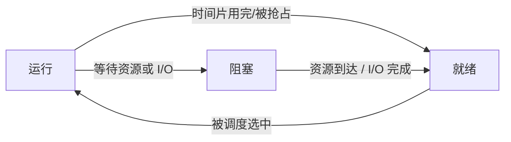

# 进程与线程：先有程序，再有进程，最后才需要线程

## 痛点：为什么会有程序？为什么程序运行后还要再发明“进程”和“线程”？

上一篇 [[操作系统概述]] 说，操作系统要管理 CPU。可在讲“进程”之前，必须先回答一个更早的问题：

> **CPU 到底在执行什么？**

CPU 本身并不知道“打开网页”“播放音乐”“计算工资”这些人类任务是什么意思。它只会机械地执行一条条机器指令，例如取数、计算、比较、跳转、读写内存。

可人真正需要的是一个**完整而且可以重复完成的任务**。总不能每次开浏览器，都由人临时一条一条告诉 CPU 接下来做什么。

于是需要先把完成任务所需的步骤写好、组织好、保存下来：

> **程序（Program）= 为了完成某个任务，预先组织并保存的一组指令和数据。**

所以“程序”首先解决的是：

> **人要完成完整任务，但 CPU 只会执行零散指令，怎么办？——把这些指令组织成程序。**

程序写好了，可以一直放在磁盘里。但它躺在磁盘上时只是静态内容，还没有真正干活。

当用户启动程序，操作系统把它装入内存、分配资源、交给 CPU 执行时，又出现第二个问题：

> **同一份程序每次运行时，执行位置、内存、打开的文件、当前状态都可能不同，OS 怎么管理“这一次运行”？**

这就需要**进程**。

而进程出现以后，还会继续遇到第三个问题：

> **一个进程内部往往不只做一件事。如果只有一条执行路线，某一步在等网络或磁盘时，其他事情也容易被拖住；如果每件事都另开一个进程，又会带来更大的资源、切换和通信成本。**

于是才需要**线程**：

> **同一个进程保留一套资源，但内部可以有多条执行路线分别干活。**

所以整篇不是三个孤立定义，而是一条连续的问题链：

> **CPU 只会执行指令 → 为完成完整任务有了程序 → 为管理程序的一次运行有了进程 → 为让一个进程内部更灵活地并发干活有了线程。**

先记住这条主线，后面的 PCB、三态和调度就都有来处了。

---

## 第一步：程序运行以后，为什么不能还叫“程序”？

假设你双击浏览器。

这时系统里不再只有磁盘上的那份程序文件，还多出了一整套“正在运行的信息”：

- CPU 执行到哪里了；
- 当前寄存器里是什么值；
- 分到了哪些内存；
- 打开了哪些文件；
- 当前是在使用 CPU，还是在等待 CPU，还是在等网络/I/O；
- 如果暂时停下来，以后从哪里继续。

这显然已经不是磁盘上的“静态程序文件”能够描述的了。

于是操作系统需要一个**动态的管理对象**来代表“这次正在运行的程序”。

这个对象就是：

> **进程（Process）= 程序的一次执行过程，是正在运行中的动态实体。**

可以先这样记：

| 概念 | 你可以理解成 | 静态/动态 |
| --- | --- | --- |
| **程序** | 磁盘上的代码和数据 | 静态 |
| **进程** | 这份程序的一次运行 | 动态 |

同一份程序甚至可以产生多个进程。比如同一个程序启动两次，两次运行的内存、状态和执行位置都可以不同。

> **程序回答“代码是什么”，进程回答“这一次现在运行成什么样了”。**

---

## 第二步：有了进程，OS 又遇到一个新麻烦——CPU 不可能一直只给它一个人

假设现在同时有：

- 浏览器进程；
- Obsidian 进程；
- 音乐播放器进程。

CPU 核心数量有限，不可能让所有进程永远同时占着 CPU。

所以操作系统会让它们轮流使用 CPU：

1. 浏览器先运行一会；
2. 暂停浏览器；
3. 让 Obsidian 运行；
4. 以后再回来继续浏览器。

问题马上来了：

> **浏览器被暂停以后，OS 下次怎么知道它刚才执行到哪了？**

如果 OS 什么都不记，那么一切换回来，浏览器就不知道该从哪里继续。

这就是 PCB 出现的真正原因。

---

## 第三步：PCB 不是凭空冒出来的，它是 OS 给每个进程建的“管理档案”

**PCB（Process Control Block，进程控制块）** 是操作系统为每个进程维护的一块管理信息。

它通常会记录：

- **进程标识信息**：例如 PID（进程号）；
- **进程当前状态**：运行、就绪、阻塞等；
- **CPU 现场**：程序计数器、寄存器等，方便以后恢复执行；
- **调度信息**：优先级、队列等；
- **资源/内存信息**：进程占用了哪些资源。

可以把 CPU 切换理解成：

> 进程 A 要暂停 → **把 A 的现场记进 PCB** → CPU 去跑进程 B → 以后再从 PCB 恢复 A 的现场。

所以 PCB 不是“另外一个孤立考点”，而是为了解决一个非常具体的问题：

> **进程会被暂停和恢复，OS 必须把它的运行现场记下来。**

### PCB 和 PID 不要混

这两个词考试容易混：

- **PID**：进程标识符/进程号，用来区分“这是哪个进程”；
- **PCB**：OS 管理这个进程的整份控制信息，也是教材里常说的**进程存在的唯一标志**。

> 题目问“进程号/标识符” → **PID**。  
> 题目问“进程存在的唯一标志/OS 管理进程的数据结构” → **PCB**。

---

## 第四步：为什么进程会有“运行、就绪、阻塞”三种状态？

现在 PCB 已经能记住进程了，下一步就很好理解：

操作系统还必须知道：

> **这个进程现在到底能不能使用 CPU？**

于是出现经典三态。

### 1. 运行（Running）

进程此刻真的占着 CPU 执行。

> **有 CPU，正在干活。**

### 2. 就绪（Ready）

进程需要的其他条件已经具备，只差 CPU。

例如浏览器已经准备好继续执行，但 CPU 此刻正在给 Obsidian 用。

> **能干活，但没抢到 CPU。**

### 3. 阻塞（Blocked / Waiting）

进程暂时就算给它 CPU 也没用，因为它还在等某个事件或资源。

例如：

- 等磁盘读取完成；
- 等网络数据回来；
- 等某个资源可用。

> **现在还不能干，先等事情发生。**

### 三态为什么这样转换



最重要的一条：

> **阻塞 → 就绪，而不是阻塞 → 运行。**

因为 I/O 完成只说明：

> “我现在终于可以继续执行了。”

但 CPU 可能还在别人手里，因此它必须先回到就绪队列重新排队。

> **阻塞醒来先排队，调度选中才能运行。**

---

## 第五步：进程已经有了，为什么还要线程？

到这里，进程已经能解决：

> **“这一份正在运行的程序归谁管理、占了哪些资源、现在是什么状态？”**

但进程还有一个新问题：**一个程序内部常常同时有很多相对独立的事情要做。**

拿浏览器来说，一个浏览器程序运行起来以后，可能同时要：

- 保持界面可以点击；
- 下载网页资源；
- 播放视频；
- 执行脚本；
- 保存文件。

假设一个进程里只有一条执行路线。

如果这条路线正在等待网络数据回来，那么它暂时干不了别的事情；用户就可能感觉“整个程序卡住了”。

### 能不能每件事都新建一个进程？

当然可以，但代价比较大。

如果把“显示页面、下载文件、播放视频”全部拆成独立进程，每个进程通常都要维护自己的一套地址空间和进程管理信息；进程之间想交换数据，还要通过 IPC 等机制通信。

也就是说：

> **多开进程能实现多路工作，但如果这些工作本来属于同一个应用、还需要大量共享代码和数据，就显得太重。**

于是出现一个更轻的办法：

> **资源不用重新分家，只在同一个进程内部增加多条执行路线。**

这些执行路线就是**线程（Thread）**。

例如可以先建立这样一个直觉：

```text
浏览器进程
├── 线程 A：处理界面
├── 线程 B：下载资源
├── 线程 C：播放视频
└── 线程 D：执行脚本
```

它们仍然属于同一个浏览器进程，因此通常可以共享：

- 地址空间；
- 代码和数据；
- 打开的文件等资源。

但每个线程又必须知道“自己执行到哪了”，因此每个线程要保留自己的执行现场，例如：

- 程序计数器；
- 寄存器；
- 栈。

所以线程真正解决的痛点是：

> **一个进程内部有多件事情要推进，既希望它们能分别执行，又不想为每件事都复制一整套进程资源。**

于是：

> **线程 = 进程内部的一条执行路径，是 CPU 调度的基本单位。**

这时再看“进程和线程”的经典区别就顺了：

> **进程主要解决资源的拥有和隔离；线程主要解决同一套资源里谁去执行、怎么多路执行。**


---

## 进程 vs 线程：理解完再看表

| 对比项 | 进程 | 线程 |
| --- | --- | --- |
| 核心角色 | 资源拥有/分配的基本单位 | CPU 调度的基本单位 |
| 地址空间 | 不同进程通常彼此独立 | 同进程线程共享地址空间 |
| 创建/切换开销 | 较大 | 通常较小 |
| 通信 | 通常需要 IPC 等机制 | 同进程可通过共享数据通信 |
| 故障影响 | 一个进程故障通常不直接破坏其他独立进程地址空间 | 一个线程严重故障可能影响整个进程 |

> 考试模型先记：**进程分资源，线程拿 CPU。**

---

## 把整条因果链一次串起来

不要分散背“程序、进程、PCB、三态、线程”，它们其实是一条连续的问题链：

1. **程序**只是磁盘里的静态代码；
2. 程序运行以后形成**进程**；
3. 多个进程要轮流使用 CPU，因此进程会暂停和恢复；
4. OS 必须记住每个进程的现场，于是有了**PCB**；
5. OS 还要知道进程现在能不能拿 CPU，于是有了**运行 / 就绪 / 阻塞**；
6. 一个进程内部还想低成本地有多条执行路线，于是有了**线程**；
7. 多个就绪进程都想要 CPU，下一篇就需要解决：**CPU 到底先给谁？**

这就是 [[进程调度]]。

---

## 考试怎么认

- “程序的一次执行过程 / 动态实体” → **进程**
- “进程号、进程标识符” → **PID**
- “进程存在的唯一标志 / OS 管理进程的数据结构” → **PCB**
- “万事俱备，只差 CPU” → **就绪**
- “等待 I/O 或资源” → **阻塞**
- “阻塞事件完成以后到哪” → **就绪**
- “资源分配基本单位” → **进程**
- “CPU 调度基本单位” → **线程**

### 常见陷阱

- ❌ 程序和进程是同一个概念  
  ✅ 程序静态，进程动态。

- ❌ PCB 就是 PID  
  ✅ PID 是标识符；PCB 是整份进程控制信息。

- ❌ 阻塞进程 I/O 完成后直接运行  
  ✅ 先进入就绪，再等待调度。

- ❌ 同一进程中的线程拥有完全独立的地址空间  
  ✅ 它们通常共享所属进程的地址空间和资源。

---

## 一句话记忆

> **程序静态躺磁盘，运行起来成进程；进程切换靠 PCB 记现场，能跑没 CPU 叫就绪，等资源叫阻塞；进程管资源，线程管执行。**

## 自测

1. 一个程序还没有启动时，为什么不能叫进程？
2. 同一份程序启动两次，为什么可以产生两个不同进程？
3. CPU 从进程 A 切换到 B，为什么需要 PCB？
4. 一个阻塞进程等到 I/O 完成，为什么不能直接变成运行状态？
5. PID 和 PCB 分别解决什么问题？
6. 为什么已经有进程以后，还需要线程？

## 下一站

> 顺着主线往下看 [[进程调度]]——现在已经知道“就绪”意味着大家都能跑、只是缺 CPU；如果就绪队列里排着很多进程，到底先让谁运行，就需要调度算法。
> 想回看 OS 为什么要管理这些东西，回 [[操作系统概述]]。
