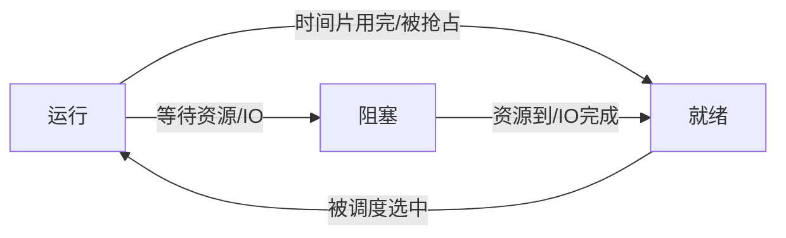

# 进程与线程：进程分家产，线程分劳动

## 痛点：程序是一份菜谱，但 CPU 要同时炒很多菜

上一篇说操作系统是大管家，管的第一件事是 CPU。可问题立刻浮现：**程序是静态的**——磁盘上那一堆代码，什么都不干；要让 CPU"炒菜"，得把它变成"正在锅里炒的那道菜"。而且 CPU 只有一个，程序成千上万，它们得排队轮流上锅。

> 痛点一句话：**程序只是菜谱，CPU 拿它没法下锅；得有个"正在运行"的实体，还得让一大票实体轮流用 CPU。**

于是操作系统发明了两个概念：**进程**（跑起来的程序）和**线程**（进程里的一条干活路线）。理解这两个概念，是后面调度、PV、死锁、内存分配全部考点的地基。

> 记一句：**程序是菜谱（静态），进程是正在炒的菜（动态），线程是这道菜里有几口锅同时开火。**

## 定义（讲人话）

- **进程** = 正在运行的程序。它不只包含代码，还带着自己的运行状态（PCB）。
- **线程** = 进程内部的一条执行路径。一个进程可以有多个线程，它们共享这个进程的地盘（地址空间、文件、数据）。

人和人的比喻最贴切：

> **进程分家产**（每个进程有自己的独立内存空间，谁也别想动谁的）；
> **线程分劳动**（同进程里的线程共享一套家产，只是一起干活、轮流抢 CPU）。

## 逐个认识

### 1. PCB：进程的身份证

每个进程都有一个 **PCB（进程控制块）**，存放它的身份、状态、寄存器信息、内存指针……这是进程**唯一标识**。

> 怎么认：题里问"进程的唯一标识 / 身份证是谁" → **PCB**。它跟人的身份证一样，丢了就是查无此人。

### 2. 三态转换：运行、就绪、阻塞

这是进程最核心的状态机，考试必考——**三态的合法路径**必须背熟：

- **运行**：正在占着 CPU 干活。
- **就绪**：万事俱备，只欠 CPU（资源都够了，就等着 CPU 施舍时间片）。
- **阻塞**：暂时没法干活，眼巴巴等某个资源或 IO 完成。

### 3. 进程 vs 线程（核心区分）

| 对比项 | 进程 | 线程 |
| --- | --- | --- |
| 分配的东西 | **资源分配单位**（内存、文件） | **CPU 调度单位** |
| 独立性 | 独立地址空间，互不干扰 | 共享所属进程的空间 |
| 切换开销 | 大（要换整个运行环境） | 小 |
| 通信 | 需要 IPC（管道/信号量等） | 直接共享变量就能聊 |
| 健壮性 | 一个崩了不影响别的进程 | 一个线程崩可能带崩整个进程 |

核心区分一句话：

> **进程是"资源的拥有者"，线程是"CPU 的使用者"。** 问"谁是资源分配单位""谁是调度单位"，就答进程 / 线程。

## 核心机制：为什么三态转换这条路径是考点重点

软考最爱挖的坑：**阻塞后的进程，只能回"就绪"，不能直接回"运行"**。为什么？因为它还要重新排队去抢 CPU——资源到了只是"可以干活了"，不代表 CPU 马上给它。

- ❌ 阻塞 → 运行（错的）
- ✅ 阻塞 → 就绪 →（被调度）→ 运行

> 记一句：**阻塞醒来先进"就绪"，别插队直接上岗。**

## 这个知识与考试的关系

- **选择题**：进程唯一标识 → PCB。
- **选择题**：三态转换合法路线 → 阻塞只能回就绪。
- **选择题**：进程/线程分工 → 资源单位 vs 调度单位。
- **陷阱**：把"进程切换开销小"说成线程 ❌，线程才小。
- **陷阱**：管道通信是半双工、先进先出（进程间通信考点常混）。

## 记忆口诀

> **进程分家产，线程分劳动；PCB 是身份证，阻塞回就绪、就绪等 CPU。**

## 下一站

> 顺着主线往下看 [[进程调度]]——一大票进程都在就绪队列排队，那 CPU 到底先给谁？这就是"调度算法"要解决的问题，也是第一个重量级计算考点。
> 想回看操作系统为什么存在，回 [[操作系统概述]]。