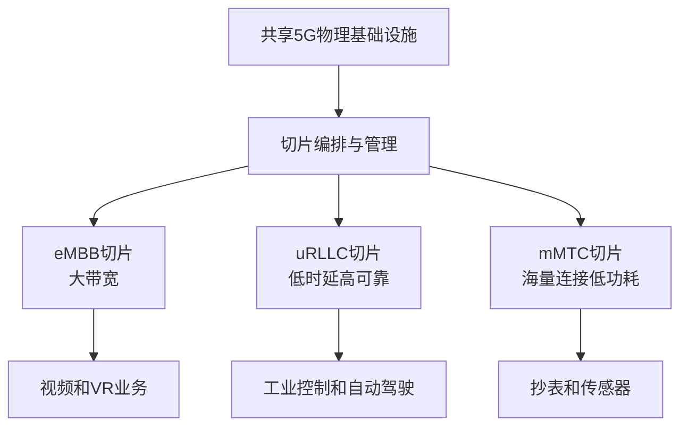

# 5G 网络切片：一张物理网里的多条“专用车道”

> [!important] 一句话结论
> 网络切片把同一套 5G 物理基础设施划分为多张相互隔离的逻辑网络，按业务定制 QoS；它是逻辑隔离和资源编排，不是为每个业务铺一套独立物理网络。

## 痛点：一张网络很难同时满足“快、准、多”

高清视频希望获得大带宽，自动驾驶需要稳定的低时延，传感器网络需要接入大量低功耗设备。若三类业务共享完全相同的资源和参数，高清视频可能挤占控制业务资源，物联网设备又会带来大量连接管理压力。

网络切片的定位是：不重复建设多套物理网络，而是在同一张物理网络上创建多张逻辑网络，为不同业务提供不同的资源、策略和服务等级。

## 定义：物理共享，逻辑分治

网络切片可以理解为“同一栋楼里的专用通道”：楼的电力、机房和线路可以共享，但每个业务切片拥有独立的逻辑配置、服务策略和资源保障。切片通常贯穿无线接入网、承载网和核心网，并由编排与管理系统负责创建、调整和回收。

这里的“隔离”主要是逻辑隔离和资源/策略隔离，具体隔离强度取决于实现；它不等于每个切片拥有完全独立的物理设备。

## 核心机制：按业务需求编排切片

切片生命周期通常包括需求定义、资源编排、部署、监控、动态调整和释放。SDN 提供可编程的网络控制思路，NFV 支持把网络功能软件化、虚拟化；它们常与网络切片一起出现，但不是“网络切片”四个字的同义词。

## 易混对比：网络切片与传统专线

| 对比项 | 网络切片 | 传统物理专线 |
| --- | --- | --- |
| 基础设施 | 多业务共享物理基础设施 | 通常提供专用物理或固定资源 |
| 隔离方式 | 逻辑、策略和资源层面的隔离 | 物理或固定链路隔离更直观 |
| 灵活性 | 可按业务动态创建和调整 | 调整成本通常较高 |
| 关键技术 | 虚拟化、SDN/NFV、编排 | 专用线路和固定配置 |
| 考试关键词 | 一网多片、按需 QoS | 独享链路、固定专用资源 |

**核心区分**：网络切片的价值是“共享基础设施下的按需逻辑专用”，不是简单把一条物理线永久分给一个客户。

## 这个知识与考试的关系

- “一张物理网络切成多张逻辑网络”直接对应网络切片。
- “不同业务不同 QoS、资源隔离、按需编排”是核心特征。
- eMBB、uRLLC、mMTC 是典型切片需求，不要把切片误认为某一种无线接入技术。
- 看到 SDN/NFV 时，理解为支撑灵活控制和虚拟化部署的相关技术；切片本身是面向业务的逻辑网络组织方式。

## 记忆口诀

**一网多片，逻辑隔离；业务不同，QoS 定制；共享底座，按需编排。**

## 下一站 / 链接

- 沿主线往下看 [[网络性能指标]]：切片是否满足业务，需要用带宽、时延、吞吐和可靠性等指标验收。
- 想回看这段，回 [[5G]]；关联主题是 [[非性能性指标]]。

