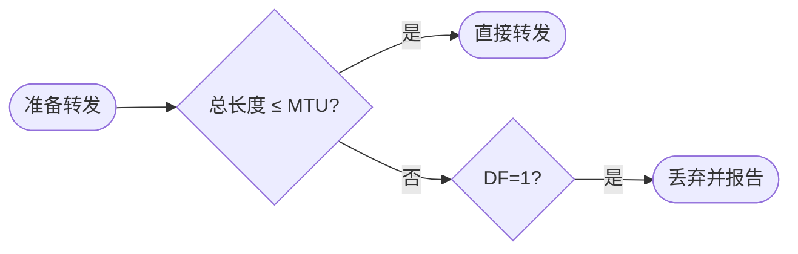

# IPv4 报文与分片：一封太大的信怎样过窄桥

> [!important] 一句话结论
> IPv4 分片题盯住 MTU、标识、DF、MF 和片偏移：每个分片共享同一标识，除末片外数据长度通常是 $8$ 字节的整数倍，片偏移按 $8$ 字节计。

## 痛点：同一个 IP 报文不一定能原样过每条链路

不同链路能承载的最大帧数据不同，这个上限叫 MTU。发送端生成的 IP 数据报可能很大，但中途某条链路的 MTU 较小，整个数据报就无法一次装进链路帧。

IPv4 提供分片机制，把一个大的 IP 数据报切成多个较小的分片，各片独立经过网络，接收端再根据标识、片偏移和 MF 标志重组。这个机制位于网络层，解决的是“跨不同 MTU 链路传输”的适配问题。

## 定义：IPv4 首部是报文的“运输面单”

IPv4 报文由首部和数据组成。首部最小长度为 $20$ 字节，实际长度由 IHL 决定；总长度字段包含首部和数据两部分。

| 字段 | 作用 | 题干怎么认 |
| --- | --- | --- |
| 版本 | IPv4 的版本号 | 版本为 4 |
| 首部长度 IHL | 指出首部长度 | 最小 $20$ 字节 |
| 总长度 | 首部加数据的总字节数 | 不能只算数据 |
| 标识 Identification | 标识同一原始数据报 | 同一报文的分片相同 |
| 标志 Flags | DF 是否禁止分片，MF 是否还有后续分片 | DF、MF |
| 片偏移 | 分片数据在原报文中的位置 | 单位是 $8$ 字节 |
| TTL | 防止报文在路由环路中无限转发 | 每经过一跳通常减 1 |
| 协议 | 标明上层协议 | ICMP=1、TCP=6、UDP=17 |

## 核心机制：分片与重组

某条链路的最大 IP 数据部分是：

$$
\text{最大分片数据长度}=\text{MTU}-\text{IP首部长度}
$$

若 DF=1，表示禁止分片；报文过大时不能切分，通常丢弃并通过 ICMP 报告。若允许分片，前面各分片的有效数据长度要按 $8$ 字节对齐，末片可以不足 $8$ 字节。MF=1 表示后面还有分片，末片 MF=0。

先判断“需不需要/能不能分”：

如果超 MTU 且允许分片，再执行真正的切分：

目的主机最后根据**标识 + 片偏移 + MF**恢复原数据报。

通常由目的主机完成重组。分片越多，首部重复越多，丢失任意一片都可能导致整个原始数据报无法重组，因此现代网络常通过路径 MTU 发现尽量避免分片。

## 性能测算：分片数与片偏移

题目：一个 IPv4 数据报总长度为 $4000$ 字节，首部 $20$ 字节，经过 MTU 为 $1500$ 字节的链路，求分片数量和各片片偏移。

每片最多承载：

$$
1500-20=1480\text{ 字节数据}
$$

原始数据长度为：

$$
4000-20=3980\text{ 字节}
$$

由于 $1480$ 是 $8$ 的倍数，前两片各承载 $1480$ 字节，剩余：

$$
3980-1480-1480=1020\text{ 字节}
$$

因此共 $3$ 片。三片的总长度分别是 $1500$、$1500$、$1040$ 字节；片偏移分别为：

$$
0\div8=0,\qquad 1480\div8=185,\qquad 2960\div8=370
$$

前两片 MF=1，末片 MF=0；三片的标识相同。

把每一片的**位置和判定依据**写出来：

| 分片 | 原数据范围 | 数据长度 | 分片总长度 | 片偏移 | MF |
| ---: | --- | ---: | ---: | ---: | ---: |
| 1 | 0～1479 | 1480B | 1500B | 0 | 1 |
| 2 | 1480～2959 | 1480B | 1500B | 185 | 1 |
| 3 | 2960～3979 | 1020B | 1040B | 370 | 0 |

其中第二片为什么是 185？

$
\frac{1480}{8}=185
$

第三片为什么是 370？

$
\frac{2960}{8}=370
$

> **片偏移表示“这一片的数据在原始数据区从哪里开始”，不是页码式的第 1、2、3 片编号。**

易错点：片偏移不是“第几片”，也不是按字节直接填写；它是该片数据起始位置除以 $8$。计算分片容量时要从 MTU 中扣除 IP 首部，不能把整个 MTU 都当成数据区。

## 易混对比：DF、MF 与片偏移

| 字段 | 解决的问题 | 典型值含义 |
| --- | --- | --- |
| 标识 | 哪些分片属于同一个原始报文 | 同一报文分片相同 |
| DF | 是否允许切分 | DF=1 禁止分片 |
| MF | 后面是否还有分片 | MF=1 还有，MF=0 是末片 |
| 片偏移 | 当前片在原数据中的位置 | 以 $8$ 字节为单位 |

**核心区分**：标识负责“认亲”，DF 决定“能不能切”，MF 表示“后面还有没有”，片偏移负责“切下来的数据放回哪里”。

## 这个知识与考试的关系

- 看到 MTU，先算每片最大数据长度；看到片偏移，记得除以 $8$。
- 看到 DF=1，不能分片；看到 MF=1，说明不是最后一片。
- TTL 每经过一个路由器通常减 1，减到 0 时丢弃并可能返回 ICMP 超时报文。
- 总长度包括 IP 首部；IHL 表示首部长度，首部不一定永远只有 $20$ 字节。

## 记忆口诀

**标识认亲，DF 禁切，MF 续片，偏移八字节；算容量，先扣首部。**

## 下一站 / 链接

- 沿主线往下看 [[TCP与UDP协议]]：IP 只负责尽力转发，接下来要看传输层如何提供可靠或快速的端到端服务。
- 想回看这段，回 [[IP编址与子网划分]]；关联主题是 [[网络协议与OSI七层]]。
