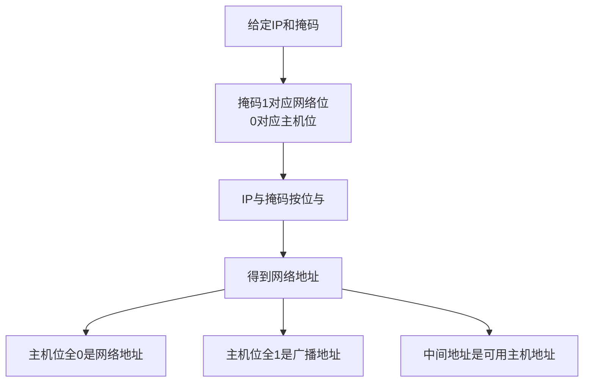

# IP 编址与子网划分：给网络划出清晰的门牌边界

> [!important] 一句话结论
> 子网题的核心是“掩码的 1 管网络、0 管主机”：用 IP 与掩码按位与得到网络地址，再根据主机位数计算地址范围、可用主机数和广播地址。

## 痛点：一串 32 位数字怎么管理整个互联网

如果每台主机只分配一个没有层次的编号，路由器就必须记住每台主机的位置，路由表会巨大且难以汇总。IP 地址把地址拆成“网络部分 + 主机部分”，让路由器先找到网络，再由局域网找到主机。

当一个组织内部主机越来越多，还需要把一个网络继续切成多个较小网络，这就是子网划分。它的定位在网络层，是路由、广播范围和地址规划的基础。

## 定义：掩码决定网络边界

IPv4 地址共 $32$ 位，通常写成四个十进制字节，例如 `192.168.1.10`。子网掩码同样是 $32$ 位：连续的 1 表示网络位，连续的 0 表示主机位。CIDR 用 `/n` 表示前 $n$ 位是网络位，例如 `/24` 等价于 `255.255.255.0`。

网络地址的通用公式是：

$$
\text{网络地址}=\text{IP 地址}\;\text{AND}\;\text{子网掩码}
$$

主机位全 0 是网络地址，主机位全 1 是定向广播地址；常规 IPv4 子网中，这两个地址通常不能分配给普通主机。

## 地址分类与特殊地址怎么认

| 类别/范围 | 首字节或范围 | 典型用途 |
| --- | --- | --- |
| A 类 | $1$～$126$ | 传统大规模单播网络 |
| B 类 | $128$～$191$ | 传统中等规模单播网络 |
| C 类 | $192$～$223$ | 传统小规模单播网络 |
| D 类 | $224$～$239$ | 组播 |
| E 类 | $240$～$255$ | 保留/实验 |

`127.0.0.0/8` 用于回环测试，不属于普通 A 类可分配地址。常见私有地址段是 `10.0.0.0/8`、`172.16.0.0/12`、`192.168.0.0/16`，私网地址不能直接在公网中路由。

现代网络更多使用 CIDR 和 VLSM，而不是只按 A/B/C 类固定划分：CIDR 支持无类别编址与路由聚合，VLSM 允许不同子网使用不同长度的掩码。

## 性能测算：子网划分完整示例

题目：将 `192.168.10.0/24` 划分为至少 $6$ 个等长子网，每个子网最多能容纳多少台可用主机？

需要从原来的主机位中借 $k$ 位，使子网数满足：

$$
2^k\ge 6
$$

因此 $k=3$，新前缀长度为 `/27`。剩余主机位数为：

$$
m=32-27=5
$$

每个子网的地址总数和可用主机数分别为：

$$
\text{地址总数}=2^5=32
$$

$$
\text{可用主机数}=2^5-2=30
$$

`/27` 的块大小为 $32$，所以子网网络地址依次为 `192.168.10.0`、`192.168.10.32`、`192.168.10.64`、`192.168.10.96`……第一个子网的可用主机范围是 `192.168.10.1`～`192.168.10.30`，广播地址是 `192.168.10.31`。

易错点：有些题目把“子网数”按传统规则排除全 0 和全 1 子网，此时会使用 $2^k-2$；现代 CIDR 通常允许使用这些子网，必须依据题干和教材口径判断。主机数在普通子网中通常减去网络地址和广播地址两个位置。

## 核心机制：从 IP 算出网络、主机和广播

子网划分真正划的是“边界”，不是简单地把十进制地址平均切开。做题时先写出前缀长度，再数主机位；不要直接凭最后一个字节猜答案。

## 易混对比：CIDR 与 VLSM

| 对比项 | CIDR | VLSM |
| --- | --- | --- |
| 解决问题 | 无类别编址、路由聚合 | 同一组织内按需划分不同大小子网 |
| 核心动作 | 合并连续地址块，缩短路由表 | 对不同子网使用不同掩码长度 |
| 关键词 | 超网、聚合、前缀 | 变长掩码、按需分配 |
| 典型收益 | 减少路由表项、节省地址 | 避免大小网络使用同一固定掩码 |

**核心区分**：CIDR 更强调“按前缀聚合和无类别路由”，VLSM 更强调“同一个地址规划中各子网大小可以不同”。

## 这个知识与考试的关系

- “按位与”得到网络地址；“主机位全 1”得到广播地址。
- 子网数常见公式是 $2^k$，可用主机数常见公式是 $2^m-2$。
- `/24` 表示 $24$ 位网络位、$8$ 位主机位；不要把 `/24` 误认为有 $24$ 台主机。
- `224` 开头是 D 类组播，`127` 开头常见为回环，`192.168` 常见为私有地址。
- 案例题常把地址规划、VLSM 和路由汇总放在一起，解题顺序是先按需求从大到小分配，再检查每段边界和剩余地址。

## 记忆口诀

**掩码一管网，掩码零管主；按位与找网，主机位全一找播。**

## 下一站 / 链接

- 沿主线往下看 [[IPv4报文与分片]]：有了 IP 地址边界，还要理解 IP 分组在不同 MTU 链路上怎样被切分。
- 想回看这段，回 [[网络互联设备]]；关联主题是 [[网络协议与OSI七层]]。

