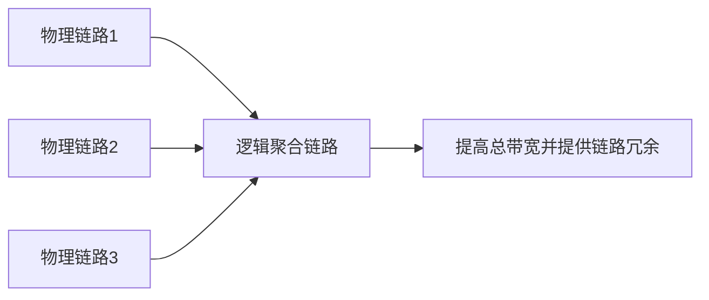

# STP 与链路聚合：交换机多接几根线，为什么反而可能出事

## 痛点：为了冗余加一条链路，却形成了环

两台或多台交换机之间只连一条线，线路坏了就断网。最自然的想法是：

> 再加一条备用链路。

但二层以太网里的广播帧没有 TTL 这样的逐跳寿命限制。如果交换网络形成环路，广播或未知单播帧可能在环里不断转发，造成广播风暴、MAC 表震荡等问题。

所以二层冗余要同时解决两个矛盾：

1. **我要备用路径，但不能让转发环路同时工作。**
2. **既然有多条物理链路，能不能把它们合起来增加带宽和可靠性？**

分别对应 STP 和链路聚合。

## STP：有冗余，但逻辑上先剪成一棵树

STP（Spanning Tree Protocol，生成树协议）的核心思路是：

> **物理上保留冗余链路，逻辑转发时阻塞部分路径，让有效拓扑无环。**

所以 STP 不是“删掉备用线”，而是：

> **备用线还在，只是正常状态下不让它参与形成环路的转发。**

### STP 真正怎么把“环”剪成“树”？

考试不一定要求你手算完整 BPDU，但机制至少要会：

1. **选根桥（Root Bridge）**：比较桥 ID，选出全网的参考根；
2. **每台非根交换机选根端口**：选择到根桥路径代价最优的那个端口；
3. **每个网段选指定端口**：决定这个网段向根方向由谁负责转发；
4. **其他冗余端口不进入正常转发**：从而把逻辑拓扑变成无环树；
5. **主链路故障时重新收敛**：原先不转发的冗余路径可能被启用。

> **STP 的关键不是“发现环后随便关一根线”，而是先建立全网一致的树形转发关系。**

## 为什么二层环路危险

交换机遇到广播帧会泛洪。如果两条路径首尾相接：

帧可能被重复复制，最终占满链路和设备处理能力。

考试看到：

- 二层环路；
- 广播风暴；
- 生成树；
- 阻塞冗余链路；

优先想到 STP。

## 链路聚合：把多条物理链路当成一条逻辑链路

链路聚合的目标不是“阻塞多余线路”，而是：

> **把多条并行物理链路组合成一个逻辑链路。**

收益通常包括：

- 增加可用带宽；
- 一条成员链路故障时，其他成员仍可工作；
- 可以按一定算法在成员链路间分担流量。

### 聚合以后是不是“一个大包拆到三根线上同时传”？

通常不是这样理解。

链路聚合会先把多条兼容的物理端口组成一个**逻辑接口**，转发时再依据源/目的 MAC、IP、端口等字段做哈希，把不同流量分配到成员链路。为了避免同一条流的报文乱序，**同一流通常会稳定落在某一条成员链路上**。

如果一条成员链路故障：

> **从聚合组中移除该成员 → 后续流量重新分配到仍正常的成员链路。**

所以链路聚合的“总带宽增加”主要体现在**多条流并行**，不等于单条流一定获得所有成员链路带宽之和。

## STP 和链路聚合别混

| 对比 | STP | 链路聚合 |
| --- | --- | --- |
| 主要问题 | 防止二层环路 | 多链路合并 |
| 对冗余链路 | 可能阻塞一部分 | 组合为一个逻辑链路 |
| 关键词 | 生成树、环路、广播风暴 | 聚合、端口捆绑、带宽、冗余 |
| 结果 | 无环转发拓扑 | 更大的逻辑链路 |

## 和交换机的关系

[[交换机]] 负责学习 MAC 和转发帧；一旦多交换机冗余互联，就会进一步遇到：

- STP：避免环路；
- 链路聚合：并行使用多条链路。

所以学习顺序是：

> **先会交换，再处理交换网络的冗余。**

## 一句话总结

> **STP 是“有备用线但别形成环”；链路聚合是“把多条线合成一条更粗、更可靠的逻辑线”。**

## 自测

1. 为什么二层广播环路可能一直持续？
2. STP 为什么不是简单删除冗余链路？
3. 链路聚合和 STP 解决的是同一个问题吗？

## 下一站

> 想回看交换机为什么会泛洪，回 [[交换机]]。  
> 想继续看跨网段后的路径选择，去 [[路由协议与路由选择]]。
