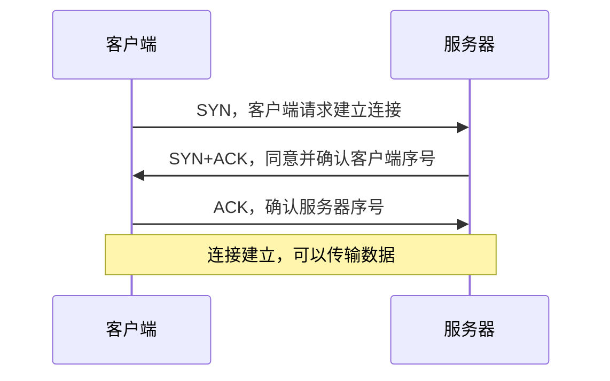
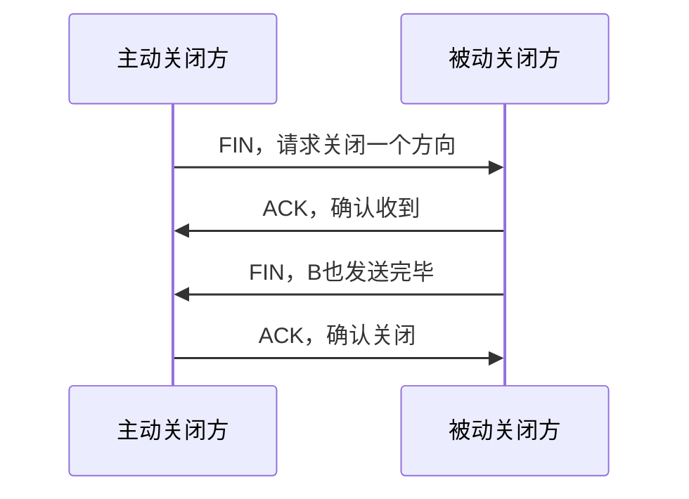

# TCP 与 UDP：可靠快递和即时广播的取舍

> [!important] 一句话结论
> TCP 面向连接、可靠、有序并提供流量/拥塞控制；UDP 无连接、开销小、尽力而为，考试高频是两者对比、三次握手、四次挥手和典型应用。

## 痛点：IP 送到了“网络”，却不保证送到“程序”

IP 只负责把分组尽力送到目标主机，可能丢失、重复、乱序，也不知道目标主机上的哪一个程序接收。文件传输需要可靠有序，实时语音则更在意及时，宁可丢一个片段也不愿等待重传。

传输层因此提供两种不同风格：TCP 像需要签收的可靠快递，UDP 像不等待回执的即时投递。应用根据业务目标选择，而不是简单地说哪个“更高级”。

## 定义：两种传输服务

| 对比项 | TCP | UDP |
| --- | --- | --- |
| 连接 | 面向连接 | 无连接 |
| 可靠性 | 确认、序号、重传、校验 | 不保证可靠、不保证顺序 |
| 数据边界 | 字节流，没有消息边界 | 保留数据报边界 |
| 控制能力 | 流量控制、拥塞控制 | 协议本身控制较少 |
| 开销与时延 | 首部和状态较多，通常更重 | 首部小，通常更轻、更快 |
| 典型场景 | Web、文件、邮件传输 | DNS 查询、实时音视频、在线游戏 |

**核心区分**：TCP 解决“可靠、有序地传完”，UDP 更适合“及时发出、由应用自己承担取舍”；速度不是 UDP 的唯一标签，可靠性、边界和控制机制才是本质。

## 核心机制：TCP 怎样建立连接

TCP 三次握手不是为了“走形式”，而是让双方确认彼此的发送和接收能力，并交换初始序号。

为什么不是两次：服务器发出的 SYN+ACK 需要客户端的 ACK 证明已经收到；第三次确认让服务器知道客户端确实能接收服务器的响应。题目若问“连接建立完成”，通常以第三次 ACK 到达为判断点。

## 核心机制：可靠传输与连接释放

TCP 用序号标识字节，用确认号表示“下一个期待的字节”，通过校验、确认和超时重传处理丢失；滑动窗口让发送端在未逐个等待确认的情况下连续发送多个字节，同时受接收端能力限制。拥塞控制则根据网络拥塞情况调整发送速度。

TCP 连接是全双工的，双方都可能还有数据要发送，因此关闭通常需要四次挥手：一方 FIN、一方 ACK；另一方数据发送完后再 FIN，原一方再 ACK。FIN 和 ACK 常分开发送，所以通常是四次而不是三次。

## 这个知识与考试的关系

- 三次握手顺序：`SYN` → `SYN+ACK` → `ACK`。
- 四次挥手顺序：`FIN` → `ACK` → `FIN` → `ACK`。
- TCP 的可靠性来自序号、确认、重传等机制，不是来自 IP。
- 流量控制主要防止接收端缓冲区被撑满；拥塞控制主要应对网络整体拥塞，二者不要混为一谈。
- 常见端口不是绝对绑定：HTTP 常用 $80$、HTTPS 常用 $443$、DNS 常用 $53$，题干若指定自定义端口应以题干为准。

## 记忆口诀

**TCP 三握手建关系，四挥手拆两边；UDP 不握手，快慢由业务定。**

## 下一站 / 链接

- 沿主线往下看 [[应用层常用协议]]：传输层准备好端到端通道后，继续看网页、域名、文件和邮件服务如何使用它。
- 想回看这段，回 [[IPv4报文与分片]]；关联主题是 [[网络性能指标]]。

