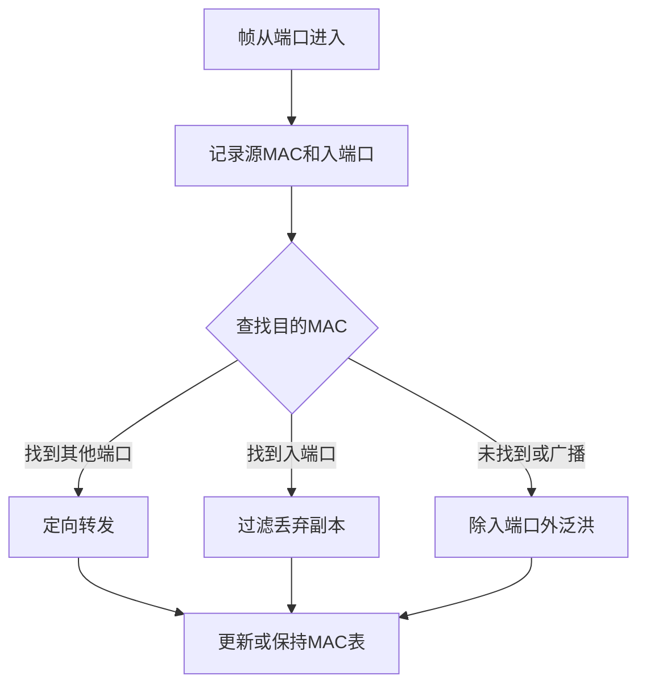

# 交换机：局域网里的“智能分拣员”

> [!important] 一句话结论
> 交换机是主要工作在数据链路层的设备，依据目的 MAC 地址和 MAC 地址表转发帧；它能隔离冲突域，但普通交换机默认不隔离广播域。

## 痛点：集线器为什么越接越堵

集线器收到一个比特，就把它从其他端口全部复制出去。所有主机共享带宽，任何一台主机发送，其他主机都要“听见”；主机数量增加后，碰撞和无效接收都会增加。

交换机的定位是给局域网做“定向分拣”：学习每个 MAC 地址在哪个端口，只把帧送往可能的目标端口，让每个端口形成相对独立的冲突域。

## 定义：交换机按 MAC 地址转发帧

二层交换机处理的是数据链路层帧，核心依据是 MAC 地址。它不需要像路由器那样根据 IP 路由表跨越不同网络；当需要跨 VLAN 或跨 IP 子网时，要由路由器或三层交换功能参与。

## 核心机制：交换机怎样学习和转发

交换机收到帧后，会把**源 MAC 地址与入端口**写入 MAC 地址表，并根据目的 MAC 查表：

- 目的地址在表中，且对应其他端口：定向转发。
- 目的地址在表中，但对应收到帧的同一端口：过滤，不必再送回。
- 目的地址未知，或帧是广播帧：除入端口外泛洪。
- 一段时间没有看到某条记录：老化删除，避免设备移动后仍沿用旧路径。

这解释了交换机为什么“越用越聪明”：它不是预先知道所有主机位置，而是通过每一帧的源地址不断学习。

## 转发方式与 VLAN

| 转发方式 | 做法 | 特点 |
| --- | --- | --- |
| 存储转发 | 收完整帧后校验，再转发 | 可靠性较好，时延相对大 |
| 直通转发 | 读到目的地址后立即转发 | 时延小，但可能转发损坏帧 |
| 无碎片转发 | 先检查帧的前一部分 | 在速度和差错之间折中 |

普通交换机把同一 VLAN 内的端口放在同一个广播域。VLAN 可以在一台或多台交换机上建立逻辑局域网，让物理位置不同的主机仍按业务分组；不同 VLAN 之间通信需要三层设备转发。

当多台交换机为了冗余连接多条链路时，还会遇到二层环路和带宽利用问题，继续看 [[STP与链路聚合]]。

## 易混对比：冲突域与广播域

| 对比项 | 冲突域 | 广播域 |
| --- | --- | --- |
| 含义 | 可能发生共享介质碰撞的范围 | 广播帧能够到达的范围 |
| 交换机普通端口 | 每个端口通常独立 | 默认仍在同一广播域 |
| 路由器端口 | 隔离 | 隔离 |
| VLAN | 通常不改变端口冲突域 | 可以划分广播域 |
| 题干关键词 | 碰撞、CSMA/CD、共享带宽 | 广播、ARP 泛洪、VLAN |

**核心区分**：交换机主要切小冲突域，路由器或 VLAN 才能切广播域；“一个端口一个冲突域”不等于“一个端口一个广播域”。

## 这个知识与考试的关系

- “依据 MAC 地址表转发”是交换机最稳定的识别词。
- “查不到目的 MAC 就泛洪”考的是学习转发逻辑，不是交换机坏了。
- “交换机隔离冲突域、不隔离广播域”是经典判断题。
- “跨 VLAN 通信”要想到路由器、三层交换机或其他三层转发能力。
- 集线器只复制信号；交换机学习并定向转发；路由器根据 IP 选择网络间路径。

## 记忆口诀

**交换机认 MAC，先学源、再查目的；冲突能隔，广播默认不隔。**

## 下一站 / 链接

- 沿主线往下看 [[STP与链路聚合]]：交换机学会转发后，再处理冗余链路的环路和聚合问题。
- 想回看这段，回 [[以太网技术]]；关联主题是 [[IP编址与子网划分]]。

