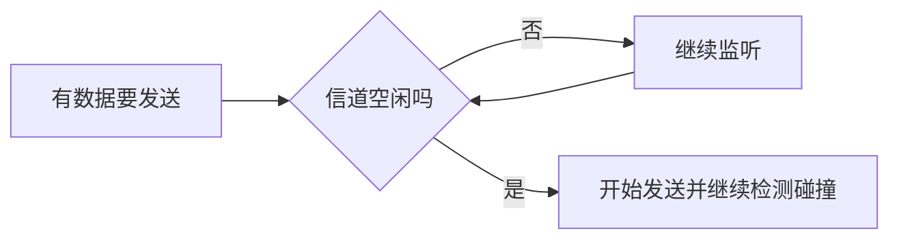

# 以太网技术：共享道路上的“先听再说”

> [!important] 一句话结论
> 以太网考点集中在 CSMA/CD、帧格式和帧长：共享介质中“先监听、再发送、边发边听，碰撞后退避重发”，标准帧长通常为 $64$～$1518$ 字节。

## 痛点：一根网线不能让所有人同时说

早期局域网像一条只有一根车道的共享道路，多台主机都挂在同一介质上。两台主机同时发送，信号就会叠在一起，接收端得到一团无法识别的噪声。若每次冲突都人工处理，网络几乎无法工作。

以太网解决的目标是制定一套公平的介质访问规则，并把数据切成有边界、有地址、能校验的帧。它位于 OSI 数据链路层，是局域网通信的基础。

## 定义：以太网是局域网里的通信规则

以太网（Ethernet）不是一根线，而是一组局域网技术规范，规定了帧怎么写、MAC 地址怎么用、主机如何共享介质。传统共享式以太网使用 CSMA/CD；现代交换式全双工以太网通常不再发生共享冲突，但帧结构和 MAC 通信仍然存在。

## 核心机制：CSMA/CD 如何处理碰撞

CSMA/CD 可以拆成四个动作：

- **载波监听**：发送前先听信道，忙就等待。
- **多路访问**：多个设备共享同一传输介质。
- **碰撞检测**：发送过程中继续监听，发现信号异常就判断发生碰撞。
- **随机退避**：停止发送，等待一个随机时间，再尝试重发。

如果发送过程中没有碰撞，就正常结束；如果检测到碰撞，再进入退避流程：

如果连续重试达到协议规定的上限，才报告发送失败；这个异常分支放在正文记即可，不必把主流程图拉成长。

随机退避的直觉是：碰撞的两台主机不能再次同时起跑，所以各自随机等一段时间。

把 CSMA/CD 的实际动作压成 5 步：

1. 有数据 → 先监听；
2. 忙 → 等，空闲 → 开始发；
3. 发送过程中继续检测；
4. 撞了 → 停止并随机退避；
5. 等完以后重新从“监听”开始，而不是直接强行发送。

> **它是一个循环竞争过程，不是“碰撞一次后自动成功”。**

考试中若题干说“无线”，不要套用这一套；无线局域网通常使用 CSMA/CA，因为无线设备难以在发送时可靠地检测碰撞。

## 逐个认识：以太网帧里有什么

教材常把基本帧概括为：目的 MAC、源 MAC、类型/长度、数据、FCS。不同教材是否把前导码和帧间隙计入帧长可能不同，做题时以题干口径为准。

| 字段 | 作用 | 题干怎么认 |
| --- | --- | --- |
| 目的 MAC | 标明帧发给谁 | 目标网卡地址 |
| 源 MAC | 标明帧来自谁 | 发送网卡地址 |
| 类型/长度 | 标明上层协议或数据长度 | IPv4、IPv6、长度 |
| 数据 | 承载上层数据 | IP 分组等 |
| FCS | 检测传输中的差错 | CRC、帧校验序列 |

常见基本帧长度为 $64$～$1518$ 字节；带 IEEE 802.1Q VLAN 标签时，最大长度通常增加到 $1522$ 字节。最小帧长与冲突检测有关：帧太短，发送端可能已经发完，碰撞信号才返回，发送端就无法发现冲突。

## 易混对比：CSMA/CD 与 CSMA/CA

| 对比项 | CSMA/CD | CSMA/CA |
| --- | --- | --- |
| 全称 | 冲突检测 | 冲突避免 |
| 典型网络 | 传统共享式有线以太网 | 无线局域网 802.11 |
| 发送后 | 边发边监听是否碰撞 | 尽量在发送前随机等待 |
| 确认机制 | 传统规则不以 ACK 为核心 | 常用 ACK 确认收到 |
| 考试关键词 | 共享总线、碰撞、退避 | 无线、半双工、隐藏终端 |

**核心区分**：有线共享介质可以“边发边听”，无线难以检测碰撞，因此无线主要采用“先避免、再确认”。

## 这个知识与考试的关系

- “先听后发、边发边听、碰撞后随机退避”对应 CSMA/CD。
- “最小 $64$ 字节、最大 $1518$ 字节、VLAN 后 $1522$ 字节”是高频数字。
- “FCS、CRC”对应帧的差错检测，不等于可靠重传。
- 现代交换机的每端口通常是独立冲突域、全双工，CSMA/CD 不再是日常转发的瓶颈；但教材和考试仍会考传统共享式以太网机制。

## 记忆口诀

**先听后发，边发边查；撞了停下，随机再发。**

## 下一站 / 链接

- 沿主线往下看 [[交换机]]：以太网定义了帧和访问规则，交换机负责把这些帧送到正确端口。
- 想回看这段，回 [[网络协议与OSI七层]]；关联主题是 [[无线局域网802.11]]。

