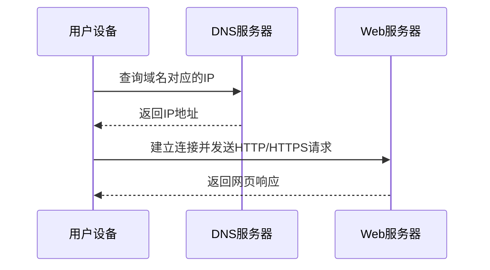
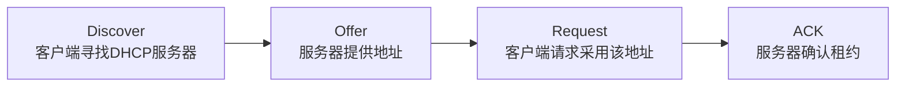

# 应用层常用协议：服务、功能和端口的对照表

> [!important] 一句话结论
> 应用层协议题按“功能 ↔ 协议 ↔ 常用端口”匹配：DNS 解析域名、DHCP 自动配置、HTTP/HTTPS 提供 Web、FTP 传文件、SMTP 发邮件、POP3/IMAP 收邮件。

## 痛点：用户想做的是业务，不是发送字节

传输层只提供“把字节送到某台主机上的某个端口”，但用户还需要访问网页、查域名、传文件、发邮件和监控设备。若每个应用都自行设计消息格式，系统之间就无法互操作。

应用层协议把常见业务的请求、响应和数据格式约定下来。端口像同一栋主机里的房间号，协议像房间里的办事规则；二者结合，数据才能交给正确的服务。

## 定义：先按功能认协议

| 功能 | 协议 | 常用端口 | 怎么认 |
| --- | --- | --- | --- |
| 域名解析 | DNS | $53$，UDP 常见，必要时也可用 TCP | 域名与 IP 互查 |
| 自动配置地址 | DHCP | 服务器 $67$、客户端 $68$ | 自动获得 IP、掩码、网关 |
| 网页访问 | HTTP | $80$ | Web 请求与响应 |
| 加密网页 | HTTPS | $443$ | HTTP + TLS |
| 文件传输 | FTP | 控制连接 $21$，数据连接常见 $20$ | 上传、下载文件 |
| 简单文件传输 | TFTP | $69$，UDP 常见 | 简单、无复杂认证 |
| 远程安全登录 | SSH | $22$ | 加密远程管理 |
| 远程终端 | Telnet | $23$ | 明文远程登录 |
| 发送邮件 | SMTP | $25$ 等 | 邮件发送/转发 |
| 接收邮件 | POP3 | $110$ | 下载式收信 |
| 管理网络设备 | SNMP | $161$ 请求、$162$ 通知 | 监控、管理、告警 |

端口是“常用约定”，不是协议的全部定义；考试常考默认端口，实际部署也可能通过配置改用其他端口。

## 核心机制：访问网页时发生了什么

用户输入域名后，客户端通常先通过 DNS 获得服务器 IP，再与服务器建立传输层连接，再使用 HTTP 或 HTTPS 交换应用数据。DHCP 则常发生在设备刚接入网络、还没有地址的时候。

### DHCP 获取地址：四步看成一条流程

记成 **D-O-R-A**：Discover → Offer → Request → ACK。

### DNS 查询：递归和迭代关注“谁继续问”

| 查询方式 | 人话 |
| --- | --- |
| 递归查询 | 被问的服务器要继续查，最终给调用者完整结果 |
| 迭代查询 | 被问的服务器可以告诉你“下一步去问谁”，由查询方继续 |

邮件要分清方向：SMTP 负责发送和服务器之间的转发，POP3 或 IMAP 负责用户收信。ARP 根据同一局域网内的 IP 查询 MAC，ICMP 常用于差错报告和连通性诊断；它们常被一起考，但不都是严格意义上的应用层协议。

## 易混对比：SMTP、POP3 与 IMAP

| 对比项 | SMTP | POP3 | IMAP |
| --- | --- | --- | --- |
| 方向 | 发信、转发 | 收信 | 收信、同步管理 |
| 邮件主要保存位置 | 发送方/中转服务器处理 | 常下载到客户端 | 通常保留并同步在服务器 |
| 题干关键词 | 发邮件、转发邮件 | 下载邮件、简单收信 | 多设备同步、文件夹管理 |

**核心区分**：SMTP 负责“发”，POP3/IMAP 负责“收”；POP3 偏下载，IMAP 偏服务器端同步管理。

## 这个知识与考试的关系

- “域名解析”选 DNS；“自动分配 IP、网关、DNS”选 DHCP。
- “网页”在 HTTP/HTTPS 中选；“加密网页、TLS”对应 HTTPS。
- “发送邮件”选 SMTP，“接收邮件”在 POP3 和 IMAP 中按题干判断。
- “远程登录但明文”是 Telnet，“远程登录且加密”是 SSH。
- “ping”使用 ICMP，不要把 ping 当成 TCP 或 UDP 应用。

## 记忆口诀

**DNS 找地址，DHCP 发配置；HTTP 看网页，FTP 搬文件；SMTP 发，POP/IMAP 收。**

## 下一站 / 链接

- 沿主线往下看 [[无线局域网802.11]]：服务跑在传输层之上，下一步切换到无线接入环境，看看 Wi-Fi 如何避免碰撞。
- 想回看这段，回 [[TCP与UDP协议]]；关联主题是 [[网络协议与OSI七层]]。
