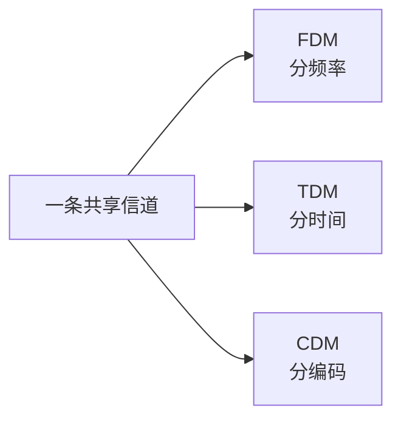

# 数据通信与交换技术：接上网线以后，数据到底怎么过去

## 痛点：有一根线，不等于双方已经会通信

两台机器即使已经接上线，也还有一串问题：

- 0 和 1 怎样变成线路能承载的信号？
- 噪声会把信号破坏到什么程度？
- 一条高速信道怎样同时服务多路数据？
- 中间经过多个节点时，到底怎样把数据转发到目的地？

数据通信先解决“**信息怎样穿过信道**”，交换技术再解决“**中间网络怎样把数据继续送下去**”。

先把这篇压成 5 个问题：

1. 一次通信有哪些角色？
2. 原始信息怎样变成能在信道上传播的信号？
3. 信道为什么不可能无限快？
4. 多路数据/多个用户怎样共享通信资源？
5. 数据经过中间节点时，电路、报文、分组三种交换到底怎么走？

> **先把“信号怎么传”和“分组怎么转”分开，后面就不会把编码、复用、交换混成一件事。**

## 一、一次完整的数据通信经历什么

先把最基本的链路看成一条流水线：

- **信源**：信息从哪里产生；
- **发信机**：把信息变成适合信道的信号；
- **信道**：信号经过的通道；
- **收信机**：把收到的信号恢复成信息；
- **信宿**：信息最终交给谁。

## 二、为什么要区分物理信道和逻辑信道

**物理信道**是真正承载信号的介质和设备，例如：

- 双绞线；
- 光纤；
- 无线电波。

**逻辑信道**是通信双方看到的逻辑通信关系，它依赖物理信道存在。

> **物理信道像真实道路，逻辑信道像在这条道路上划出来的一条业务通道。**

## 三、信息为什么要编码和调制

计算机内部的数据最终要变成电、光或无线信号才能传播。

发送端和接收端是一对相反过程：

发送端先完成“把信息变成信号”：

信号穿过信道后，接收端做相反的事：

> **编码/调制属于发送端加工；解调/译码属于接收端恢复。信道本身负责承载信号，不负责“理解”原始信息。**

教材展开时还会出现信源编码、信道编码、交织、脉冲成形、采样判决、去交织等步骤。零基础先抓住主干：

> **发送端把信息加工成适合传输的信号；接收端再反向恢复。**

## 四、信道为什么不可能无限快：香农公式

有噪声信道的理论容量可用香农公式描述：

$$
C=B\log_2\left(1+\frac{S}{N}\right)
$$

| 符号 | 含义 |
| --- | --- |
| \(C\) | 信道容量，bit/s |
| \(B\) | 信道带宽，Hz |
| \(S\) | 信号平均功率 |
| \(N\) | 噪声平均功率 |
| \(S/N\) | 信噪比 |

先记关系，不急着背推导：

> **带宽越大、信噪比越好，理论可达到的信道容量通常越高。**

注意：若题目给的是 dB，需要先按题目要求处理信噪比单位，不能直接把 dB 数字当作 \(S/N\) 的线性比值代入。

## 五、一条信道怎样同时服务多路数据：复用

复用技术解决：

> **一条物理信道怎么同时承载多路信息？**

| 技术 | 怎么分 | 直觉 |
| --- | --- | --- |
| FDM 频分复用 | 分频率 | 各走不同频段 |
| TDM 时分复用 | 分时间 | 大家轮流占时间片 |
| CDM 码分复用 | 分编码 | 用不同编码区分 |

记：

> **频分分频率，时分分时间，码分分编码。**

## 六、复用和多址为什么名字这么像

多址技术关注的是：

> **多个用户怎样共享同一通信资源？**

常见：

- FDMA：频分多址；
- TDMA：时分多址；
- CDMA：码分多址。

考试区分：

| 术语 | 重点 |
| --- | --- |
| 复用 | 多路数据如何共享一条信道 |
| 多址 | 多个用户如何共享通信资源 |

多路复用是多址的重要技术基础，但两个词关注角度不同。

用同一条通信资源来想最容易区分：

- 问“**一条资源里怎样塞进多路信号**” → 复用；
- 问“**多个用户怎样获得各自的使用份额**” → 多址。

> **复用站在“信号/信道”视角，多址站在“用户接入”视角。名字相似，不代表问的是同一个对象。**

## 七、中间网络怎样转发：三种交换思路

### 电路交换：先占一条路

优点：建立后时延较稳定。  
代价：即使暂时没有数据，预留资源也可能闲置。

### 报文交换：整件收下再转发

整个报文到达中间节点后，节点完整存储，再选择下一跳。报文大时缓存压力和等待时间都会增大。

### 分组交换：拆成小包共享线路

现代互联网的数据转发以分组交换思想为核心。

> **电路先占路，报文整件走，分组拆小包。**

## 八、发送时延和传播时延为什么不是一回事

发送长度为 \(L\) bit 的数据到速率为 \(R\) bit/s 的链路：

$$
t_{tx}=\frac{L}{R}
$$

这是**发送时延**：把所有比特推入链路需要多久。

距离为 \(d\)，信号传播速度为 \(v\)：

$$
t_{prop}=\frac{d}{v}
$$

这是**传播时延**：信号在介质里真正跑到对端需要多久。

| 时延 | 主要看什么 |
| --- | --- |
| 发送时延 | 数据量、发送速率 |
| 传播时延 | 距离、传播速度 |

更完整的总时延去 [[网络性能指标]]。

## 考试怎么认

- 信源、信宿、发信机、收信机 → 数据通信系统。
- 带宽、信噪比、最大信道容量 → 香农公式。
- FDM/TDM/CDM → 复用。
- FDMA/TDMA/CDMA → 多址。
- 独占通路 → 电路交换。
- 整个报文存储转发 → 报文交换。
- 拆成小分组 → 分组交换。
- 数据长度 ÷ 速率 → 发送时延。
- 距离 ÷ 传播速度 → 传播时延。

## 易错点

- 带宽增加不等于电磁波“跑得更快”。
- 发送时延不是传播时延。
- FDM 和 FDMA 不完全是同一个观察角度。
- “分组交换”不保证每个分组都一定沿同一条路径，具体取决于网络和协议。

## 一句话总结

> **数据通信解决“信息怎样变成信号并穿过信道”；复用解决“一条路怎样多路共享”；交换解决“经过中间网络怎样继续转发”。**

## 自测

1. 编码、调制、解调、译码在完整链路中是什么顺序？
2. 香农公式里的 \(B\) 和 \(S/N\) 分别表示什么？
3. FDM 与 FDMA 的关注点有什么区别？
4. 发送时延与传播时延分别由什么决定？

## 下一站

> 顺着主线去 [[网络类型与广域网技术]]：会传之后，看看不同范围的网络怎样组织。  
> 想看网络通信怎样分层协作，去 [[网络协议与OSI七层]]。
