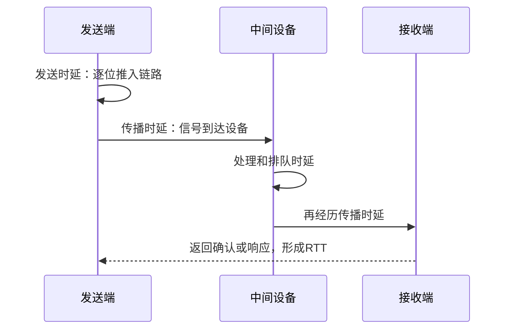

# 网络性能指标：别把“线路快”误认为“数据已送达”

> [!important] 一句话结论
> 性能计算要分清速率/带宽、吞吐量、发送时延、传播时延、处理时延、排队时延和 RTT；发送时延看数据量，传播时延看距离。

## 痛点：网络到底是带宽不够，还是路上太远

用户说“网络慢”，可能是链路每秒传不了多少比特，也可能是数据已经发出却在远距离传播，或者路由器排队拥堵。只说一个“速度”无法定位问题。

网络性能指标把“快不快、能装多少、等多久、堵不堵”拆开测量。它们是网络设计、容量规划和案例分析中的度量语言。

## 定义：不同指标回答不同问题

| 指标 | 人话解释 | 关键点 |
| --- | --- | --- |
| 速率 | 当前链路每秒传输多少比特 | 常用 bit/s |
| 带宽 | 链路理论上可提供的最高速率 | 是能力上限，不是实际结果 |
| 吞吐量 | 实际有效传输速率 | 通常不超过可用带宽 |
| 发送时延 | 把整段数据推入链路需要多久 | 看数据长度和发送速率 |
| 传播时延 | 信号从起点到终点传播多久 | 看距离和传播速度 |
| 处理时延 | 设备检查首部、查表等耗时 | 与设备处理能力有关 |
| 排队时延 | 数据在设备队列中等待多久 | 拥塞时明显增加 |
| RTT | 往返时延 | 请求到响应返回的总等待时间 |

总时延常写为：

$$
d_{\text{total}}=d_{\text{trans}}+d_{\text{prop}}+d_{\text{proc}}+d_{\text{queue}}
$$

其中发送时延和传播时延最容易混淆：

$$
d_{\text{trans}}=\frac{\text{数据长度}}{\text{发送速率}},\qquad
d_{\text{prop}}=\frac{\text{链路距离}}{\text{传播速度}}
$$

## 性能测算：总时延完整示例

题目：发送一个 $1\ \mathrm{MB}$ 文件，链路速率为 $10\ \mathrm{Mbit/s}$，链路距离为 $1000\ \mathrm{km}$，信号传播速度为 $2\times10^8\ \mathrm{m/s}$，处理时延 $2\ \mathrm{ms}$，排队时延 $5\ \mathrm{ms}$，求单向总时延。

按网络计算常用十进制单位，$1\ \mathrm{MB}=8\times10^6$ bit，$10\ \mathrm{Mbit/s}=10\times10^6$ bit/s，$1000\ \mathrm{km}=10^6$ m。

发送时延：

$$
d_{\text{trans}}=\frac{8\times10^6}{10\times10^6}=0.8\ \mathrm{s}
$$

传播时延：

$$
d_{\text{prop}}=\frac{10^6}{2\times10^8}=0.005\ \mathrm{s}
$$

处理和排队时延为 $0.002\ \mathrm{s}$ 与 $0.005\ \mathrm{s}$，所以：

$$
d_{\text{total}}=0.8+0.005+0.002+0.005=0.812\ \mathrm{s}
$$

易错点：bit 和 Byte 相差 $8$ 倍；km 要换成 m；发送时延是“把数据送上链路”，传播时延是“信号在链路中前进”，不能因为数据已经发送完就认为接收端马上收到。

## 核心机制：从发送到接收的时间线

RTT 是否等于两倍单向总时延，要看链路是否对称、请求与响应大小是否相同，以及题目是否忽略处理和排队时延。题目明确“往返路径相同且忽略其他时延”时，才可直接近似为两倍传播或两倍单向时延。

## 易混对比：带宽、吞吐量与速率

| 对比项 | 带宽 | 吞吐量 | 速率 |
| --- | --- | --- | --- |
| 含义 | 理论能力上限 | 实际有效传输结果 | 某条链路的传输能力表述 |
| 是否受拥塞影响 | 能力上限相对稳定 | 明显受丢包、协议、拥塞影响 | 视题目语境而定 |
| 题干关键词 | 最大、理论、容量 | 实际、有效、平均 | $\mathrm{bit/s}$、链路速率 |

**核心区分**：带宽像道路设计容量，吞吐量像当前实际通过的车辆数，速率是描述传输能力的通用量；不要把理论上限直接当作实际吞吐量。

## 这个知识与考试的关系

- “数据长度 ÷ 发送速率”是发送时延；“距离 ÷ 传播速度”是传播时延。
- 总时延要按题目给出的组成项相加；RTT 要确认是单向还是往返。
- 单位换算是计算题的主要陷阱：$1$ Byte $=8$ bit，$1$ ms $=10^{-3}$ s。
- “实际有效速率”对应吞吐量，“理论最大传输能力”更接近带宽。

## 记忆口诀

**发送看数据量，传播看距离；带宽是上限，吞吐看实际；RTT 要来回。**

## 下一站 / 链接

- 沿主线往下看 [[非性能性指标]]：性能指标回答“快不快”，还要用可用性、可靠性、可维护性回答系统“好不好用、好不好管”。
- 想回看这段，回 [[5G网络切片]]；关联主题是 [[TCP与UDP协议]]。

