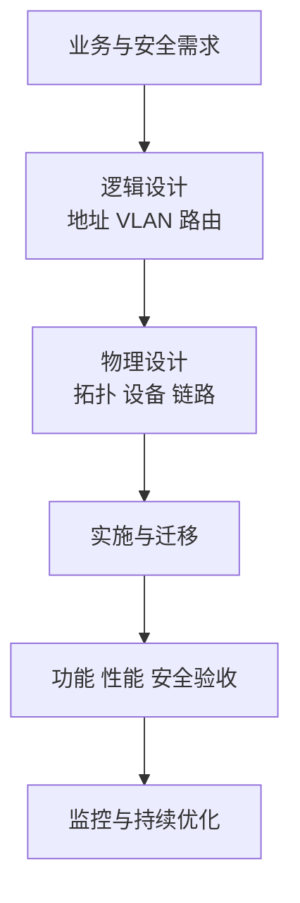

# 网络拓扑、组网与网络工程：把设备连成可维护的网络

## 痛点：能互通不等于网络建得好

随手把设备接通，规模变大后会出现单点故障、广播失控、地址混乱和难以扩容。拓扑描述“怎么连”，组网决定“用什么设备和协议”，网络工程把需求、设计、实施和验收串成闭环。

## 定义（讲人话）

网络拓扑是节点与链路关系图，像城市道路图；逻辑拓扑描述数据怎么走，物理拓扑描述线缆怎么接，两者可能不同。

## 逐个认识

| 拓扑 | 特点 | 怎么认 |
| --- | --- | --- |
| 总线型 | 共用主干，结构简单 | 主干故障影响大、冲突共享 |
| 星型 | 节点连接中心设备 | 易维护，中心设备是关键点 |
| 环型 | 首尾相连 | 数据沿环传递，断点影响环路 |
| 树型 | 分层星型扩展 | 易扩展，适合园区层次化设计 |
| 网状 | 多条冗余路径 | 可靠但成本与路由复杂度高 |

三层园区网常按接入层、汇聚层、核心层组织：接入层连接终端，汇聚层实施策略与汇总，核心层高速转发。小网络可以折叠层次，不必机械堆三层设备。

## 这个知识与考试的关系

- “所有节点接中心设备”认星型；“任意两点多路径”认网状。
- 需求分析要先于设备选型；验收应覆盖连通、性能、安全、可靠性与可运维性。
- 地址规划联系 [[IP编址与子网划分]]，设备分工联系 [[网络互联设备]]，性能验收联系 [[网络性能指标]]。

## 记忆口诀

> **总线共主干，星型靠中心，环型首尾连，树型分层长，网状多路保可靠。**

## 下一站

> 网络组建完成后，回 [[计算机网络索引]] 沿协议主线继续复习。
> 想回看比特和分组怎样传，回 [[数据通信与交换技术]]。
