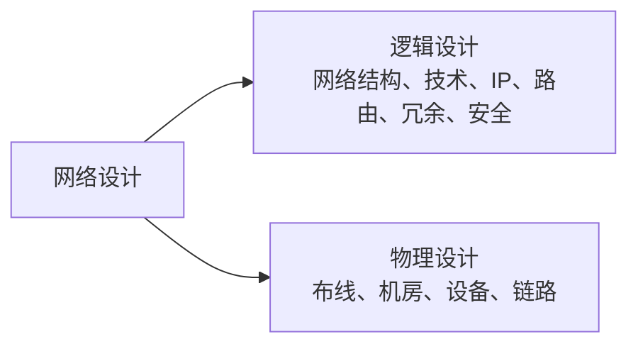
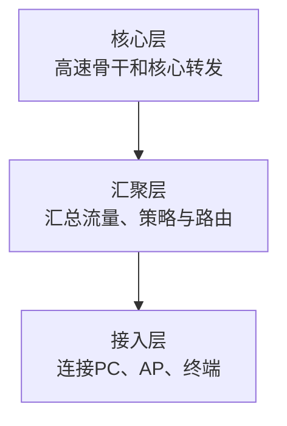
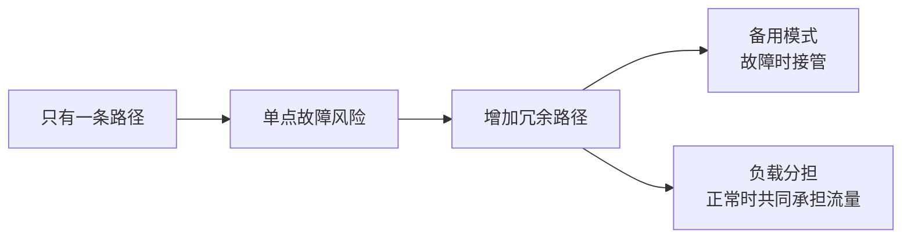

# 网络拓扑、组网与网络工程：会通信之后，怎样真正把一张网络建出来

## 痛点：设备买齐、线插通，不等于网络设计完成

一个小办公室随手把交换机和路由器接起来也许能用。但规模一大，马上出现：

- 地址怎么规划？
- 哪些用户放同一 VLAN？
- 路由怎么走？
- 核心设备坏了怎么办？
- 主链路断了有没有备用路径？
- 布线、机房、设备如何落地？
- 上线以后怎样验收和切换？

网络工程的目标是把“能通信”变成“**可建设、可扩展、可维护、可验证的网络**”。

## 一、先认网络拓扑：节点到底怎么连

| 拓扑 | 结构特点 | 优点 | 主要风险 |
| --- | --- | --- | --- |
| 总线型 | 共用主干 | 简单、线缆少 | 主干故障影响大、共享冲突 |
| 星型 | 都连中心设备 | 易管理、易定位 | 中心设备重要 |
| 环型 | 首尾相连 | 结构规则 | 环路中断会影响通信 |
| 树型 | 分层扩展 | 易扩展 | 上层节点影响范围大 |
| 网状 | 多条路径互连 | 冗余强 | 成本和管理复杂 |

拓扑不是为了背图形，而是看：

> **单点故障在哪里？有没有冗余？扩展时会不会失控？**

## 二、网络建设有三个大阶段

教材主线非常清楚：

### 1. 网络规划：先回答“为什么建、要达到什么目标”

规划阶段以需求为导向，例如：

- 有多少用户、多少站点；
- 需要什么带宽和时延；
- 是否要求高可用；
- 安全边界在哪里；
- 预算和工期是什么。

> **先有需求，再选设备。**

### 2. 网络设计：把需求变成方案

网络设计再拆成两部分。

#### 逻辑设计

回答“网络从逻辑上怎么工作”：

- 网络结构；
- VLAN 和地址规划；
- [[IP编址与子网划分]]；
- [[路由协议与路由选择]]；
- 冗余和备份；
- 安全策略。

#### 物理设计

回答“这些逻辑能力靠什么真正落地”：

- 综合布线；
- 机房；
- 设备型号和数量；
- 物理链路；
- 机架、电源等工程条件。

### 3. 网络实施：把纸面设计变成可用网络

这类流程非常适合横向看，因为它就是明确的先后顺序。

## 三、为什么大型园区网常分接入、汇聚、核心

随着终端增多，不适合所有交换机“平铺”互连。常见层次化网络：

- **接入层**：离用户最近；
- **汇聚层**：汇总多个接入区并实施策略；
- **核心层**：承担高速骨干转发。

小型网络可以折叠层次，不是所有网络都必须硬放三层设备。

## 四、冗余设计：为什么“备用”和“负载分担”不是一个词

### 备用路径

主路径正常时，备用路径可能不承担正常流量；主路径故障后再接管。

### 负载分担

多条可用路径同时承担业务流量，在提升可靠性的同时利用并行链路增加能力。

二层冗余还要防止环路，继续看 [[STP与链路聚合]]。

## 五、把网络工程和前面知识串起来

| 网络工程问题 | 对应知识 |
| --- | --- |
| 网络分几层 | 接入 / 汇聚 / 核心 |
| 地址怎么规划 | [[IP编址与子网划分]] |
| 不同网段怎么互通 | [[路由协议与路由选择]] |
| 二层冗余如何防环 | [[STP与链路聚合]] |
| 设备怎么分工 | [[网络互联设备]] |
| 带宽时延够不够 | [[网络性能指标]] |
| 可靠和易维护吗 | [[非性能性指标]] |

## 考试怎么认

- “以需求为导向、可行性” → 网络规划。
- “网络结构、技术选型、IP、路由、冗余、安全” → 逻辑设计。
- “布线、机房、设备选型” → 物理设计。
- “设备验收、安装调试、试运行切换、培训” → 网络实施。
- “用户终端接入” → 接入层。
- “策略汇总” → 汇聚层。
- “高速骨干” → 核心层。

## 易错点

- 规划、设计、实施不是同一阶段。
- 逻辑设计不是画机房布线；物理设计也不是决定 IP 地址。
- 冗余不意味着所有备用链路都必须同时转发。
- 三层园区结构是常见设计模型，小网络可以简化。

## 一句话总结

> **网络工程 = 先规划目标，再做逻辑/物理设计，最后实施验证；层次化和冗余设计让网络规模变大后仍然可控。**

## 自测

1. IP 地址规划属于逻辑设计还是物理设计？
2. 设备安装和系统切换属于哪个阶段？
3. 备用路径和负载分担有什么区别？
4. 接入、汇聚、核心三层各做什么？

## 下一站

> 回 [[计算机网络索引]] 把全章五块主线串起来。  
> 想继续看网络冗余里的二层问题，去 [[STP与链路聚合]]。
