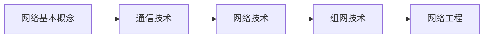
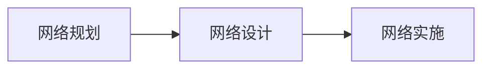

# 计算机网络索引：从“信息怎么传”一直走到“网络怎么建”

> [!important] 使用方式
> 不再把全章 20 个知识点硬串成一条超长线。先抓住五块主线，再进入每块里的原子卡：**基本概念 → 通信技术 → 网络技术 → 组网技术 → 网络工程**。

> [!tip] 复习入口
> 学完原子卡后，用 [[计算机网络-复习总纲]] 做闭卷串联。

## 一张总图先建立全局位置

这五块分别回答：

| 主块 | 核心问题 |
| --- | --- |
| 网络基本概念 | 为什么要联网，网络好不好怎么衡量 |
| 通信技术 | 信息怎样变成信号并穿过信道 |
| 网络技术 | LAN/WLAN/MAN/WAN/移动网络分别怎么组织 |
| 组网技术 | 协议、设备、交换、IP、TCP、路由怎样协作 |
| 网络工程 | 网络怎样规划、设计、实施和验收 |

---

## 一、网络基本概念：先知道“网络为什么存在”

建议顺序：

1. [[计算机网络基本概念与功能]]
2. [[网络性能指标]]
3. [[非性能性指标]]

这一块先建立两个判断：

> **网络不只负责传数据，还承担资源共享、集中管理、分布式处理和负载均衡。**

> **性能指标看快不快；非性能指标看可靠、可扩展、好不好管。**

---

## 二、通信技术：先把“信息怎么穿过线路”讲明白

核心入口：

1. [[数据通信与交换技术]]
2. [[5G]]

重点掌握：

- 信源 → 发信机 → 信道 → 收信机 → 信宿；
- 编码 → 调制 → 信道 → 解调 → 译码；
- 香农公式；
- FDM/TDM/CDM 与 FDMA/TDMA/CDMA；
- 电路交换、报文交换、分组交换；
- 发送时延与传播时延。

这块是后面所有协议和网络类型的“物理通信底座”。

---

## 三、网络技术：不同范围的网络怎样组织

建议顺序：

1. [[网络类型与广域网技术]]
2. [[以太网技术]]
3. [[无线局域网802.11]]
4. [[5G网络切片]]

重点是：

- LAN、WLAN、MAN、WAN、移动通信网；
- 以太网帧和 CSMA/CD；
- Wi-Fi 与 CSMA/CA；
- SONET、DDN、帧中继、ATM 的教材识别；
- 5G 切片“一张物理网，多张逻辑网”。

---

## 四、组网技术：设备和协议怎样把多张网络真正连起来

这一块内容最多，按“分层 → 二层 → 三层 → 传输 → 应用”走。

### 1. 先看协议分层

[[网络协议与OSI七层]]

掌握：

- OSI 七层；
- TCP/IP 模型；
- 封装与解封装；
- 每层典型协议和设备。

### 2. 局域网二层转发

依次看：

1. [[交换机]]
2. [[STP与链路聚合]]

核心：

- MAC 地址学习、泛洪、过滤；
- 冲突域与广播域；
- VLAN；
- STP 防二层环路；
- 链路聚合增加带宽和冗余。

### 3. 网络设备怎么分工

[[网络互联设备]]

按层次识别：

> **中继/集线看信号，交换看 MAC，路由看 IP，网关做协议转换。**

### 4. IP 地址和网络层

依次看：

1. [[IP编址与子网划分]]
2. [[IPv4报文与分片]]
3. [[IPv6与IPv4过渡]]
4. [[路由协议与路由选择]]

核心：

- CIDR / VLSM；
- 网络地址、广播地址、可用主机数；
- MTU 与 IPv4 分片；
- IPv6 单播/组播/任播；
- 双协议栈、隧道、NAT-PT；
- 路由表、下一跳、IGP、BGP。

### 5. 端到端传输与应用服务

依次看：

1. [[TCP与UDP协议]]
2. [[应用层常用协议]]

核心：

- TCP 三次握手 / 四次挥手；
- 流量控制与拥塞控制；
- DNS / DHCP / HTTP(S) / FTP / 邮件 / SNMP 等。

---

## 五、网络工程：把知识变成真正可落地的网络

入口：

[[网络拓扑、组网与网络工程]]

主线：

设计阶段继续拆成：

- 逻辑设计：结构、IP、VLAN、路由、冗余、安全；
- 物理设计：布线、机房、设备、链路；
- 层次化组网：接入层、汇聚层、核心层；
- 冗余：备用路径、负载分担。

---

## 计算题清单

| 笔记 | 重点计算 |
| --- | --- |
| [[数据通信与交换技术]] | 香农公式、发送/传播时延 |
| [[IP编址与子网划分]] | 子网数、主机数、网络/广播地址 |
| [[IPv4报文与分片]] | MTU、分片长度、片偏移 |
| [[网络性能指标]] | 总时延、吞吐量、RTT、单位换算 |
| [[非性能性指标]] | 可用性、MTBF/MTTR |

---

## 重点易混总表

| 容易混 | 一句话区分 |
| --- | --- |
| 发送时延 vs 传播时延 | 一个看数据量/速率，一个看距离/传播速度 |
| FDM vs FDMA | 一个偏多路复用，一个偏多用户接入 |
| CSMA/CD vs CSMA/CA | 有线传统共享介质“检测”，无线“避免” |
| 交换机 vs 路由器 | MAC 二层转发 vs IP 三层转发 |
| 冲突域 vs 广播域 | 碰撞范围 vs 广播传播范围 |
| STP vs 链路聚合 | 防环 vs 多链路合并 |
| CIDR vs VLSM | 聚合/无类别前缀 vs 按需不同子网大小 |
| IPv4 vs IPv6 | 32 位 vs 128 位 |
| IGP vs BGP | AS 内部 vs AS 之间 |
| TCP 流量控制 vs 拥塞控制 | 防接收端撑爆 vs 防网络拥塞 |

---

## 考场闭卷复现

- [ ] 说出“基本概念 → 通信 → 网络技术 → 组网 → 网络工程”五块主线。
- [ ] 画出“原始信息 → 编码 → 调制 → 信道 → 解调 → 译码 → 信息”。
- [ ] 说清 FDM/TDM/CDM 和 FDMA/TDMA/CDMA 的区别。
- [ ] 说出“物链网传会表应”并给每层举例。
- [ ] 手算一个 IPv4 子网题和一个 IPv4 分片题。
- [ ] 区分 IPv6 的单播、组播、任播和三种过渡思路。
- [ ] 解释 STP 为什么能防二层环路。
- [ ] 说清 IGP 与 BGP 的范围。
- [ ] 画出 TCP 三次握手和四次挥手。
- [ ] 说出网络规划、设计、实施三个阶段。

## 上下游链接

- 上游入口：[[计算机基础知识索引]]、[[学习路线]]。
- 本模块起点：[[计算机网络基本概念与功能]]。
- 本模块收口：[[网络拓扑、组网与网络工程]]。
