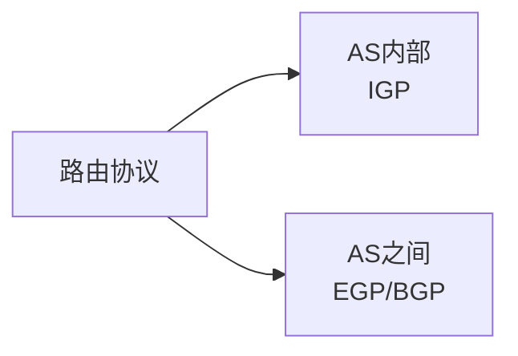

# 路由协议与路由选择：目标不在这个网段，下一跳该交给谁

## 痛点：知道目的 IP，不代表知道怎么走

主机知道目的 IP 后，如果目的地址不在本地子网，就要把分组交给网关。路由器收到分组后又面临同样的问题：

> **去这个目标网络，下一跳应该从哪个接口出去？**

路由的本质就是为目标网络选择下一跳和出口。

## 路由器真正做的事

注意：

- 路由器主要依据 **目的 IP 和路由表**；
- 每经过一跳，二层 MAC 封装通常会改变；
- IP 负责跨网络逻辑寻址，MAC 负责当前链路这一跳。

## 路由从哪里来

路由表里的信息大体可以来自：

- 直连路由：接口所在网络自动形成；
- 静态路由：管理员手工指定；
- 动态路由：路由器通过路由协议互相学习。

规模小、路径固定时静态路由简单；网络变大后动态协议更容易适应拓扑变化。

## 先理解 AS：为什么还要分“内部”和“外部”

互联网不是一台公司统一管理的巨大路由器，而是由很多自治系统 AS（Autonomous System）组成。

例如可以把一个大型运营商或组织管理的路由域理解成一个 AS。

所以路由协议先分两个大方向：

### IGP：自治系统内部

IGP 是“内部网关协议”这一类协议的统称，用在同一个 AS 内。

现实中常见的内部路由协议包括 RIP、OSPF、IS-IS 等；考试若只问教材层级，先抓住“**AS 内部**”。

### EGP / BGP：自治系统之间

EGP 表示外部网关协议类别，解决 AS 之间的路由交换。

现代互联网域间路由的核心协议是 BGP。

考试识别：

> **AS 之间、Internet 域间路由、边界网关 → BGP。**

## 路由协议和“路由表”不是一回事

- **路由协议**：路由器之间如何交换、学习路径信息。
- **路由表**：最终存下来的可用路径结果。
- **转发**：真正收到分组时，根据表项把数据送出去。

> **协议负责“学路”，路由表负责“记路”，转发负责“走路”。**

## 与子网划分的关系

[[IP编址与子网划分]] 决定“哪些地址属于同一个网络”；路由技术解决“不同网络之间怎样到达”。

所以：

- 同网段：通常直接在链路层找到目标；
- 不同网段：交给路由器寻找下一跳。

## 与冗余设计的关系

网络工程里常有：

- 主路径；
- 备用路径；
- 负载分担。

路由协议需要在拓扑变化时重新选择可达路径，这也是大型网络不能只靠人工静态配置的重要原因。

## 考试怎么认

| 关键词 | 优先想到 |
| --- | --- |
| 路由表、下一跳、出口接口 | 路由转发 |
| AS 内部 | IGP |
| AS 之间 | EGP 类协议 |
| Internet 域间、边界网关 | BGP |
| 管理员手工配置 | 静态路由 |
| 拓扑变化自动学习 | 动态路由 |

## 易错点

- IGP 不是一个单独协议名，而是一类 AS 内部路由协议。
- BGP 不等于“局域网内部最短路径协议”，它主要用于自治系统之间。
- 路由协议负责学习路径，不直接替代 IP 地址和子网掩码。

## 一句话总结

> **路由就是“目标不在本地时选下一跳”；IGP 管 AS 内，BGP 重点管 AS 之间。**

## 自测

1. 路由器收到 IP 分组后主要查什么？
2. IGP 和 BGP 最核心的范围区别是什么？
3. 路由协议、路由表、实际转发分别扮演什么角色？

## 下一站

> 想回看路由器和交换机差在哪，去 [[网络互联设备]]。  
> 想看这些路由能力怎样放进实际网络设计，去 [[网络拓扑、组网与网络工程]]。
