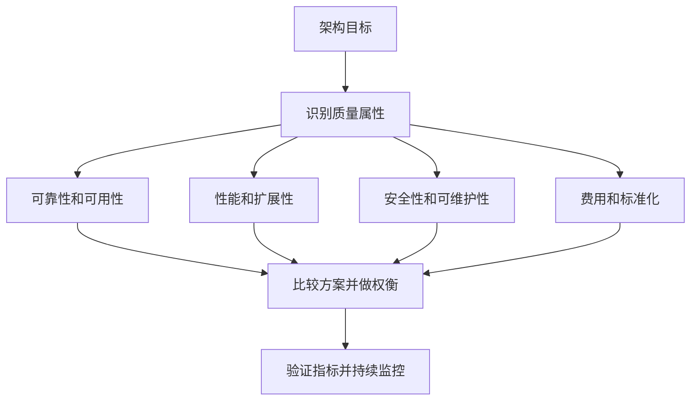

# 非性能性指标：系统不只要跑得快，还要值得长期使用

> [!important] 一句话结论
> 非性能性指标从费用、质量、标准化、可靠性、可扩展性和可维护性评价系统；可用性计算重点是 $\mathrm{MTBF}/(\mathrm{MTBF}+\mathrm{MTTR})$，案例和论文常考权衡。

## 痛点：快系统不一定是好系统

一个系统响应很快，但经常宕机、无法扩容、没人维护或成本高得无法承受，仍然不能算成功。架构设计不是只追求单项性能，而是在业务目标、成本、质量和长期演进之间做取舍。

非性能性指标也叫质量属性或非功能性指标。它们描述系统“应该具有什么品质”，是架构选型、方案论证、案例分析和论文表达的重要依据。

## 定义：六类质量要求

| 指标 | 人话解释 | 题干怎么认 |
| --- | --- | --- |
| 费用 | 建设、运行、维护和升级成本 | 预算、投入产出、TCO |
| 质量 | 功能适合性、性能、兼容性、易用性等综合品质 | 满足需求、用户体验 |
| 标准化 | 遵循统一标准，便于互联、迁移和管理 | 标准、规范、接口统一 |
| 可靠性 | 在规定条件和时间内持续正确运行 | 故障率、MTBF、容错 |
| 可扩展性 | 业务增长后能增加能力 | 加机器、加资源、扩展功能 |
| 可维护性 | 出问题容易定位、修复和变更 | 监控、日志、模块化、自动化 |

可扩展性常分为：水平扩展是增加节点，垂直扩展是提升单节点 CPU、内存等资源。ISO/IEC 25010 是常见软件质量模型标准名称，考试中要注意它是质量模型关联词，不要把标准名误写成某个具体架构模式。

## 性能测算：可用性与停机时间

可用性常用公式为：

$$
A=\frac{\mathrm{MTBF}}{\mathrm{MTBF}+\mathrm{MTTR}}
$$

其中 MTBF 是平均无故障时间，MTTR 是平均修复时间。若某系统 MTBF 为 $999$ 小时，MTTR 为 $1$ 小时，则：

$$
A=\frac{999}{999+1}=0.999=99.9\%
$$

若按一年 $365$ 天估算，年度总时间为 $8760$ 小时，$99.9\%$ 可用性对应的最大不可用时间约为：

$$
8760\times(1-0.999)=8.76\text{ 小时}
$$

常见对照：$99.99\%$ 一年约允许不可用 $52.56$ 分钟，$99.999\%$ 一年约允许不可用 $5.256$ 分钟。题目若指定按月、按 30 天或按工作时间统计，应使用题目给定周期。

## 核心机制：指标之间要做权衡

增加冗余可能提升可靠性，却增加费用和运维复杂度；拆分服务可能提升独立扩展和维护能力，却带来分布式通信与治理成本。架构师要说明“为什么这样取舍”，而不是笼统地写“系统性能更好”。

## 易混对比：可靠性、可用性与可维护性

| 对比项 | 可靠性 | 可用性 | 可维护性 |
| --- | --- | --- | --- |
| 核心问题 | 多久不出故障 | 需要时能否提供服务 | 出故障后能否快速恢复/变更 |
| 常见指标 | MTBF、故障率 | MTBF、MTTR 综合计算 | MTTR、定位时间、变更成功率 |
| 典型措施 | 冗余、容错、校验 | 集群、故障转移、降级 | 监控、日志、自动化、模块化 |
| 题干关键词 | 连续无故障 | 服务可用、SLA | 易定位、易修复、易升级 |

**核心区分**：可靠性偏“少出故障”，可维护性偏“出了故障好修”，可用性把“出故障频率”和“修复速度”综合成用户能否使用的结果。

## 这个知识与考试的关系

- 计算题常考可用性公式和 3 个 9、4 个 9、5 个 9 对应的停机时间。
- 案例题要把需求翻译成质量属性，再写设计措施：高可靠对应冗余/故障转移，易维护对应监控/日志/自动化。
- 论文中写“在成本、性能、可靠性之间权衡”，比只罗列技术名词更符合架构师表达。
- “水平扩展”是加节点，“垂直扩展”是增强单节点；不要把二者写反。

## 记忆口诀

**费用要算账，质量看全局；可靠少出错，可用能服务；扩展扛增长，维护好修改。**

## 下一站 / 链接

- 沿主线往下看 [[系统工程与信息系统基础]]：计算机网络的基础知识完成后，转入系统工程与信息系统基础模块。
- 想回看这段，回 [[网络性能指标]]；关联主题是 [[5G网络切片]]。

