# 计算机系统基础知识地图

> [!important] 先建立“整机视角”
> 计算机系统不是一堆孤立名词。考试里的知识可以串成一条链：**数据如何表示 → CPU 如何执行 → 数据放哪里 → 部件如何通信 → OS 如何管理资源 → 机器如何联网 → 软件如何运行 → 性能如何评价**。

## 一、全局知识树

```mermaid
flowchart TB
    ROOT[计算机系统基础]
    ROOT --> A[1 数据与机器表示]
    ROOT --> B[2 CPU 与体系结构]
    ROOT --> C[3 存储系统]
    ROOT --> D[4 总线与 I/O]
    ROOT --> E[5 操作系统]
    ROOT --> F[6 计算机网络]
    ROOT --> G[7 软件与程序语言]
    ROOT --> H[8 多媒体]
    ROOT --> I[9 性能与可靠性]

    A --> A1[进制转换]
    A --> A2[原反补移码]
    A --> A3[定点与浮点]
    A --> A4[字符编码]
    A --> A5[校验码/海明码]

    B --> B1[运算器与控制器]
    B --> B2[寄存器]
    B --> B3[指令执行]
    B --> B4[寻址方式]
    B --> B5[CISC/RISC]
    B --> B6[流水线]
    B --> B7[Flynn 分类]

    C --> C1[存储层次]
    C --> C2[主存 SRAM/DRAM]
    C --> C3[Cache]
    C --> C4[外存]
    C --> C5[RAID]

    D --> D1[总线]
    D --> D2[程序查询]
    D --> D3[中断]
    D --> D4[DMA]
    D --> D5[通道]

    E --> E1[进程/线程]
    E --> E2[调度]
    E --> E3[PV 同步互斥]
    E --> E4[死锁]
    E --> E5[存储管理]
    E --> E6[文件/设备管理]

    F --> F1[OSI/TCP-IP]
    F --> F2[以太网与交换]
    F --> F3[IP/子网]
    F --> F4[TCP/UDP]
    F --> F5[应用层协议]
    F --> F6[无线/5G]

    I --> I1[性能指标]
    I --> I2[Amdahl]
    I --> I3[网络性能指标]
```

## 二、主学习链

### 1. 数据怎么进入计算机
[[计算机系统组成]] → [[数据表示与编码-进制转换]] → [[数据表示与编码-原反补移码]] → [[数据表示与编码-定点与浮点]] → [[数据表示与编码-字符编码]] → [[校验码]] → [[海明码]]

### 2. CPU 怎么把程序跑起来
[[CPU内部组成-运算器与控制器]] → [[CPU内部组成-寄存器体系]] → [[CPU内部组成-指令执行过程]] → [[指令寻址方式]] → [[CPU指令集 CISC与RISC]] → [[指令流水线]] → [[Flynn分类法]]

### 3. 数据放在哪里
[[存储层次与主存]] → [[Cache]] → [[外存与RAID]]

### 4. CPU 怎么和外设沟通
[[总线]] → [[IO控制技术]] → [[中断技术]]

### 5. 谁来管理 CPU、内存和设备
[[操作系统概述]] → [[进程与线程]] → [[进程调度]] → [[信号量与PV操作]] → [[死锁与银行家算法]] → [[存储管理]] → [[虚拟存储与页面置换]] → [[文件管理]] → [[设备管理与磁盘调度]] → [[嵌入式系统]]

### 6. 多台机器怎么互联
[[计算机网络索引]] → [[网络协议与OSI七层]] → [[以太网技术]] → [[交换机]] → [[网络互联设备]] → [[IP编址与子网划分]] → [[IPv4报文与分片]] → [[TCP与UDP协议]] → [[应用层常用协议]] → [[无线局域网802.11]] → [[5G]] → [[5G网络切片]]

### 7. 最后怎么评价系统
[[计算机性能指标与Amdahl定律]] → [[网络性能指标]] → [[非性能性指标]]

## 三、考试关系图

| 能力 | 重点知识 | 常见任务 |
|---|---|---|
| 识记 | 五大部件、寄存器、协议、RAID、调度算法 | 选择正确描述 |
| 对比 | CISC/RISC、SRAM/DRAM、TCP/UDP、进程/线程 | 判断特征差异 |
| 计算 | 流水线、Cache、子网、页面置换、磁盘调度、Amdahl | 套公式并识别单位/边界 |
| 推演 | PV、死锁、指令执行、网络分层 | 按状态/流程推出结果 |
| 架构思维 | 层次化存储、I/O 解耦、OS 资源管理、网络分层 | 解释为什么这样设计 |

## 四、计算题清单

- [ ] 进制转换与补码
- [ ] 浮点表示
- [ ] 海明码
- [ ] 流水线周期、总时间、吞吐率、加速比
- [ ] Cache 平均访问时间
- [ ] RAID 容量
- [ ] Amdahl 定律
- [ ] 进程调度
- [ ] 银行家算法
- [ ] 页面置换
- [ ] 磁盘调度
- [ ] IP 子网划分
- [ ] 网络传输/性能指标

## 五、容易混淆的对比

- [[CPU指令集 CISC与RISC|CISC vs RISC]]
- [[进程与线程|进程 vs 线程]]
- [[TCP与UDP协议|TCP vs UDP]]
- [[存储层次与主存|SRAM vs DRAM]]
- [[IO控制技术|查询 / 中断 / DMA / 通道]]
- [[Cache|直接 / 全相联 / 组相联映射]]

## 六、推荐用法

- **第一次学习**：按 [[学习路线]] 的故事线顺序学。
- **第二次复习**：按本页九大模块扫盲区。
- **考前冲刺**：优先计算题清单 + 易混淆对比 + 错题。
- **做错题时**：不要只记答案，要从 [[真题错题索引]] 反链回对应知识卡。

## 下一站

→ [[学习路线]]
