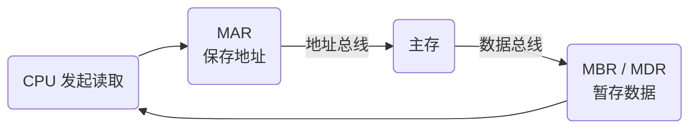

# 寄存器体系：CPU 为什么需要这么多“临时小格子”？

## 先抓住主线

前面 [[CPU内部组成-运算器与控制器]] 已经见过 ACC、PSW、PC、IR。

本卡不再重复它们所属的运算器/控制器结构，而是把所有寄存器放到一条工作主线上理解：

> **CPU 要执行指令，就必须不断暂存“数据、指令、地址和状态”。寄存器负责暂存；当数据来自主存时，MAR/MBR 负责衔接，总线负责传送。**

可以先压成三类：

- **运算相关**：ACC、PSW
- **控制相关**：PC、IR
- **访存相关**：MAR、MBR/MDR

---

## 为什么 CPU 需要寄存器？

CPU 计算速度很快，但正在使用的数据、指令和状态不能每一步都去主存重新取。

因此需要一批位于 CPU 内部的高速暂存单元：

> **寄存器 = CPU 手边马上要用的临时存储位置。**

例如一次运算可以抽象成：

$$
\text{寄存器中的操作数}
\rightarrow
\text{ALU}
\rightarrow
\text{结果写回寄存器}
$$

这里要分清：

> **寄存器负责“暂存”，ALU 负责“计算”。**

---

## 常见寄存器分别记什么？

| 寄存器 | 主要保存 | 怎么认 |
| --- | --- | --- |
| **ACC** | 运算结果 / 中间结果 | “运算结果” |
| **PSW** | 零、负、进位、溢出等状态 | “状态”“条件转移” |
| **PC** | 下一条指令地址 | “下一条” |
| **IR** | 当前正在执行的指令 | “当前指令” |
| **MAR** | 本次要访问的主存地址 | “地址” |
| **MBR / MDR** | CPU 与主存交换的数据或指令 | “数据”“读写” |

最容易混的三组：

> **PC 管下一条，IR 管当前。**  
> **MAR 记地址，MBR/MDR 装数据。**  
> **ACC 放结果，PSW 记状态。**

---

## 为什么讲寄存器会讲到 MAR 和 MBR？

因为 CPU 需要的数据并不总在 CPU 内部。

假设 CPU 要读取主存地址 1000 中的数据 25，它必须先解决两个问题：

1. **去哪里找？** → MAR
2. **找回来的东西先放哪里？** → MBR/MDR

于是：

$$
MAR=1000
$$

表示本次访问主存地址 1000；

读取完成后：

$$
MBR=25
$$

表示从主存取回的数据暂存在 MBR/MDR 中。

所以：

> **MAR 告诉主存“去哪里”，MBR/MDR 暂存“搬什么”。**

这就是为什么 MAR、MBR 会出现在寄存器体系里：它们本来就是**服务于访存过程的专用寄存器**。

---

## 总线为什么又跟着出现？

现在还有最后一个问题：

> MAR 已经有地址了，地址怎么送到主存？主存的数据又怎么回到 CPU？

这就从“暂存”进入了“传送”。

- **寄存器**：东西暂时放哪里
- **总线**：东西怎样在部件之间移动

一次最简单的主存读取：

可以按下面的顺序理解：

1. CPU 把地址放入 MAR；
2. 地址经地址相关总线/通路送到主存；
3. 控制器发出“读”信号；
4. 主存找到对应位置；
5. 数据经数据相关总线/通路返回；
6. 数据暂存在 MBR/MDR；
7. CPU 再把它送给后续需要的部件。

所以知识链不是跳跃，而是：

> **CPU 要干活 → 寄存器负责暂存 → 数据可能在主存 → MAR/MBR 负责衔接 → 总线负责搬运。**

---

## MAR、MBR 和总线不要混

### MAR ≠ 地址总线

- MAR：保存地址的**寄存器**
- 地址总线/地址通路：传送地址的**线路/通路**

关系是：

> **MAR 里放地址 → 地址再经相关通路送到主存。**

### MBR ≠ 数据总线

- MBR/MDR：暂存数据
- 数据总线/数据通路：传送数据

关系是：

> **数据在通路上移动，到达后由寄存器暂存。**

因此：

| 部件 | 解决的问题 |
| --- | --- |
| 寄存器 | 暂时放哪里 |
| 总线 | 怎样搬过去 |

---

## 寄存器为什么不和运算器、控制器并列？

“CPU = 运算器 + 控制器”是**功能层面的高层划分**。

寄存器不是 CPU 的第三个一级功能模块，而是实现这些功能时使用的具体部件：

- ACC、PSW 等服务于运算过程；
- PC、IR 等服务于控制过程；
- MAR、MBR/MDR 服务于访存过程。

不同教材对部分寄存器画在哪个框中可能略有差异，考试更重要的是认清它们的**功能**。

> **寄存器是实现运算器和控制器功能的一部分。**

---

## 考试怎么认

常见题眼：

- “下一条指令地址” → **PC**
- “当前指令” → **IR**
- “主存地址” → **MAR**
- “CPU 与主存交换的数据/指令” → **MBR / MDR**
- “运算结果” → **ACC**
- “零、负、进位、溢出” → **PSW**

高频坑：

- PC ≠ 当前指令；
- MAR ≠ 数据寄存器；
- MBR/MDR ≠ 地址寄存器；
- MAR ≠ 地址总线；
- 寄存器 ≠ CPU 第三个一级组成。

---

## 一句话记住

> **寄存器负责“暂存”，ALU 负责“算”，控制逻辑负责“指挥”，总线负责“搬”。**

> **PC 下一条，IR 当前；MAR 记地址，MBR/MDR 装数据；ACC 放结果，PSW 记状态。**

---

## 自测

1. 为什么 CPU 已经有寄存器，还要专门有 MAR 和 MBR/MDR？

   > [!success]- 核对答案
   > 通用寄存器保存 CPU 内部运算要用的值；MAR 专门暂存本次主存访问地址，MBR/MDR 暂存与主存交换的数据或指令，让访存步骤有明确的地址端和数据端。

2. MAR 和地址总线是不是同一个东西？

   > [!success]- 核对答案
   > 不是。MAR 是保存地址的寄存器，地址总线是传送地址的通路；MAR 中的地址经地址通路送往主存。

3. PC 和 IR 的区别是什么？

   > [!success]- 核对答案
   > PC 保存下一条待取指令的地址；IR 保存当前已取出、正在分析或执行的指令。

4. 为什么寄存器不是 CPU 的第三个一级组成？

   > [!success]- 核对答案
   > “运算器、控制器”是功能划分，寄存器是实现这些功能时使用的具体部件，分别服务于运算、控制或访存。

5. CPU 从主存读取一个数时，MAR、总线、MBR/MDR 分别负责什么？

   > [!success]- 核对答案
   > MAR 暂存目标地址；地址通路把地址送到主存、数据通路把读出的数据送回；MBR/MDR 暂存返回的数据供 CPU 使用。

## 下一站

- 上一站：[[CPU内部组成-运算器与控制器]]
- 下一站：[[CPU内部组成-指令执行过程]]
- 关联：[[总线-数据地址与控制]]
