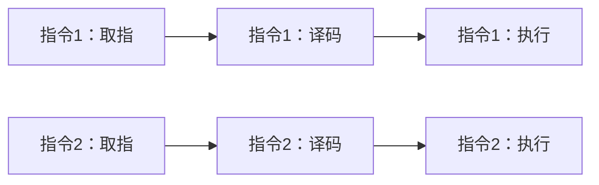

# 指令流水线的基本概念：为什么多条指令可以“重叠跑”

> [!summary] 快速复习卡片
> **作用**：让多条指令的不同阶段重叠执行，提高吞吐量  
> **不是**：减少一条指令必须经历的步骤  
> **核心收益**：流水线铺开后，单位时间可以完成更多指令  
> **后续计算顺序**：周期 → 总时间 → 吞吐率 → 加速比  
> **考试重点**：流水线主要提升吞吐，不等于单条指令延迟一定更短

## 先定位：CPU 原本是怎样执行指令的

在 [[CPU内部组成-指令执行过程]] 里，一条指令会经历取指、译码、执行、访存、写回等阶段。

如果 CPU 必须等一条指令所有阶段都结束，下一条才开始，那么很多硬件会在等待。

例如指令 1 已经进入译码阶段时，负责取指的部件通常已经空出来了。

于是产生一个自然想法：

> **让指令 2 开始取指，同时让指令 1 继续译码。**

这就是指令流水线。

## 流水线到底改变了什么

流水线没有删除任何必要阶段，也不是让同一条指令瞬间完成。

它做的是：

> **让多条指令错开进入不同阶段，使不同硬件同时工作。**

真正并行发生的是：

- 指令 1 在后面的阶段工作；
- 指令 2 已经开始前面的阶段；
- 后面还可以继续跟指令 3、指令 4。

## 最重要的考试结论

> **流水线主要提高的是吞吐量，而不是保证单条指令延迟变短。**

第一条指令仍然需要经过完整流水线。

真正获得的收益是：

> **流水线铺开后，单位时间可以完成更多指令。**

## 为什么后面还要继续拆卡

流水线真正开始计算时会连续遇到几个不同问题：

1. [[流水线周期]]：每隔多久能推进一拍？
2. [[流水线总执行时间]]：执行很多条指令一共多久？
3. [[流水线吞吐率]]：单位时间完成多少条？
4. [[流水线加速比]]：比完全串行快多少？
5. [[流水线冒险的基本概念]]：真实流水线为什么不能永远每拍顺利推进？

## 一句话记住

> **流水线 = 不减少一条指令的步骤，而是把多条指令错开，让不同阶段同时工作。**

## 自测

1. 流水线为什么能提高吞吐量？
2. 第一条指令是否一定因为流水线而明显更快？
3. “多条指令同时执行”为什么不等于“同一条指令同时做完所有阶段”？

## 下一站

- 上一站：[[CPU内部组成-指令执行过程]]
- 下一站：[[流水线周期]]
