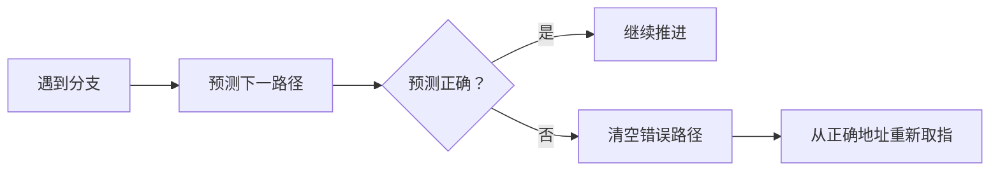

# 控制冒险：分支结果还没出来，下一条指令到底从哪里取

## 先定位：控制冒险缺的是“正确的下一地址”

遇到条件分支时，CPU 需要知道：

> **条件成立就跳转，还是不成立继续顺序执行？**

但流水线为了提高吞吐，不愿意完全停在那里等。

于是分支结果还没出来时，取指阶段可能已经开始取后续指令。

如果方向猜错，就取到了错误路径。

这就是：

> **控制冒险（Control Hazard）。**

## 最保守的处理：等

等分支条件和目标地址确定，再继续取指。

优点：简单、不会走错。  
代价：流水线要停。

## 更常见的思路：分支预测

CPU 先预测：

> “我猜这次会跳”或“我猜这次不会跳”。

预测正确时减少停顿。

预测错误时，要把已经进入流水线的错误路径指令**清空（flush）**，再从正确地址重新取。

## 一句话记住

> **控制冒险 = 不知道下一条去哪；能预测就先走，猜错就清空重来。**

## 自测

1. 为什么普通顺序指令不会产生同样的“下一地址不确定”？
2. 分支预测错误后为什么要 flush？
3. 控制冒险和数据冒险分别在等什么？

## 下一站

- 上一站：[[数据冒险]]
- 下一站：[[Flynn分类法]]
