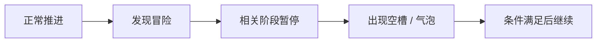

# 流水线停顿与气泡：发现不能继续以后，CPU 最保守的处理是什么

## 先定位：停顿是处理冒险的方法之一

[[流水线冒险的基本概念]] 只是说：

> **现在继续会有风险。**

最直接、最保守的处理方法就是：

> **先等一拍或几拍，直到条件满足。**

这叫**停顿（stall）**。

## 什么叫气泡

因为某些阶段被迫等待，流水线中会出现一个没有执行有效指令工作的空槽。

这个空槽常被形象地叫作：

> **气泡（bubble）**

## 为什么停顿会降低性能

理想流水线希望每个周期都有有效指令向前推进。

停顿以后：

- 某些阶段没有做有效工作；
- 总执行时间增加；
- 吞吐率下降。

所以处理器会尽量用更聪明的方法减少停顿，例如数据转发或分支预测。

## “发生冒险”是否代表所有阶段全停

不一定。

经典流水线里经常是：

- 某些前级冻结；
- 更早进入流水线的指令仍继续完成；
- 被阻塞的位置插入气泡。

因此不要理解成“一有冒险，CPU 所有东西都静止”。

## 一句话记住

> **停顿 = 等；气泡 = 因等待在流水线里留下的无效空槽。**

## 下一站

- 上一站：[[流水线冒险的基本概念]]
- 下一站：[[结构冒险]]
