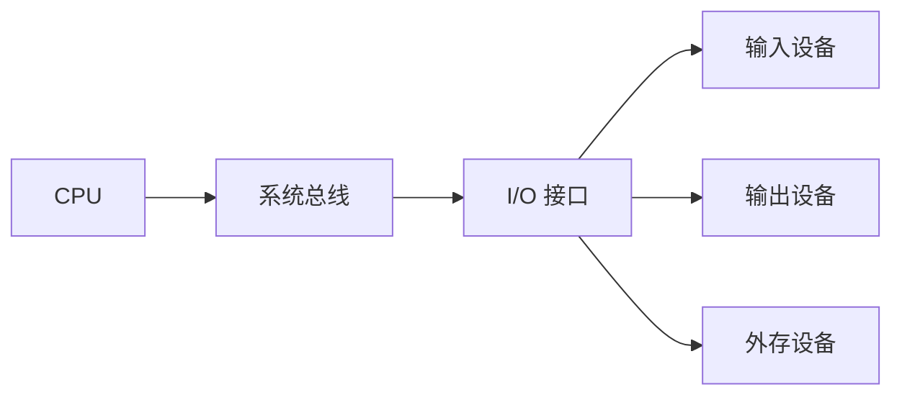
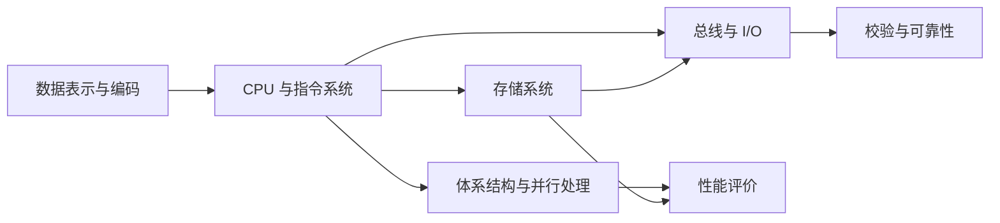

# 计算机系统组成：一套看懂整台机器怎么拼

## 痛点：让一台计算机“换程序不换硬件”

1946 年的 ENIAC 是 30 吨、1.8 万个电子管的庞然大物，但它的“编程”靠**人工插拔线路板**——换一道题就要重新布一次电路，等于“改程序=改硬件”。这就是“一题一机”：要做不同类型的题，就得重新造一台机器，通用计算根本无从谈起。

冯·诺依曼看破了这个问题，提出天才解法，这也正是**整台计算机的组成逻辑**：

> **把“程序”也当成“数据”，和操作的数据一起存进机器里。** 这样换程序只需换内存里的内容，不用换硬件——通用计算机从此诞生。

要理解整台机器怎么拼，抓住三件事：**存储程序原理（为什么能通用）、五大部件（靠什么分工）、指令驱动（怎么跑起来）**。这套骨架，就是下面整块“计算机组成与体系结构”的学习地图。

> 记一句：**冯·诺依曼 = “程序也是数据，存进机器换程序不换硬件”——五大部件按此分工，靠逐条取指译码执行跑起来。**

## 定义（讲人话）

基于冯·诺依曼“存储程序”原理的计算机，由五大部件组成，把**程序与数据同存于存储体系**，靠控制器逐条取指、译码、驱动运算器执行，实现“换程序而不换硬件”。经典结构与哈佛结构的差异见 [[冯·诺依曼结构与哈佛结构]]。

## 三根支柱

| 支柱 | 是什么 | 对应下面的学习卡 |
| --- | --- | --- |
| **存储程序原理** | 指令和数据同存，是通用性的根源 | [[数据表示与编码-进制转换]]（数据怎么表示） |
| **五大部件** | 输入/存储/运算/控制/输出分工 | [[CPU内部组成-运算器与控制器|运算器与控制器]]（核心分工） |
| **指令驱动** | 取指→译码→执行循环 | [[CPU内部组成-指令执行过程]]（怎么跑） |

## 五大部件一句话

- **输入设备**：把程序和数据送进来
- **存储器**：存程序和数据（[[存储层次与主存]]、[[Cache]]、[[外存与RAID]]）
- **运算器**：算术与逻辑运算（[[CPU内部组成-运算器与控制器|运算器与控制器]]）
- **控制器**：发出控制信号，协调各部件（[[CPU内部组成-运算器与控制器|运算器与控制器]]、[[CPU内部组成-寄存器体系]]）
- **输出设备**：把结果吐出去

输入/输出设备通常不直接接到 CPU 内部，而是通过 [[IO接口|I/O 接口]] 连接总线。接口负责地址译码、数据缓冲、速度匹配、格式转换和状态/控制信号协调；更细的缓冲机制见 [[单缓冲与双缓冲]]。

> 怎么认：题干出现“速度匹配、缓冲、状态寄存器、设备控制”时，优先想到 I/O 接口；出现“具体键盘、磁盘、显示器”时，是外设。

## 本块知识地图：先看“它属于哪一类”

现在这一块不再把几十张原子卡平铺在同一层，而是先按“这是什么部件/解决什么问题”分成 7 类：

| 分类 | 你可以把它理解成 | 学习入口 |
| --- | --- | --- |
| **CPU 与指令系统** | CPU 里面有什么、怎样取指执行、怎样用流水线加速 | [[CPU与指令系统索引]] |
| **存储系统** | 数据放在哪里，Cache、主存、外存怎样分工 | [[存储系统索引]] |
| **总线与 I/O** | CPU、内存、外设之间怎样连接和传数据 | [[总线与IO索引]] |
| **数据表示与编码** | 数字和字符怎样变成计算机能处理的 0/1 | [[数据表示与编码索引]] |
| **校验与可靠性** | 数据出错后怎样发现、定位或纠正 | [[校验与可靠性索引]] |
| **体系结构与并行处理** | 处理器怎样组织，多核/GPU/Flynn 等怎样分类 | [[体系结构与并行处理索引]] |
| **性能评价** | 怎样衡量 CPU/整机性能，局部优化能带来多少收益 | [[性能评价索引]] |

### 先分清“目录分类”和“学习顺序”

这 7 个目录不是一根硬串联链。**目录编号主要负责分类，不代表每个模块都是前一个模块的直接后续机制。**

真正比较强的理解主干是：

> **数据表示与编码 → CPU 与指令系统 → 存储系统 → 总线与 I/O**

它依次回答“数据怎么表示、CPU 怎么处理、数据放哪里、部件之间怎么传”。

另外还有两个横向分支：

- **校验与可靠性**同时作用于存储和传输：数据只要被保存或搬运，就可能发生比特错误。
- **体系结构与并行处理**从 CPU/整机组织方式向外扩展：多核、GPU、Flynn 等不是由中断技术推导出来的。

最后 **性能评价**再从整体上衡量这些设计到底快不快。

为了连续阅读，本章推荐顺序仍可以走：**数据表示 → CPU → 存储 → 总线与 I/O → 校验与可靠性 → 体系结构与并行处理 → 性能评价**。其中“校验 → 体系结构”只是学习顺序切换，不代表两者存在直接机制依赖。

### 一条总主线

学习时先问自己：

1. **这是 CPU 内部的东西吗？** → 去 [[CPU与指令系统索引]]
2. **这是“数据放哪里、怎么存”的问题吗？** → 去 [[存储系统索引]]
3. **这是“部件之间怎么传”的问题吗？** → 去 [[总线与IO索引]]
4. **这是数值/字符怎样表示的问题吗？** → 去 [[数据表示与编码索引]]
5. **这是检错纠错的问题吗？** → 去 [[校验与可靠性索引]]
6. **这是多核、GPU、Flynn 这类组织方式吗？** → 去 [[体系结构与并行处理索引]]
7. **这是“快不快、快多少”的问题吗？** → 去 [[性能评价索引]]

> 原子卡仍然保持一张卡只讲一个知识点；新增目录和索引只负责**归类与导航**，不把知识重新合并成大笔记。

## 本章怎么按优先级复习

2026-09-02 按“原子卡本身的真题证据”重新校准后，本章 55 张考点卡不再把上位主题优先级批量下放：

| 级别 | 数量 | 你怎么学 |
| --- | ---: | --- |
| **P0** | **1** | 必读，优先拿分 |
| **P1** | **8** | 重点掌握 |
| **P2** | **31** | 第二轮理解、会识别 |
| **P3** | **15** | 时间紧可以先跳过 |

**P0：** [[中断技术]]

**P1：** [[Cache-命中率与平均访问时间]]、[[Cache-映射方式]]、[[IO控制技术]]、[[总线-数据地址与控制]]、[[数据表示与编码-原反补移码]]、[[数据表示与编码-定点与浮点]]、[[CPU性能指标]]、[[Amdahl定律]]

> [!important] 优先级看“这张卡本身考不考”
> 一个上位主题是 P1，不代表它拆出来的每个子机制都必须 P1。前置知识仍然可以很重要，但“帮助理解后续”不再自动等于“考试重点”。

## 这个块与考试的关系

这一块是上午综合知识的基础得分区（常考 CPU 部件归属、指令流水线计算、Cache、RAID、中断、校验码、性能指标等，计算题多）。每一张卡都带“怎么认”和“这个知识与考试的关系”，按卡学完即覆盖考法。

## 下一站

> 顺着主线往下走，该看 **[[数据表示与编码-进制转换]]**——学会把十进制转成机器能认的0/1。
