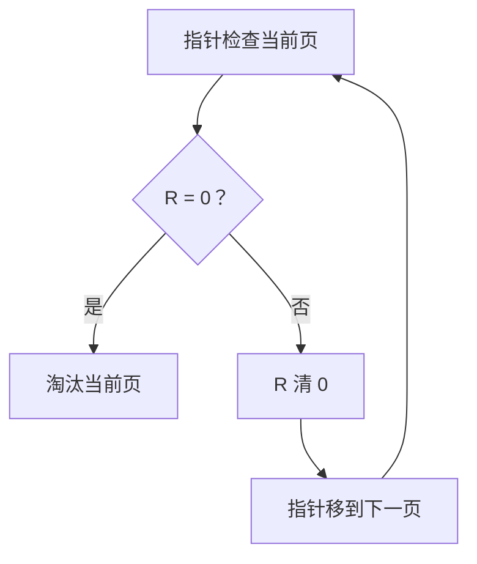

# Clock 页面置换：怎样不用精确记录“最近时间”，也近似 LRU

## 先定位：LRU 思路好，但精确维护“谁最久没访问”成本高

[[LRU页面置换算法]] 希望优先留下最近使用过的页。

Clock 算法用一个更便宜的近似办法：

> **每个页只记录“最近有没有被访问过”，再用一个指针循环扫描。**

## 两个核心东西

### 访问位 R

页面被访问时：

> $R=1$

表示它最近得到过一次使用机会。

### 时钟指针

指针指向下一位候选页面，并沿页框环形移动。

## 发生置换时到底怎么扫

看指针当前指向的页。

### 如果 R = 0

说明从上次检查以后没有看到它被访问。

> **直接选择它作为牺牲页。**

### 如果 R = 1

说明最近访问过。

于是：

1. 把 R 清成 0；
2. 暂时不淘汰；
3. 指针移动到下一页继续检查。

这就叫给它一次：

> **第二次机会（Second Chance）。**

## “是不是替换最近一轮没访问的页”

可以这样建立直觉，但要更精确一点：

> **Clock 循环扫描；遇到 R=1 就清零并放过一次，最终淘汰扫描到的第一个 R=0 页面。**

所以不是先把“最近一整轮”完整统计完再统一选择，而是**边扫描边给第二次机会**。

## 指针什么时候动

- 遇到 R=1：清零后向前移动；
- 找到牺牲页、换入新页后：指针通常继续指向下一个候选位置。

题目若给出具体初始指针位置，必须从那个位置开始扫。

## 一句话记住

> **Clock = 环形指针 + 访问位；1 就清零放过，0 就淘汰。**

## 下一站

- 上一站：[[LRU页面置换算法]]
- 下一站：[[文件管理]]
