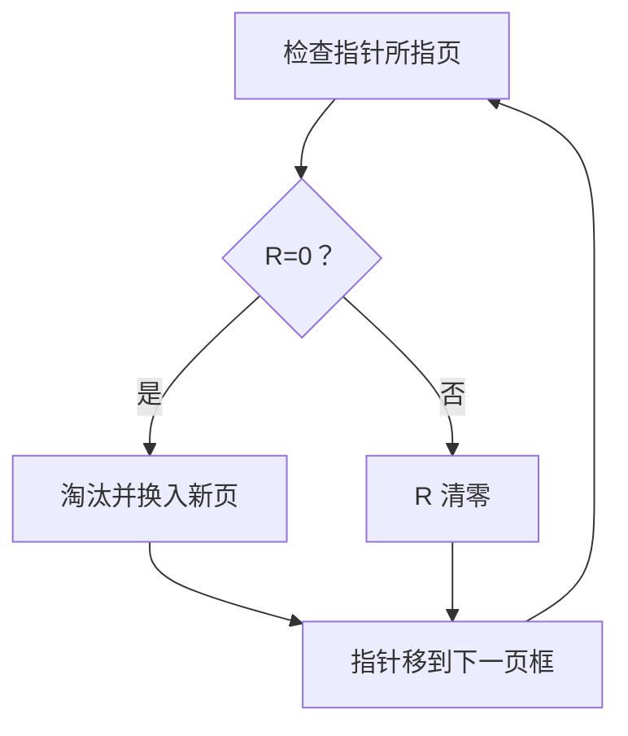

# Clock 页面置换：用访问位近似 LRU

> [!summary] 快速复习卡片
> **作用/定位**：Clock 用访问位和环形指针给最近访问过的页面一次“第二次机会”，以较低成本近似 LRU。
> **核心结论**：需要置换时从当前指针开始扫：遇 R=1 就清成 0 并继续；遇到第一个 R=0 就淘汰，再把指针移向下一位置。
> **2019真题题眼**：题目若同时给“访问位 + 修改位”，先关注**最近是否访问过**；候选页中未修改页换出成本更低，因为通常无需写回外存。
> **经典题型怎么做**：标清初始指针和R位 → 缺页且页框满时沿环扫描 → 1清零放过，0成为候选 → 若题设再给修改位，按题设继续比较写回代价。
> **易错点**：Clock不是“统计完一整轮再比较”；标准二次机会是边扫边清零。访问位/修改位组合题要以题目给出的置换规则为准。

## 为什么需要 Clock

[[LRU页面置换算法]] 要判断“谁最久没被访问”，精确维护访问次序有成本。Clock 只给每个驻留页保存一个**访问位 R**，再用指针循环扫描：

- 页面被访问：硬件把 R 置为 1；
- 需要置换：从指针当前位置开始找；
- 遇到 R=1：清成 0，给一次“第二次机会”，指针后移；
- 遇到 R=0：选为牺牲页；
- 换入新页后：新页的 R 通常置 1，指针移到下一页框。

## 走一遍：为什么叫“第二次机会”

设 4 个页框按环形排列，当前内容和访问位为：

| 指针位置 | 页 | R |
| --- | --- | ---: |
| → | A | 1 |
|  | B | 1 |
|  | C | 0 |
|  | D | 1 |

现在缺页，需要换入 E：

1. 查 A：R=1，清为 0，放过；
2. 查 B：R=1，清为 0，放过；
3. 查 C：R=0，淘汰 C，换入 E；
4. 指针停到 D，作为下一次扫描起点。

Clock **不是先统计完整一轮再统一比较**，而是边扫边清零，淘汰遇到的第一个 R=0 页。

## 与 FIFO、LRU 的边界

| 算法 | 判断依据 | 特点 |
| --- | --- | --- |
| [[FIFO页面置换算法|FIFO]] | 进入内存的先后 | 简单，不看近期使用 |
| [[LRU页面置换算法|LRU]] | 过去的最近访问次序 | 效果通常好，精确实现成本较高 |
| Clock | 访问位 + 环形指针 | 给近期访问页一次机会，是 LRU 的近似 |

> [!warning] 做题先看初始状态
> 初始指针位置、各页访问位和题目规定的换入页 R 值会改变结果；以题设为准。

## 一句话记住

> **Clock：指针循环找 0；遇 1 清零放过，遇 0 立即淘汰。**

## 上一站

- [[LRU页面置换算法]]

## 下一站

- [[文件与文件系统]]
