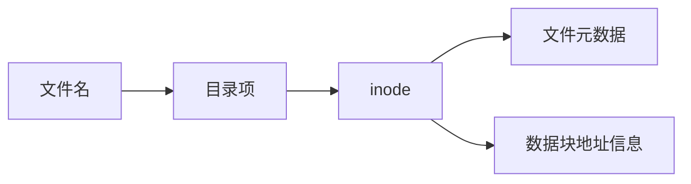

# FCB 与 inode：文件内容在磁盘上，操作系统靠什么“认识这个文件”

## 先定位：文件名只是名字，OS 还需要一份文件管理档案

[[文件与文件系统]] 已经知道，一个文件除了内容，还需要：

- 大小；
- 权限；
- 时间；
- 数据块位置等管理信息。

这些信息不能每次靠扫描整个磁盘重新猜。

于是操作系统为文件保存**文件控制信息**。

## FCB 是什么

**FCB（File Control Block，文件控制块）**是操作系统教材里的抽象概念：

> **一组用于描述和管理文件的控制信息。**

它可以记录：

- 文件标识/名称相关信息；
- 文件大小；
- 存储位置；
- 权限；
- 创建/修改时间等。

所以：

> **FCB 是“文件管理信息这一类东西”的概念。**

## inode 又是什么

在 Unix/Linux 文件系统中，经典实现里使用 **inode（index node，索引节点）**保存文件的主要元数据以及数据块定位信息。

因此可以这样理解：

> **inode 是 Unix/Linux 文件系统实现 FCB 类职责的一种具体数据结构。**

不要反过来说“所有操作系统的 FCB 都叫 inode”。

## inode 里为什么通常不靠文件名认文件

经典 Unix 风格文件系统中：

> **目录项负责把“文件名”映射到 inode。**

inode 再负责描述文件本身及定位数据。

所以打开一个路径时更像：

这解释了一个重要关系：

> **目录负责“按名字找”，inode 负责“找到以后认文件和找数据”。**

## 为什么 inode 会出现“直接地址、一级间接、二级间接”

一个文件可能很大，数据块很多。

inode 自己空间有限，不可能直接塞下无限多个数据块号。

所以才会产生：

> **直接记录少量数据块地址 + 再通过索引块间接记录更多地址。**

这就是后面的 [[文件多级索引]]。

## 一句话记住

> **FCB 是文件控制信息的抽象概念；inode 是 Unix/Linux 中承担类似职责的具体实现。目录名先找到 inode，inode 再找到文件数据。**

## 下一站

- 上一站：[[文件与文件系统]]
- 下一站：[[目录与文件打开过程]]
