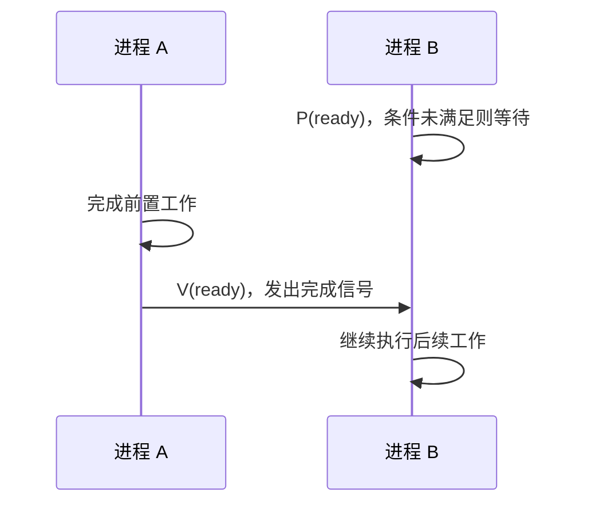

# PV 实现同步：为什么“B 必须等 A 做完”也能用信号量

## 先定位：同步不是防止同时进入，而是建立先后关系

假设：

- A 负责读取数据；
- B 必须等数据读取完成以后才能处理。

这里并不是“同一时刻只能有一个人操作”的问题。

真正要求是：

> **A 完成某件事之前，B 不能越过某个位置。**

这就是同步。

## 最小模型

建立信号量：

$$
ready=0
$$

为什么初值是 0？

因为一开始“数据已经准备好”这个条件**还没有发生**。

B 在继续前先执行 P(ready)。

没有通知时，B 等待。

A 完成准备后执行 V(ready)，通知条件已经成立，B 才能继续。

## 和互斥最简区别

| 目标 | 问题 |
| --- | --- |
| 互斥 | 能不能两个人同时进 |
| 同步 | 谁必须先做、谁必须后做 |

因此初值也不能机械死背。

> **先问信号量代表什么，再决定初值。**

## 一句话记住

> **同步 = 交通信号：条件没发生就 P 等着，前置工作完成后 V 放行。**

## 下一站

- 上一站：[[PV操作实现互斥]]
- 下一站：[[生产者消费者问题]]
