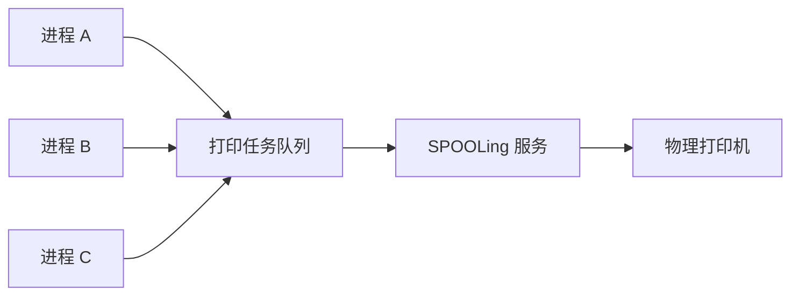

# SPOOLing：只有一台打印机，为什么多个程序看起来都能“同时打印”

## 先定位：缓冲解决速度差，SPOOLing 进一步解决独占设备共享

CPU 和外设速度差很大，可以通过 [[单缓冲与双缓冲]] 减少双方互相等待。

但打印机还有另一类问题：

> **同一时刻只能真正打印一项任务。**

如果每个进程都直接占住打印机直到全部打印完成，其他进程会长时间等待。

于是产生 SPOOLing。

## SPOOLing 是什么

**SPOOLing（Simultaneous Peripheral Operations On-Line，假脱机技术）**的核心思路是：

> **程序先把要交给独占设备的任务写入后备队列，由专门服务再按顺序真正操作设备。**

对应用来说，打印任务已经提交，但真正的物理打印可以稍后发生。

多个进程共享的是提交任务的逻辑接口和队列，物理打印机仍然一次只处理一个任务。

所以：

> **SPOOLing 没有让物理独占性消失，而是通过排队和后台服务把它包装成更容易共享的虚拟设备。**

## 和普通缓冲不要混

- 缓冲：重点是**速度匹配、减少等待**；
- SPOOLing：重点是**把独占设备的直接占用改成任务排队和后台处理**。

## 一句话记住

> **SPOOLing = 先把任务排队，程序先走，后台再让独占设备逐个处理。**

## 下一站

- 上一站：[[单缓冲与双缓冲]]
- 下一站：[[磁盘调度算法]]
