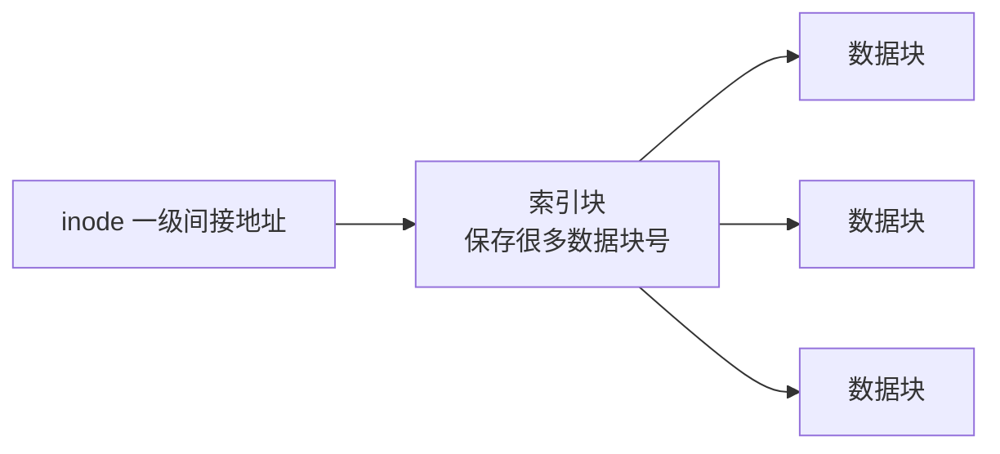
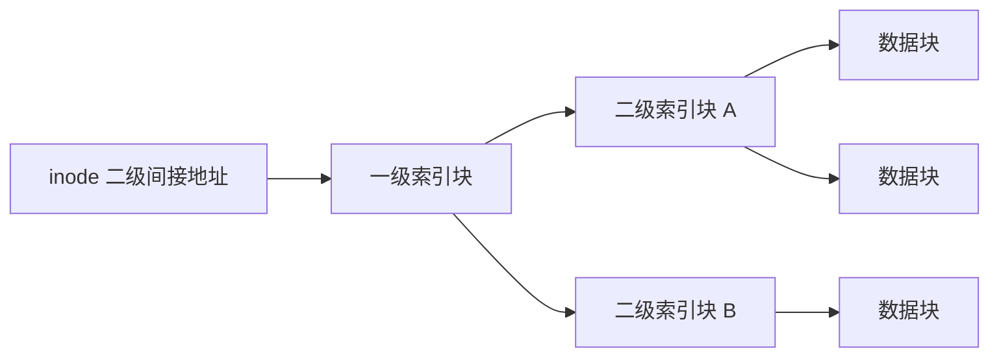

# 文件多级索引：一级间接、二级间接到底“间接”在哪里

## 先定位：先把“索引块”当成一张地址清单

[[文件物理结构与分配方式]] 已经知道：

> **索引分配 = 另外建立一张清单，清单里存数据块地址。**

**索引块**就是：

> **磁盘上专门用来保存一批“块号/块地址”的块。**

它通常不保存文件正文数据，而是保存“正文在哪”。

## 直接地址是什么

如果 inode/FCB 中某个地址项直接写：

> 数据块 35

那么：

中间没有额外地址清单，所以叫**直接索引/直接地址**。

## 一级间接索引是什么

inode 地址项不再直接指正文数据，而是先指向**一个索引块**。

索引块里有很多地址项，每一项再指向一个数据块。

因此“一级间接”的一级，指的是：

> **从 inode 到数据块之间，多经过 1 层索引块。**

## 二级间接索引是什么

文件再大，一张索引块也不够。

于是 inode 先指向第 1 层索引块。

第 1 层里面存的不是数据块地址，而是：

> **第 2 层索引块的地址。**

第 2 层索引块里才保存真正的数据块地址。

所以：

> **二级间接 = 中间经过两层“地址清单”。**

## 一张 4KB 索引块能存多少个地址项

假设：

- 索引块大小 4KB；
- 一个块地址项 4B。

那么：

$$
\frac{4KB}{4B}
=
\frac{4096B}{4B}
=
1024
$$

所以一张索引块能保存：

> **1024 个块地址。**

## 一级间接为什么能定位 1024 个数据块

因为这 1024 个地址项，每项直接指一个数据块：

$$
1024\text{ 个数据块}
$$

如果每个数据块 4KB，则这部分**文件数据容量**是：

$$
1024\times4KB=4096KB=4MB
$$

这里最后乘 4KB，是因为：

> **前面算出的是“能找到多少个数据块”，乘每个数据块大小才变成“能保存多少文件数据”。**

## 二级间接为什么是 1024 × 1024

第一层有 1024 个地址项，每项指向一张第二层索引块。

每张第二层索引块又有 1024 个数据块地址。

所以：

$$
1024\times1024
$$

个数据块。

若每块 4KB：

$$
1024\times1024\times4KB
$$

才是可表示的数据容量。

## 块号边界为什么经常要减 1

如果直接地址一共能覆盖 6 个逻辑数据块，逻辑块号从 0 开始，则它们是：

$$
0,1,2,3,4,5
$$

所以“6 个块”对应的最后块号是：

$$
6-1=5
$$

这和“地址范围末减首加一”是同一类计数问题：

> **数量和从 0 开始的最大编号相差 1。**

## 一句话记住

> **直接：inode 直接指数据；一级：inode → 1 张索引清单 → 数据；二级：inode → 清单 → 更多清单 → 数据。**

## 下一站

- 上一站：[[文件物理结构与分配方式]]
- 下一站：[[位示图与空闲空间管理]]
