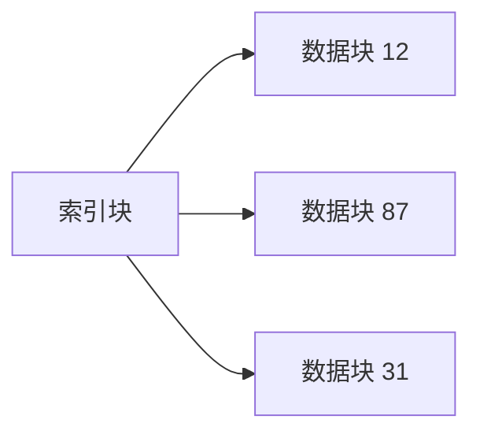

# 文件物理结构：一个文件有很多数据块，磁盘上到底怎样把它们串成“同一个文件”

## 先定位：文件内容可能跨很多磁盘块

[[文件逻辑结构]] 是用户视角。

现在站到文件系统实现层：

> **一个文件的第 0、1、2、3 个逻辑块，实际应该放到哪些物理块？**

经典有三种思路。

## 连续分配

把文件数据放在连续物理块上。

只要知道：

> **起始块 + 文件长度**

就能定位后续块。

优点：

- 顺序访问快；
- 随机定位也简单。

缺点：

- 文件增长困难；
- 容易产生外部碎片或需要提前估计空间。

## 链接分配

文件块可以散落。

每个块记录：

> **下一个块在哪里。**

优点：

- 文件增长灵活；
- 不要求连续空间。

缺点：

- 随机访问差；
- 指针占空间；
- 指针损坏会影响后续链。

## 索引分配

另外建立一张**索引表/索引块**，里面集中记录这个文件各数据块的物理块号。

优点：

> 可以集中查“第几个逻辑块放在哪里”，支持随机访问。

代价：

> 索引表本身也要占空间。

当文件特别大，一张索引块都放不下所有块号，就自然进入 [[文件多级索引]]。

## 一句话记住

> **连续 = 数据块挨着放；链接 = 数据块互相指下一块；索引 = 另做一张块地址清单。**

## 下一站

- 上一站：[[文件逻辑结构]]
- 下一站：[[文件多级索引]]
