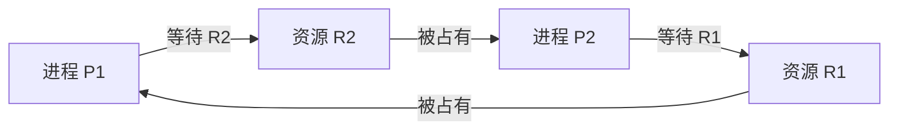

# 死锁：为什么大家都在等，却再也没人能继续

## 先定位：信号量能让进程等待，但“等待”本身也可能形成问题

[[信号量与PV基本概念]] 里已经看到：资源暂时不可用时，进程可以阻塞等待。

普通等待并不可怕。

例如 A 等打印机，打印机一旦空闲，A 就能继续。

真正危险的是：

> **多个进程互相等着对方手里的资源，而谁都无法先完成并释放资源。**

这就是死锁（Deadlock）。

## 一个最小例子

- P1 已占有 R1，还申请 R2；
- P2 已占有 R2，还申请 R1。

现在：

- P1 不拿到 R2 就不能继续；
- P2 不拿到 R1 也不能继续；
- 两边都无法完成，因此也没人释放手里的资源。

## 死锁和普通阻塞不要混

| 状态 | 以后能否自行继续 |
| --- | --- |
| 普通阻塞 | 等待条件出现后可以 |
| 死锁 | 形成互相等待，系统不会靠这些进程自身自然解开 |

所以：

> **阻塞不一定是死锁。**

## 死锁成立需要哪四个条件

经典模型中，四个条件必须同时存在：

| 条件 | 人话 |
| --- | --- |
| 互斥 | 某些资源同一时刻只能给一个进程 |
| 请求并保持 | 已经拿着一些资源，还继续申请别的 |
| 不剥夺 | 已分配资源不能随意被系统强制抢走 |
| 循环等待 | P1 等 P2，P2 又等……最后绕回 P1 |

一句话串起来：

> **资源只能独占；拿着不放还继续要；别人不能强抢；最后形成等待环。**

如果能破坏其中至少一个条件，就能从机制上防止经典死锁形成。

## 一句话记住

> **死锁不是“资源暂时不够”，而是多个进程形成无法自行解除的循环等待。**

## 自测

1. 一个进程单纯等磁盘 I/O，是不是死锁？
2. “已经拿着 R1，又申请 R2”对应哪个条件？
3. 为什么循环等待在四条件里特别直观？

## 下一站

- 上一站：[[生产者消费者问题]]
- 下一站：[[资源分配图与死锁判断]]
