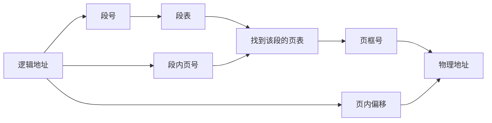

# 段页式：为什么要“先按逻辑分段，再把每个段继续分页”

## 先定位：分页和分段各自解决的问题不同

[[分页基本概念]] 的优点：

> **固定大小页可以离散放入物理页框，减少外部碎片问题。**

[[分段管理]] 的优点：

> **按代码、数据、栈等逻辑单位组织，方便保护、共享和程序理解。**

于是很自然会问：

> 能不能两边的优点都要？

这就是段页式。

## 段页式怎么组织

先把程序按逻辑划成多个段。

再把每个段内部继续切成固定大小的页。

因此逻辑地址通常包含：

> **段号 + 段内页号 + 页内偏移。**

## 为什么要查两层

第一层：

> **段号 → 找到这个段对应的页表。**

第二层：

> **页号 → 在这个页表里找到物理页框。**

所以段页式地址转换比单纯分页多一层查找和管理。

## 它“解决”了什么

段页式不是说所有缺点都消失。

它是在取舍：

- 保留分段的逻辑组织；
- 又让每个段内部用分页方式离散存放；
- 代价是地址转换和管理结构更复杂。

## 一句话记住

> **段页式 = 逻辑上先分段，物理管理时段内再分页；先查段表，再查页表。**

## 下一站

- 上一站：[[分段管理]]
- 下一站：[[虚拟存储与页面置换]]
